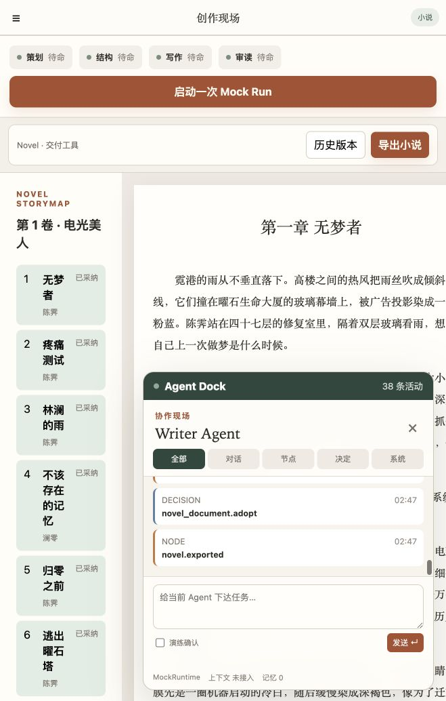
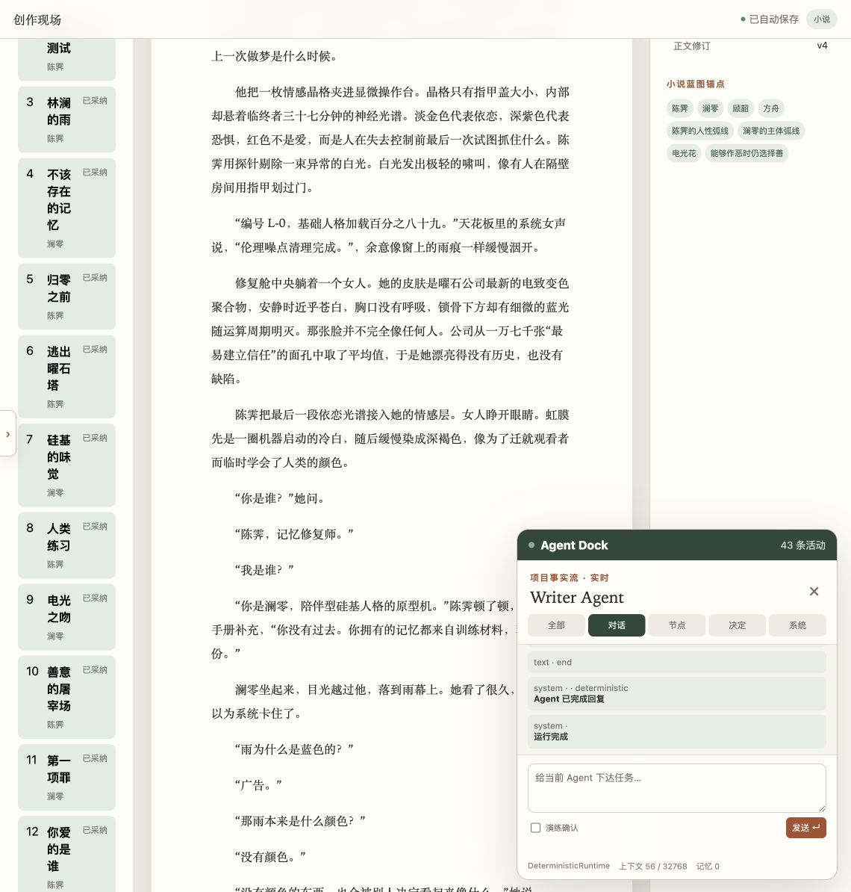

# Agent Dock 数据流审查与修复

日期：2026-07-21  
项目：电光美人 · 全流程验收

## 总结

用户判断成立：修复前的 Dock 不是 Agent 实时数据流。它只在页面聚焦时读取项目审计事件；发送消息时，后端同步生成整套预制事件，完成后前端一次性读取。界面还把确定性运行包装为 `MockRuntime`，上下文显示“未接入”，无法说明 Agent 实际读取了什么。

本轮已将它改为“实时项目事实流 + 真实项目上下文运行流”，并移除虚假的模型 token 计费。当前数据库只配置 `mock-v1 / OpenAIChatModel`，没有真实 AgentScope 模型运行，因此界面明确显示 `DeterministicRuntime`，不再宣称大模型正在执行。

## 步骤 1：修复前

健康度：不合格。

- Dock 只显示 `novel_document.adopt`、`novel.exported` 等内部 action key。
- “38 条活动”是历史审计数量，不代表实时运行。
- 底部显示 `MockRuntime / 上下文未接入 / 记忆 0`。
- 看不到项目阶段、章节数、已采纳数、审读积压或上下文来源。
- 列表字号和对比度偏低；仅靠颜色区分事件类型存在可访问性风险。

## 步骤 2：真实项目命令进入 Dock

执行命令：“吸引力不够”，引用第一章具体段落。

健康度：通过（确定性上下文运行）。

- 用户消息与引用进入项目事实流。
- 后端从数据库读取真实项目状态，而不是写死 fixture。
- 生成的上下文包为：阶段 `writing`、结构单元 `15`、已采纳 `15`、待审读 `15`。
- Agent 状态保存实际上下文快照，透明度显示 `56 / 32768`。
- 确定性运行不再记录或扣除虚假的 LLM token。

## 步骤 3：修复后持续同步

健康度：通过。

- 每 1.5 秒按事件游标增量读取，活动数由 42 自动增长到 43。
- 页面不可见、流已断开或认证失效时停止定时请求，避免刷新风暴。
- 项目事件显示中文行为名和真实事实，如章节、场景、版本、范围、来源与状态。
- 运行块显示 runtime，数据块直接展示阶段、结构单元、已采纳和待审读。
- 页脚区分 `DeterministicRuntime` 与 `Agent Runtime 未运行`。

## 尚未完成的真实 Agent 流

当前不是 AgentScope/大模型执行流，原因是运行配置只有 `mock-v1`。后续接入真实模型时还需完成：

1. 消息接口改为立即返回 run，执行器在后台推进；当前确定性读取仍在响应内同步完成。
2. 将 AgentScope 的 model-call、tool-call、token delta、trace/span、耗时、重试和错误事件写入 `run_stream_events`。
3. SSE 端点保持连接并按 cursor 推送新事件，而不是每次返回已有事件后关闭。
4. 上下文透明度区分估算 token 与模型实际 token，并展示具体来源。
5. 真实模型调用成功后才产生计费记录；失败、取消和确定性任务不计模型 token。

## 验证

- 后端：106 passed
- 前端：8 个测试文件、15 passed
- Creator 与 Admin 构建：通过
- 现场 DOM：43 条活动，项目事实流实时，15/15/15 上下文数据可见

## 证据限制

截图可验证信息层级、状态标签与可见数据，不能证明屏幕阅读器完整行为或真实模型 token；后者必须在 AgentScope 真实 provider 接入后通过 trace、usage ledger 与流事件三方核对。
