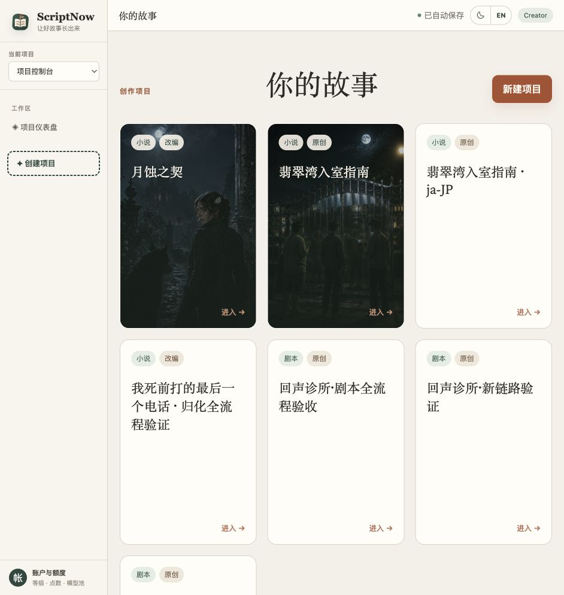
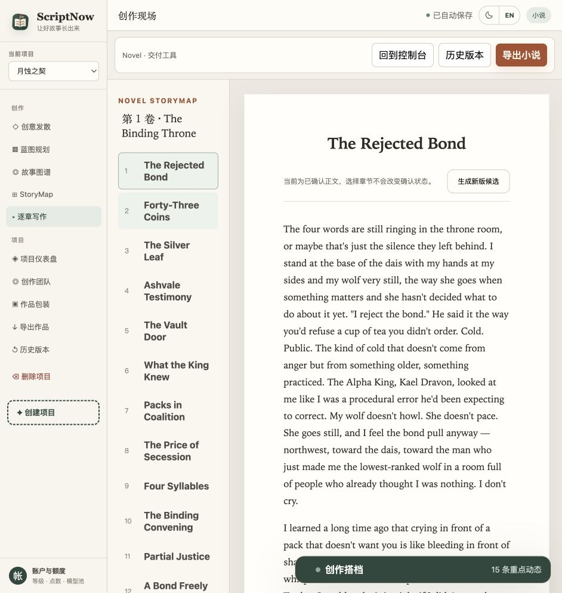
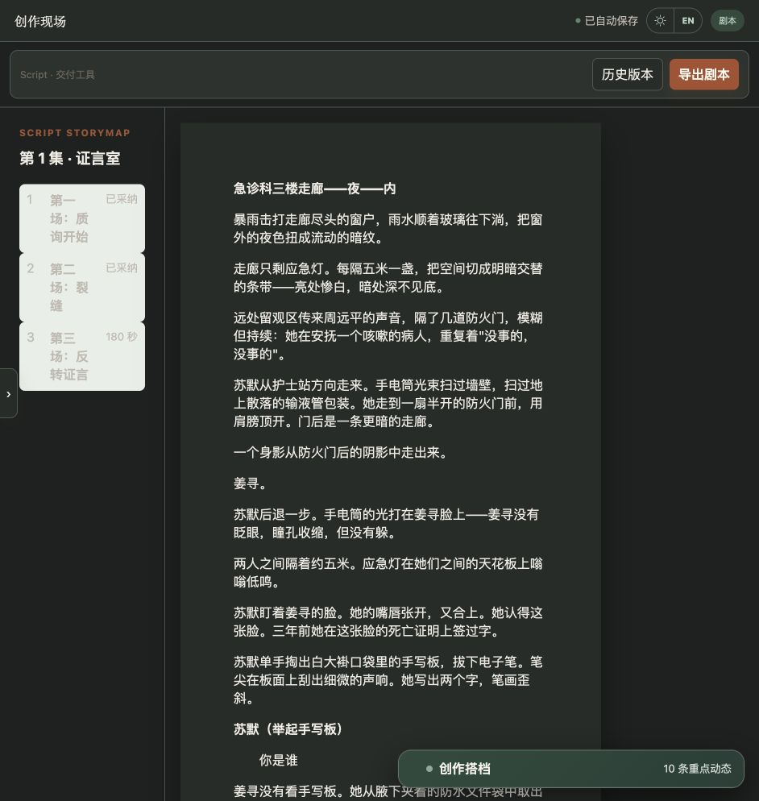
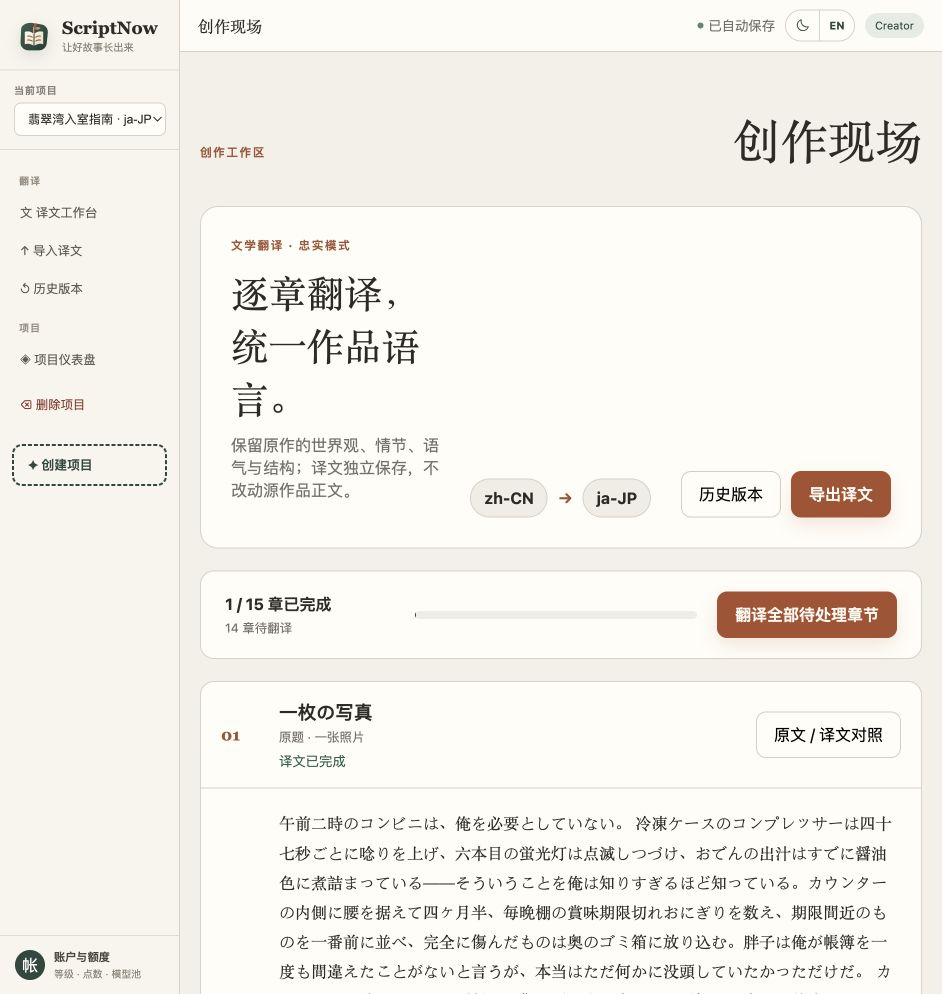
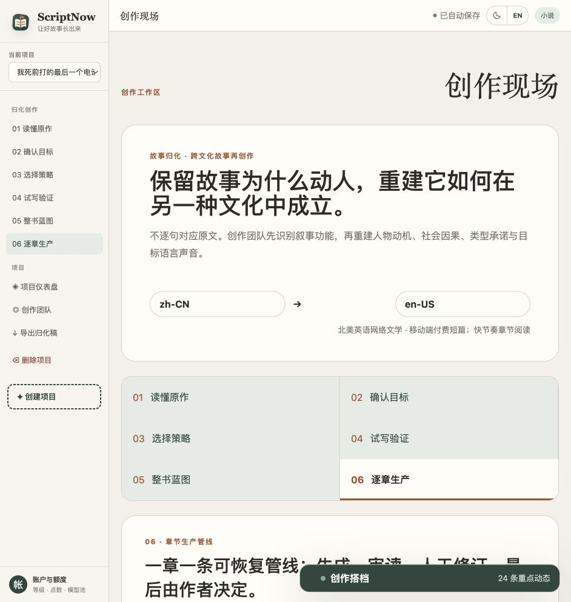

# ScriptNow

## Docker production deployment

The supported production setup uses Docker Compose with a loopback-only application port and an external HTTPS reverse proxy. Build registries are configurable, production secrets are mandatory, and mainland China mirrors can be enabled without modifying source files.

生产环境采用 Docker Compose，应用端口仅监听本机，由宝塔或 Nginx 提供 HTTPS 反向代理。构建源可以配置，生产密钥必须显式设置，国内镜像无需修改源码即可启用。

See / 查看：[Docker deployment guide / Docker 部署指南](./docs/DOCKER-DEPLOYMENT.md)

**AI agent–powered creative production for novels, scripts, translation, and cross-cultural story recreation.**

[简体中文](#简体中文) · [English](#english) · [日本語](#日本語) · [한국어](#한국어)

Current version: **`0.2.0-rc.1`**

Latest status: aligned to **ScriptNow v1.1** domain-separated contracts.

## Product preview · 产品预览

ScriptNow is not a single text generator. It provides four distinct production modes that share project governance while preserving their own creative contracts.

ScriptNow 不是单一的文本生成器，而是四种独立的故事生产模式：共享项目治理，但保留各自的创作契约与交付流程。



| Novel creation · 小说创作 | Script creation · 剧本创作 |
| --- | --- |
|  |  |
| Faithful translation · 忠实翻译 | Cross-cultural recreation · 跨文化归化 |
|  |  |

---

## 简体中文

ScriptNow 是由 AI Agent 创作团队驱动的故事生产平台，覆盖小说、剧本、忠实翻译和跨文化故事归化。创作者负责方向、修订与最终判断；Agent 团队负责创意发散、蓝图规划、逐章或逐场创作、审读和交付。

### 四种项目模式

| 模式 | 适用场景 | 生产流程 | 主要产物 |
| --- | --- | --- | --- |
| **小说创作** | 原创小说、长短篇连载、小说改编 | 创意方向 → 小说蓝图 → 故事图谱 → Novel StoryMap → 逐章候选、修订与采纳 → 审读 → 包装与导出 | 人物与关系、章节结构、可编辑候选稿、确认正文、书名简介标签与封面 |
| **剧本创作** | 短剧、电影、连续剧和剧本改编 | 戏剧引擎 → 剧本蓝图 → Script StoryMap → 逐场创作 → 连贯性与可拍性审读 → 格式化交付 | 集场结构、场景行动、台词与视听节奏、分场正文、剧本导出 |
| **忠实翻译** | 在不改变原作的前提下生成独立译本 | 源章节读取 → 逐章翻译 → 原文/译文对照 → 术语确认与动态纠偏 → 历史版本 → 译文导出 | 独立译稿、双栏对照、作品术语表、纠偏队列与译文版本 |
| **跨文化归化** | 将故事改写为另一语言和市场真正成立的新作品 | 读懂原作 → 确认目标市场 → 选择重构策略 → 试写验证 → 整书蓝图 → 逐章生产与审读 | 故事基因与保护项、文化映射、策略候选、归化蓝图、目标语言成稿 |

四种模式不会共用一套通用提示词强行拼装。小说以人物欲望、关系变化和长程叙事为中心；剧本以场景行动、戏剧冲突和视听表达为中心；忠实翻译保护原作；跨文化归化则在保护故事核心的前提下重建文化因果。

### 核心能力

- 小说与剧本采用独立领域模型、StoryMap、写作、审读及导出流程。
- 候选稿、人工修订、采纳正文和历史版本具有明确边界。
- 通过可追溯上下文检索、素材图谱和 Context Manifest 支持长程创作。
- 支持忠实翻译、术语治理，以及分阶段的跨文化故事归化。
- 基于 AgentScope 2.0 运行 Agent、工具调用、确认、暂停与恢复流程。
- 提供创作端与管理端，管理 Provider、模型、Skill、MCP、记忆和用量。

### 五分钟启动

```bash
make setup
make dev
```

开发地址：

- 创作端：<http://127.0.0.1:5174>
- 管理端：<http://127.0.0.1:5173>
- 后端 API：<http://127.0.0.1:8000>

也可以分别运行 `make backend`、`make creator` 或 `make admin`。

部署参考（反向代理场景）：

- 创作端：`/`（默认 `https` 域名托管到 `:5174`）
- 管理端：`/admin/`
- 后端 API：`/api/` 透传到 `:8000`

### 工程边界

```text
scriptnow/
├── backend/
│   ├── src/scriptnow/
│   │   ├── platform/       # 共享平台能力
│   │   ├── novel/          # 小说领域
│   │   ├── script/         # 剧本领域
│   │   └── translation/    # 翻译领域
│   └── skills/             # 运行时 Skill 资产
└── frontend/
    ├── apps/creator/       # 创作端
    ├── apps/admin/         # 管理端
    └── packages/shared/    # 无领域语义的共享基础
```

小说与剧本只共享 `platform`，不共享正文、StoryMap、Writer、审读、格式或导出领域模块。

### 规格与验证

- [v1.1 规格基线](./docs/v7-spec-v1.1/00-README.md)
- [产品与技术规格](./docs/v7-spec-v1.1/01-PRD-V7.md)
- [旧资源隔离规则](./docs/v7-spec-v1.1/02-LEGACY-DECONTAMINATION.md)
- [发布说明](./docs/v7-spec-v1.1/RELEASE-NOTES.md)
- [归档索引](./docs/archive/README.md)

```bash
make test
make lint
make build
```

---

## English

ScriptNow is an AI agent–powered story production platform for novels, scripts, faithful translation, and cross-cultural story recreation. Creators retain control over direction, revision, and final decisions, while an agent team supports ideation, blueprint planning, chapter or scene production, review, and delivery.

### Four project modes

| Mode | Best for | Production flow | Primary deliverables |
| --- | --- | --- | --- |
| **Novel creation** | Original fiction, serials, short fiction, and novel adaptation | Direction → novel blueprint → narrative graph → Novel StoryMap → chapter candidates, revision, and adoption → review → packaging and export | Characters and relationships, chapter architecture, editable candidates, adopted manuscript, metadata, and covers |
| **Script creation** | Short-form drama, film, series, and script adaptation | Dramatic engine → script blueprint → Script StoryMap → scene production → continuity and producibility review → formatted delivery | Episode/scene structure, visual action, dialogue, audiovisual rhythm, adopted scenes, and script exports |
| **Faithful translation** | Producing an independent translated edition without rewriting the source | Source chapter → chapter translation → source/target comparison → terminology confirmation and correction → version history → export | Independent translation, comparison view, glossary, correction queue, and translated editions |
| **Cross-cultural recreation** | Rebuilding a story so it works in another language, culture, and market | Understand source → define target → choose strategy → validate sample → whole-book blueprint → chapter production and review | Story DNA and protected elements, cultural mapping, strategy candidates, recreation blueprint, and target-language manuscript |

The four modes are not assembled from one generic prompt. Novel creation centers on desire, relationship change, and long-range narrative; script creation centers on scene action, dramatic conflict, and audiovisual expression; faithful translation protects the source; cross-cultural recreation rebuilds cultural causality while preserving the story’s core.

### Core capabilities

- Separate domain models, StoryMaps, writing, review, and export workflows for novels and scripts.
- Explicit boundaries between candidates, human revisions, adopted manuscripts, and version history.
- Traceable context retrieval, narrative graphs, and Context Manifests for long-form continuity.
- Faithful translation, terminology governance, and staged cross-cultural story recreation.
- AgentScope 2.0–based agent execution, tool calls, confirmations, pause, and recovery.
- Creator and admin applications for providers, models, skills, MCP, memory, and usage.

### Start in five minutes

```bash
make setup
make dev
```

Development endpoints:

- Creator: <http://127.0.0.1:5174>
- Admin: <http://127.0.0.1:5173>
- Backend API: <http://127.0.0.1:8000>

Run individual services with `make backend`, `make creator`, or `make admin`.

Deployment convention (reverse-proxy):

- Creator app: `/` (or mapped to port `5174`)
- Admin app: `/admin/`
- Backend API: `/api/` proxy to `:8000`

### Architecture boundary

```text
scriptnow/
├── backend/
│   ├── src/scriptnow/
│   │   ├── platform/       # Shared platform capabilities
│   │   ├── novel/          # Novel domain
│   │   ├── script/         # Script domain
│   │   └── translation/    # Translation domain
│   └── skills/             # Runtime skill assets
└── frontend/
    ├── apps/creator/       # Creator application
    ├── apps/admin/         # Admin application
    └── packages/shared/    # Domain-neutral shared foundations
```

Novel and Script share only `platform`. They do not share manuscript, StoryMap, Writer, review, formatting, or export domain modules.

### Specifications and verification

- [v1.1 specification baseline](./docs/v7-spec-v1.1/00-README.md)
- [Product and technical specification](./docs/v7-spec-v1.1/01-PRD-V7.md)
- [Legacy decontamination rules](./docs/v7-spec-v1.1/02-LEGACY-DECONTAMINATION.md)
- [Release notes](./docs/v7-spec-v1.1/RELEASE-NOTES.md)
- [Archive index](./docs/archive/README.md)

```bash
make test
make lint
make build
```

---

## 日本語

ScriptNow は、小説、脚本、忠実翻訳、異文化向けストーリー再創作に対応する、AI エージェント駆動型の物語制作プラットフォームです。作者は方向性、修正、最終判断を担い、エージェントチームはアイデア展開、設計、章・シーン単位の執筆、レビュー、納品を支援します。

### 4 つのプロジェクトモード

| モード | 用途 | 制作フロー | 主な成果物 |
| --- | --- | --- | --- |
| **小説制作** | オリジナル小説、連載、短編、小説化 | 方向性 → 小説設計 → 物語グラフ → Novel StoryMap → 章候補・修正・採用 → レビュー → パッケージと出力 | 人物と関係、章構成、編集可能な候補稿、採用本文、作品情報、表紙 |
| **脚本制作** | ショートドラマ、映画、シリーズ、脚本化 | ドラマエンジン → 脚本設計 → Script StoryMap → シーン制作 → 連続性・撮影可能性レビュー → 書式化 | 話数・シーン構成、映像行動、台詞、視聴覚リズム、採用シーン、脚本出力 |
| **忠実翻訳** | 原作を書き換えず独立した翻訳版を制作 | 原文章 → 章翻訳 → 原文・訳文比較 → 用語確定・訂正 → 履歴 → 出力 | 独立訳稿、比較表示、作品用語集、訂正キュー、翻訳版 |
| **異文化再創作** | 別の言語・文化・市場で成立する物語へ再構築 | 原作理解 → 対象確認 → 戦略選択 → 試作検証 → 全体設計 → 章制作・レビュー | 物語の核と保護要素、文化マッピング、戦略候補、再創作設計、対象言語の完成稿 |

4 つのモードを一つの汎用プロンプトで組み立てることはありません。小説は欲望・関係変化・長期的な物語、脚本はシーン行動・ドラマ上の衝突・映像表現、忠実翻訳は原作保護、異文化再創作は物語の核を守りながら文化的因果を再構築することに重点を置きます。

### 主な機能

- 小説と脚本に、それぞれ独立したドメインモデル、StoryMap、執筆、レビュー、出力フローを提供。
- 候補稿、人による修正、採用済み本文、履歴バージョンを明確に分離。
- 追跡可能なコンテキスト検索、物語グラフ、Context Manifest による長編の整合性維持。
- 忠実翻訳、用語管理、段階的な異文化向けストーリー再創作。
- AgentScope 2.0 に基づくエージェント実行、ツール呼び出し、確認、一時停止、再開。
- Provider、モデル、Skill、MCP、メモリ、使用量を管理する制作画面と管理画面。

### 5 分で起動

```bash
make setup
make dev
```

開発用 URL：

- 制作画面：<http://127.0.0.1:5174>
- 管理画面：<http://127.0.0.1:5173>
- バックエンド API：<http://127.0.0.1:8000>

個別に起動する場合は、`make backend`、`make creator`、`make admin` を使用します。

デプロイ時の標準設定（リバースプロキシ）：

- クリエイト：`/`（既定で `https` ドメイン→`:5174`）
- 管理者：`/admin/`
- API：`/api/` を `:8000` に転送

### アーキテクチャ境界

```text
scriptnow/
├── backend/
│   ├── src/scriptnow/
│   │   ├── platform/       # 共通プラットフォーム機能
│   │   ├── novel/          # 小説ドメイン
│   │   ├── script/         # 脚本ドメイン
│   │   └── translation/    # 翻訳ドメイン
│   └── skills/             # 実行時 Skill
└── frontend/
    ├── apps/creator/       # 制作画面
    ├── apps/admin/         # 管理画面
    └── packages/shared/    # ドメイン非依存の共通基盤
```

小説と脚本が共有するのは `platform` のみです。本文、StoryMap、Writer、レビュー、書式、出力の各ドメインモジュールは共有しません。

### 仕様と検証

- [v1.1 仕様基準](./docs/v7-spec-v1.1/00-README.md)
- [製品・技術仕様](./docs/v7-spec-v1.1/01-PRD-V7.md)
- [旧資産の隔離ルール](./docs/v7-spec-v1.1/02-LEGACY-DECONTAMINATION.md)
- [リリースノート](./docs/v7-spec-v1.1/RELEASE-NOTES.md)
- [アーカイブ索引](./docs/archive/README.md)

```bash
make test
make lint
make build
```

---

## 한국어

ScriptNow는 소설, 대본, 충실 번역 및 문화권별 스토리 재창작을 지원하는 AI 에이전트 기반 스토리 제작 플랫폼입니다. 창작자는 방향, 수정, 최종 판단을 담당하고 에이전트 팀은 아이디어 확장, 청사진 설계, 장·장면 단위 집필, 검토 및 결과물 제작을 지원합니다.

### 네 가지 프로젝트 모드

| 모드 | 적합한 작업 | 제작 흐름 | 주요 결과물 |
| --- | --- | --- | --- |
| **소설 창작** | 오리지널 소설, 연재, 단편, 소설 각색 | 방향 → 소설 청사진 → 스토리 그래프 → Novel StoryMap → 장별 후보·수정·채택 → 검토 → 패키징·내보내기 | 인물과 관계, 장 구성, 편집 가능한 후보 원고, 확정 본문, 작품 정보와 표지 |
| **대본 창작** | 숏폼 드라마, 영화, 시리즈, 대본 각색 | 드라마 엔진 → 대본 청사진 → Script StoryMap → 장면 제작 → 연속성·제작 가능성 검토 → 형식화 | 회차·장면 구조, 시각적 행동, 대사, 시청각 리듬, 확정 장면, 대본 파일 |
| **충실 번역** | 원작을 바꾸지 않고 독립 번역본 제작 | 원문 장 → 장별 번역 → 원문·번역 비교 → 용어 확정·교정 → 버전 기록 → 내보내기 | 독립 번역 원고, 비교 화면, 작품 용어집, 교정 대기열, 번역 버전 |
| **문화권 재창작** | 다른 언어·문화·시장에서 성립하도록 이야기를 재구성 | 원작 이해 → 목표 정의 → 전략 선택 → 샘플 검증 → 전체 청사진 → 장별 제작·검토 | 이야기 핵심과 보호 요소, 문화 매핑, 전략 후보, 재창작 청사진, 목표 언어 원고 |

네 가지 모드는 하나의 범용 프롬프트를 억지로 공유하지 않습니다. 소설은 욕망·관계 변화·장기 서사, 대본은 장면 행동·극적 갈등·시청각 표현, 충실 번역은 원작 보호, 문화권 재창작은 이야기의 핵심을 지키면서 문화적 인과관계를 다시 세우는 데 초점을 둡니다.

### 핵심 기능

- 소설과 대본에 각각 독립된 도메인 모델, StoryMap, 집필, 검토 및 내보내기 흐름을 제공합니다.
- 후보 원고, 사용자 수정본, 채택된 본문 및 버전 기록의 경계를 명확히 구분합니다.
- 추적 가능한 컨텍스트 검색, 내러티브 그래프 및 Context Manifest로 장편의 연속성을 유지합니다.
- 충실 번역, 용어 관리 및 단계별 문화권 스토리 재창작을 지원합니다.
- AgentScope 2.0 기반 에이전트 실행, 도구 호출, 확인, 일시 정지 및 복구를 제공합니다.
- Provider, 모델, Skill, MCP, 메모리 및 사용량을 관리하는 창작 앱과 관리 앱을 제공합니다.

### 5분 안에 시작하기

```bash
make setup
make dev
```

개발 주소:

- 창작 앱: <http://127.0.0.1:5174>
- 관리 앱: <http://127.0.0.1:5173>
- 백엔드 API: <http://127.0.0.1:8000>

개별 서비스는 `make backend`, `make creator`, `make admin`으로 실행할 수 있습니다.

배포 구성을 위한 표준 방식(역방향 프록시):

- 크리에이터 앱: `/` (또는 도메인에서 `:5174`로 매핑)
- 관리자 앱: `/admin/`
- 백엔드 API: `/api/`를 `:8000`으로 프록시

### 아키텍처 경계

```text
scriptnow/
├── backend/
│   ├── src/scriptnow/
│   │   ├── platform/       # 공통 플랫폼 기능
│   │   ├── novel/          # 소설 도메인
│   │   ├── script/         # 대본 도메인
│   │   └── translation/    # 번역 도메인
│   └── skills/             # 런타임 Skill 자산
└── frontend/
    ├── apps/creator/       # 창작 앱
    ├── apps/admin/         # 관리 앱
    └── packages/shared/    # 도메인 중립 공통 기반
```

소설과 대본은 `platform`만 공유합니다. 본문, StoryMap, Writer, 검토, 형식 및 내보내기 도메인 모듈은 공유하지 않습니다.

### 사양 및 검증

- [v1.1 사양 기준](./docs/v7-spec-v1.1/00-README.md)
- [제품 및 기술 사양](./docs/v7-spec-v1.1/01-PRD-V7.md)
- [레거시 격리 규칙](./docs/v7-spec-v1.1/02-LEGACY-DECONTAMINATION.md)
- [릴리스 노트](./docs/v7-spec-v1.1/RELEASE-NOTES.md)
- [아카이브 색인](./docs/archive/README.md)

```bash
make test
make lint
make build
```

---

## License

Proprietary. All rights reserved.
