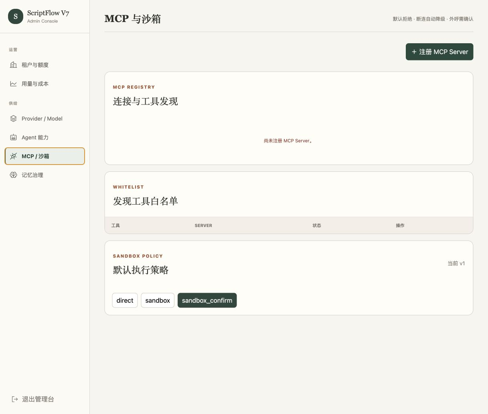

# ScriptNow MCP 能力审查

日期：2026-07-21

## 结论

项目需要 MCP，但只用于“必须访问项目外部、且信息具有时效性或专业来源”的能力。创意发散、蓝图、正文写作和审读的核心方法仍由 Skills 与项目事实驱动；MCP 不应成为创作主链的默认依赖。

当前已完成第一段安全运行闭环：运行快照中的 `mcp.<server>.<tool>` 会经过启用状态、连接状态和工具白名单校验，服务端解密连接配置后构造 MCPClient，并注入真实 AgentScope Toolkit；stdio 客户端也已纳入连接关闭生命周期。为避免绕过用户授权，标记为“需要确认”的 Server 暂不挂载，必须等确认事件与原调用续跑机制完成后再开放。

当前数据库仍未注册真实 MCP Server，因此本轮只能用自动化测试验证配置筛选与 Toolkit 装配，尚不能宣称市场搜索等外部能力已经可用。

## 界面证据

当前空状态只告诉管理员“尚未注册”，没有解释 MCP 适用场景、推荐能力包、角色挂载关系或注册后的验收步骤。`direct / sandbox / sandbox_confirm` 也仍是工程术语，缺少风险含义。

## 创作流程能力判断

| 环节 | 是否需要 MCP | 推荐能力 | 边界 |
|---|---|---|---|
| 创建项目 / 创意发散 | 是，可选 | 热门题材、平台榜单、关键词趋势、目标读者信号 | 生成带日期、地区、平台与来源的“市场观察”，不得直接写入 StoryCore |
| 改编素材理解 | 否 | 使用项目内 RAG loop | 原著是项目事实源，不应发送给外部搜索工具 |
| 蓝图规划 | 有条件 | 历史、地理、科学、法律等事实检索 | 只有用户选择“考据模式”或 Agent 发现事实缺口时调用 |
| StoryMap | 通常不需要 | Skills + 已采纳蓝图 | 不让实时热点改变已经确认的因果结构 |
| 正文写作 | 有条件 | 事实查询、术语查询 | 只返回参考材料，不允许外部工具直接写正文或采纳修订 |
| 审读 | 是，可选 | 事实核查、敏感内容与引用来源核验 | Finding 必须带来源、时间和置信度 |
| 作品包装 | 是，可选 | 搜索关键词、平台标签趋势、竞品定位 | 只能形成包装候选，不得修改作品事实 |
| 生图 | 否 | 已有 Image Provider | 生图属于模型供给，不应包装成 MCP |

## 建议的首批能力包

1. **市场雷达（P0）**：`search_trends`、`get_rank_snapshot`、`compare_keywords`。只挂载创意导演与包装 Agent；返回结构化快照和来源，不返回“照着热门写”的结论。
2. **可信资料检索（P0）**：`web_search`、`fetch_source`、`fact_check_claims`。挂载故事建筑师与审读编辑；白名单限定可信域名或来源等级。
3. **版权与素材溯源（P1）**：查询作品、作者、授权状态与素材来源；任何外部写入或下载必须确认。
4. **平台发布数据（P1）**：获取平台标签、尺寸、元数据规范与变更日期，供作品包装使用。

## 产品与技术缺口

- **P0 运行时可观测性**：无需确认的白名单 MCP 已可注入 Toolkit，但工具开始、结果、失败和降级事件尚未桥接到创作搭档信息流。
- **P0 角色挂载待实测**：后台现可将已批准、无需确认的 MCP 工具封装成工具组并直接挂载到指定角色，AgentFactory 也会把挂载结果冻结进运行快照；仍需真实 Server tracer 验证端到端调用。
- **P0 缺少 Schema 治理**：工具表仅保存名称和描述，没有输入 Schema 摘要、schema digest、风险级别与数据出境标签。
- **P0 确认机制未闭环**：Dock 有确认事件模型，但尚未实现真实 MCP `RequireUserConfirmEvent → 用户决定 → 原调用续跑`；当前此类 Server 会被运行时安全拒绝挂载。
- **P1 空状态无引导**：应提供“市场研究、资料考据、版权检索”三个推荐模板，并解释注册、发现、白名单、挂载、试运行五步。
- **P1 搜索结果无事实隔离**：外部结果需要独立的 Research Snapshot；只有用户明确采纳后，相关结论才能成为创作约束。
- **P1 缺少时效策略**：趋势结果需要 `observed_at / region / platform / source / ttl`，过期后不可继续作为当前市场依据。
- **可访问性风险**：当前空状态文字尺寸和对比度偏弱；三个沙箱选项缺少可理解说明，单靠颜色无法表达风险差异。键盘顺序与屏幕阅读器状态仍需实际测试。

## 推荐实施顺序

1. 继续完成 MCP Runtime tracer bullet：本地只读测试 Server → 发现 → 白名单 → 角色挂载 → Agent 调用 → Dock 事件 → 断连降级。当前已完成白名单到 Toolkit 装配及连接生命周期。
2. 建立 Research Snapshot 契约与来源字段，再接入“市场雷达”；不要先接一个通用搜索框。
3. 将只读可信检索设为沙箱直通；外呼、下载、写入和携带项目内容的调用继续要求确认。
4. 完成角色级挂载与运行快照可视化后，再开放管理员注册第三方 MCP。

## 审查限制

本次界面证据覆盖管理后台空状态。未注册真实 MCP Server，因此无法从界面验证实际工具返回、Schema 展示、确认续跑、断连恢复和键盘操作；这些必须在 tracer bullet 中实测。当前结论不代表市场雷达或网页检索已经对创作者开放。
