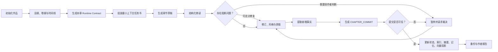
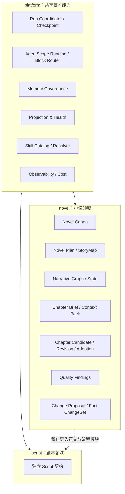

# Webnovel Writer → ScriptNow 融合评估与规划

| | |
|---|---|
| 文档性质 | 外部参考系统审计与融合规划 |
| 日期 | 2026-07-26 |
| 状态 | 待评审；不授权开发 |
| 评估对象 | `/Users/quchenchen/Documents/github/webnovel-writer` |
| 对齐基线 | ScriptNow `v7-spec-v1.1` |
| 外部快照 | `master@2041aba`，产品版本标注 `v6.2.1` |

## 1. 执行结论

`webnovel-writer` 值得系统借鉴，但不适合整体迁入 ScriptNow。

它最成熟的不是单个 Prompt、题材模板或 Claude Code 命令，而是围绕长篇连载建立的六类机制：

1. **写前契约与写后提交分离**：动笔前用 runtime contract 限定本章任务，写完后用 `CHAPTER_COMMIT` 登记新增事实。
2. **事实源与查询投影分离**：正文事实、提交事实、索引、摘要、记忆和 Dashboard 不混为一体。
3. **章节工作流设门禁且支持断点恢复**：预检、审读、事实提取、提交、投影和备份都有明确完成条件。
4. **最小充分上下文**：按任务检索相关设定、近期章节、伏笔和项目记忆，避免全书上下文直接灌入模型。
5. **伏笔、读者承诺和时间线是可管理对象**：不仅保存文本，还记录其创建、推进、兑现、冲突和失效。
6. **面向作者报告结果，面向工程记录过程**：作者看到完成情况、影响和下一步，内部日志保留可诊断细节。

建议采用“**吸收机制、重建契约、拒绝代码搬运**”的融合策略：

- 不合并两个仓库；
- 不把 `.story-system`、`.webnovel`、CLI 和 Claude Code 专属流程带入 ScriptNow；
- 不复制 GPL-3.0 代码、长篇 Skill 文本和题材模板；
- 在 ScriptNow 既有候选稿、版本、项目事件、叙事图谱、AgentScope Runtime 和自适应 Skills 之上重新表达这些能力；
- 所有业务参数继续来自项目设置、平台策略、作品契约或 Agent 与用户交互，禁止写死篇幅、章节数、节奏比例、模型或题材规则。

最终建议不是增加一个“Webnovel 模式”，而是增强 ScriptNow 小说域的**长篇连续创作内核**。

## 2. 评估边界与证据

### 2.1 本次审计覆盖

- 根目录与插件目录的 README、架构说明和工作流文档；
- 8 个 Skill：初始化、规划、写作、审读、查询、学习、Dashboard、Doctor；
- 4 个 Agent：上下文、审读、数据提取、作品拆解；
- Story System、章节提交、运行账本、写作门禁、投影、记忆、RAG、伏笔、作者报告和 Dashboard 相关实现；
- 题材模板、分类 CSV、写作与审读参考资料；
- 测试目录、发布记录、近期提交和许可证。

### 2.2 未覆盖或不能确认

- 本次不是完整视觉可用性测试，没有把 Dashboard 当作最终产品 UI 进行评分；
- 本地环境未安装 `pytest`，因此未重新执行外部项目测试套件；
- 外部仓库 README 报告 v6.2.1 有 774 项测试通过，本规划只将其视为仓库自述证据；
- 外部项目公开的 v7 RFC 属于未来设计，不视为当前已实现能力；
- 本文不是法律意见。由于外部项目采用 GPL-3.0，任何代码级复用都必须另行完成许可证审查。

### 2.3 评估原则

每项机制按以下问题判断：

1. 是否直接改善真实作者的创作连续性？
2. 是否能成为清晰、可测试的领域契约？
3. 是否与 ScriptNow 的唯一事实源、Candidate 不变式和 Script/Novel 隔离原则一致？
4. 是否能保留用户最终判断，而不是让门禁替用户创作？
5. 是否能在多租户、Web 应用和 AgentScope Runtime 中成立？
6. 是否引入重复真源、静默降级、硬编码策略或版权风险？

## 3. 外部项目成熟度判断

| 维度 | 评级 | 结论 |
|---|---:|---|
| 长篇连续创作流程 | 4.5 / 5 | 主链完整，明确覆盖写前、写中、写后和恢复 |
| 事实与投影治理 | 4.5 / 5 | 设计意识成熟，但文件、JSON、SQLite 多介质增加复杂度 |
| 上下文管理 | 4 / 5 | 任务化、渐进加载值得采用 |
| 伏笔与长期记忆 | 4 / 5 | 类别和生命周期较完整，仍存在重复记忆载体 |
| 质量闭环 | 3.5 / 5 | 结构化审读和 blocking 裁决有效，部分规则过于刚性 |
| Skills 组织 | 3.5 / 5 | 流程清晰，但 Skill 过长、夹杂大量 Shell 编排 |
| 可恢复性与诊断 | 4.5 / 5 | run ledger、checkpoint、doctor 和 projection retry 较成熟 |
| 作者体验 | 3.5 / 5 | 作者报告优秀，CLI 与只读 Dashboard 限制协作体验 |
| SaaS / 多租户适配 | 2 / 5 | 本地文件项目和 Claude Code 假设不适合直接迁移 |
| 国际化与领域扩展 | 2.5 / 5 | 中文网文资源丰富，但分类、文案和流程耦合较深 |

综合判断：它是一套成熟度较高的**本地长篇网文工作流参考实现**，不是可直接嵌入 ScriptNow 的平台组件。

## 4. 外部系统实际工作方式

### 4.1 端到端主链



这条流程最重要的价值是把以下三件事分开：

- **作品如何写**：由创作 Agent 和风格规则负责；
- **作品写了什么**：由事实提取和章节提交负责；
- **系统如何查得快、看得懂**：由索引、摘要、记忆和 Dashboard 投影负责。

### 4.2 真源模型

外部系统的实际真源关系如下：

| 层 | 外部实现 | 角色 |
|---|---|---|
| 写前真源 | `.story-system/MASTER_SETTING.json`、卷/章契约 | 本章创作约束 |
| 写后真源 | accepted `CHAPTER_COMMIT` | 本章新增事实和状态改变 |
| 原始作品 | 正文章节文件 | 作者可阅读和修改的文本 |
| 查询投影 | `state.json`、`index.db`、summary、memory、vector | 检索与展示 |
| 运行证据 | run ledger、projection log、doctor | 恢复和诊断 |

该设计方向与 ScriptNow“领域表是事实源，项目事件是不可变活动日志，聚合只发生在查询投影层”基本一致；但外部项目依赖文件和多种本地存储介质，不能直接照搬。

### 4.3 上下文和记忆

外部系统将创作上下文拆成：

- 当前章纲、运行契约；
- 角色、世界规则、时间线；
- 最近章节与相关历史章节；
- active open loops 和 reader promises；
- 项目写作经验、风格记忆；
- RAG 检索得到的证据。

其记忆大致分为：

- working：当前任务所需内容；
- episodic：近期章节和创作过程；
- semantic：角色状态、世界事实、时间线、伏笔、读者承诺、关系等。

值得采用的是“按任务组装并声明来源”的思想，不是 `memory_scratchpad.json` 这个文件形式。

### 4.4 运行恢复

外部系统不会简单地在失败后重跑全部步骤，而是记录：

- 正文是否已经可信生成；
- 审读结果是否完整；
- 事实提取产物是否存在；
- commit 是否 accepted；
- 每个 projection 是否完成；
- 正文是否被作者手工修改；
- 章纲是否晚于正文更新。

恢复时只补跑失败步骤，并在可能覆盖作者修改时停下。这个机制应作为 ScriptNow 运行协调器的参考，而不是写进小说 Skill 的 Shell 命令。

## 5. 值得融合的机制

### 5.1 P0：章节创作“任务契约 → 候选稿 → 事实提交”

#### 外部优点

写前契约限定本章职责，写后提交登记事实，避免模型把“计划”“正文”和“事实”混成一份文档。

#### ScriptNow 目标表达

| 阶段 | ScriptNow 契约 |
|---|---|
| 写前 | `NovelChapterBrief`：本章目标、必须推进、不可破坏、允许新增、篇幅与语言等项目参数 |
| 生成中 | `NovelChapterCandidate`：ThinkingBlock、ToolBlock、TextBlock 分流，正文流式只读预览 |
| 校验后 | 可编辑的候选修订；人工保存形成独立 revision |
| 采纳时 | `NovelChapterAdoption`：明确选择某一 revision 成为当前正文 |
| 写后 | `NovelFactChangeSet`：建议新增/变更/失效的事实、关系、伏笔、承诺和时间点 |
| 确认后 | 领域事实更新 + `project_events` 活动记录 + 查询投影刷新 |

必须保留现有 Candidate 不变式：Agent 输出不能直接覆盖已采纳正文；事实提取不能因为“生成成功”自动获得领域真源地位。

### 5.2 P0：最小充分上下文包

为每次创作构造版本化 `NovelContextPack`：

```text
NovelContextPack
├── task_contract          本章任务与动态参数
├── current_canon          已采纳且与本章直接相关的事实
├── latest_revisions       前文最新人工/采纳版本
├── narrative_state        角色状态、时间线、关系和位置
├── active_threads         必须推进或避免误回收的伏笔/承诺
├── evidence               适配项目的原始素材证据
├── style_plan             本章激活的 Skills 与风格边界
└── provenance             每项内容的来源、版本和置信度
```

上下文包必须：

- 使用最新人工修订或采纳版本；
- 先查确定性领域事实和图谱，再做语义检索；
- 有 token 预算时按相关性裁剪，而不是截断正文尾部；
- 记录遗漏原因和检索模式；
- 不把不确定推断伪装成既定事实；
- 不把 Agent 的思考文本混入正文或领域事实。

### 5.3 P0：可恢复运行与幂等步骤

建议在平台层统一定义：

```text
prepared
→ context_ready
→ generating
→ candidate_streamed
→ validating
→ editable
→ revised
→ adopted
→ facts_proposed
→ facts_committed
→ projections_ready
→ completed
```

同时存在 `needs_user`、`failed`、`cancelled`，但不得用“降级成功”掩盖契约或 block 解析错误。

恢复原则：

1. 每一步产物带 `run_id`、输入版本、配置快照和幂等键；
2. 从最近可信 checkpoint 恢复；
3. 投影失败只重建投影，不重写正文；
4. 人工修改发生后，旧 run 不得覆盖新 revision；
5. 模型、SkillPlan、上下文包或项目参数变化后，不可把旧产物当作同一输入的续跑；
6. 用户看到“正在做什么、已经完成什么、下一步是什么”，重复进度事件在 UI 聚合显示。

### 5.4 P1：伏笔、读者承诺和时间线生命周期

外部项目把 open loop 和 reader promise 从普通标签提升为长期对象，这一点适合融入 ScriptNow 已有叙事图谱和 `NarrativeState`。

建议规范：

| 对象 | 必要状态 | 关键字段 |
|---|---|---|
| `StoryThread` | proposed / active / advanced / resolved / abandoned / contradicted | 首次出现、预期兑现窗口、重要度、证据 |
| `ReaderPromise` | proposed / active / partially_paid / paid / broken / waived | 承诺内容、建立方式、兑现标准、受影响读者预期 |
| `TimelineFact` | proposed / confirmed / superseded / contradicted | 故事时间、叙述顺序、参与实体、来源 |
| `CharacterState` | proposed / confirmed / superseded / contradicted | 欲望、认知、关系、位置、能力、情绪状态 |

Agent 只能提出变更；自动确认仅限可由已采纳正文确定性推导且通过契约校验的事实。具有解释空间、会改写蓝图或影响后续多章的变更进入 `NovelChangeProposal`，由用户或明确的产品策略裁决。

### 5.5 P1：结构化审读与用户裁决

吸收外部项目的“一次结构化审读 + 定点修订”思想，但重新定义阻断边界：

#### 可阻断

- 输出无法解析为预期 AgentScope blocks；
- 候选正文为空、截断或混入系统数据；
- 明确破坏已采纳事实、时间线或用户锁定边界；
- 缺失必须的来源归属或存在安全/版权风险；
- 继续操作会覆盖更新的人工 revision。

#### 默认不阻断

- 文风、节奏、钩子、情绪强度、市场适配度；
- Skill 推荐与作者选择不同；
- 字数处于项目设定容差内；
- “更适合连载”或“更适合平台”的策略意见。

非阻断项形成可定位的 review findings，由作者选择接受、忽略、交给 Agent 修订或人工编辑。用户覆盖决定写入审计记录，但不能伪造“问题不存在”。

### 5.6 P1：作者报告与工程诊断分层

作者报告固定回答：

1. 本次完成了什么；
2. 哪些内容需要作者判断；
3. 哪些问题系统已经处理；
4. 后续创作将基于哪个版本；
5. 建议的下一步是什么。

工程诊断保留：

- block 类型与解析状态；
- 模型、Provider、SkillPlan、工具调用；
- 上下文构建和检索证据；
- token、延迟、重试、超时；
- checkpoint、projection、异常堆栈。

创作搭档默认只展示作者报告和有意义的协作事件；原始事件、内部枚举和 traceback 进入“运行详情”，不得占据创作主体区域。

### 5.7 P2：项目经验学习

外部 `/webnovel-learn` 的方向有价值，但 ScriptNow 不应把一次成功写法直接升级为全局 Skill。

建议建立四级晋升：

```text
一次创作观察
→ 项目偏好候选
→ 项目级策略
→ 经跨作品评估的类型/平台 Skill 候选
→ 管理员审核发布的正式 Skill
```

每次晋升需要：

- 来源作品和适用范围；
- 正反样本；
- 与现有 Skill 的冲突检查；
- 质量、成本和稳定性评估；
- 版本、回滚和停用策略；
- 不得包含可识别的原作品表达或用户私密素材。

## 6. 不应融合的内容

### 6.1 不迁入本地文件运行时

拒绝引入：

- `.story-system` 与 `.webnovel` 目录作为 ScriptNow 真源；
- 每部作品独立维护 JSON、SQLite、向量库和日志文件；
- 通过 Shell 命令串联生产工作流；
- 依赖 Claude Code 目录、命令和提问接口；
- 在开发树保存用户数据库、上传素材、备份和运行日志。

ScriptNow 是多租户产品，必须继续使用数据库领域模型、对象/文件工作区、平台运行协调器和权限边界。

### 6.2 不直接复制 GPL 代码或文档

外部项目根许可证为 GPL-3.0。规划阶段可以研究思想、接口责任和行为模式，但默认禁止：

- 复制 Python、React、Shell 或 Skill 文本；
- 改名后迁入外部模块；
- 把题材模板或 CSV 直接作为 ScriptNow 内置资产；
- 依据外部实现逐行重写形成实质性派生。

如未来确需代码复用，必须先出独立许可证决策，不得在普通开发任务中顺手引入。

### 6.3 不采用静默 RAG 降级

外部系统允许向量检索失败后退回 BM25。ScriptNow 可以支持多种检索模式，但必须：

- 在 run 配置与结果中记录实际检索模式；
- 根据任务风险判断是否允许降级；
- 高风险事实核对不能把低召回结果标记为完整；
- 向用户说明质量影响，而不是宣称等价成功；
- 结构化输出或 AgentScope block 解析失败不得用普通文本猜测补齐。

### 6.4 把外部题材资产转化为可验证能力，不硬编码产品策略

外部的 37 个题材分类、爽点比例、strand 配比、Anti-AI 规则和 blocking
阈值不是应被搁置的普通研究材料，而是题材覆盖、策略候选和质量对标的重要输入。
它们不得以原文、固定剧情或全局常量直接进入运行时，但应经过独立抽象、版权隔离、
成对生成评测和回归验证，转化为 ScriptNow 自有的版本化 Skill、质量锚点和可配置门禁。

ScriptNow 中对应内容必须来自：

- 项目创建参数；
- CreativeProfile；
- 版本化 SkillPlan；
- 平台/租户策略；
- Agent 与用户的创作交互；
- 被采纳的动态创作提案。

同一套规则不能同时强加给番茄网文、英文狼人短篇、文学小说和剧本。

### 6.5 不复制其未来 v7 Story Repo 作为当前方案

外部 v7 RFC 中“Markdown 真源、Git 分支 what-if、会话即编辑器”等思想可供 UX 参考，但它是未来设计，而且部分主张与 ScriptNow 数据库、多租户和事件体系冲突。不得把 RFC 当成已验证实现或替代当前 v1.1 基线。

## 7. 机制映射决策

| 外部机制 | ScriptNow 现状 | 决策 | ScriptNow 落点 |
|---|---|---|---|
| 写前 runtime contract | 已有项目参数、SkillPlan、context pack | 改造后采用 | `NovelChapterBrief` |
| accepted `CHAPTER_COMMIT` | 已有候选、revision、adoption、项目事件 | 改造后采用 | adoption 后的 `NovelFactChangeSet` |
| state/index/summary 投影 | 已有领域表、图谱和查询层 | 采用原则 | 平台 projection contract |
| write gates | 有候选校验与质量服务，状态仍需统一 | 改造后采用 | 可配置、分级门禁 |
| run ledger / resume | 蒸馏已有 checkpoint，创作链需统一 | 采用 | 平台 RunCoordinator |
| 最小上下文任务书 | 已有 `context_pack` | 强化 | 版本化 `NovelContextPack` |
| open loops / promises | 已有 NarrativeHook、叙事图谱 | 强化 | `StoryThread`、`ReaderPromise` |
| memory scratchpad | 已有平台记忆与图谱 | 拒绝文件形式 | AgentScope memory + 领域事实 |
| RRF / rerank / graph hybrid | 已有 RAG 与叙事图谱基础 | 条件采用 | 可观测检索策略 |
| reviewer blocking | 已有质量审读 | 收窄后采用 | 事实/安全硬阻断，创作软建议 |
| project learn | 已有自适应 Skills 规划 | 改造后采用 | 受控 Skill 晋升 |
| doctor / preflight | 有运行与健康接口但呈现分散 | 采用 | 平台健康与恢复中心 |
| 只读 Dashboard | 已有创作现场和图谱 | 不直接采用 | 可编辑、可追溯工作区 |
| 37 题材分类与模板 | 当前题材 Skills 覆盖明显不足 | 转化后采用 | 建立覆盖地图，独立编写策略，成对基准验证后进入 Skill admission |
| Claude Code Skills | 已有 AgentScope SkillCatalog | 拒绝运行形式 | 拆为 Skill、Tool、Policy 三类 |

## 8. 目标架构

### 8.1 领域边界



融合只增强 platform 的通用运行能力和 novel 的小说连续性能力，不建立 Novel 与 Script 的共享正文、StoryMap、Writer、审读或导出模型。

### 8.2 真源优先级

1. 用户明确锁定的项目边界和配置；
2. 已采纳的小说正文 revision；
3. 已确认的小说领域事实、StoryMap 和动态变更；
4. 带来源和状态的叙事图谱；
5. 原始素材证据；
6. 项目记忆和协作偏好；
7. 检索投影、摘要和模型推断。

低优先级内容不能覆盖高优先级真源。冲突必须显式返回来源和建议处理方式。

### 8.3 Tool、Skill、Policy 分工

| 类型 | 负责什么 | 示例 |
|---|---|---|
| Tool / Service | 确定性读取、写入、查询、校验和恢复 | 构建 context pack、查图谱、保存 revision、重放 projection |
| Skill | 如何完成创作任务 | 连载章规划、英文狼人情感张力、短篇节奏、伏笔兑现 |
| Policy | 什么时候允许、要求或阻止 | 覆盖保护、事实冲突、token/超时、用户确认、许可证 |

不得把数据库写入命令、Shell 流程、模型选择和业务参数全部塞进一个长 Skill。

## 9. Skills 融合规划

### 9.1 保留现有阶段型 Skills

ScriptNow 继续以现有小说阶段组织能力：

- 创意发散；
- 蓝图与结构；
- StoryMap；
- 逐章写作；
- 连续性与质量审读；
- 平台、类型、语言和风格能力；
- 素材蒸馏与叙事图谱。

外部 Skills 不以同名命令迁入。

### 9.2 补充横切能力

建议评审以下 Skill 候选，而不是立即创建：

| 候选 | 解决问题 | 是否独立 Skill |
|---|---|---|
| 长篇章节任务设计 | 把卷纲、章纲、活跃伏笔和篇幅参数转为本章任务 | 是 |
| 伏笔推进与兑现 | 判断本章应建立、推进、误导还是兑现哪些线索 | 是 |
| 读者承诺管理 | 把类型期待和情绪回报转为可检查承诺 | 是 |
| 连续性审读 | 角色、时间、地点、关系、能力和认知一致性 | 是 |
| 上下文组装 | 确定性检索和裁剪 | 否，应为 Tool / Service |
| 事实提取 | 从已采纳 revision 提出 FactChangeSet | Agent 能力 + Tool schema |
| 提交和投影 | 写领域事实、事件和索引 | 否，应为 Service |
| 项目经验学习 | 提炼作品级策略候选 | 是，但必须走晋升治理 |
| 作者报告 | 转译运行结果 | 否，应为共享呈现契约 |

### 9.3 外部题材资源的处理

外部模板先进入“能力候选池”，其分类可成为覆盖地图，其策略只能在独立抽象与验证后进入产品：

1. 提取抽象的创作问题和质量标准，不复制表达；
2. 与 ScriptNow 已有类型 Skills 去重；
3. 区分类型、平台、语言、叙述声音和质量维度；
4. 用公开或自有样本建立正反例；
5. 由 `skill-creator` 生成独立候选；
6. 通过静态校验、对照生成、盲审和回归测试；
7. 管理后台审核后发布。

禁止按外部目录原样复制 37 个模板；但必须对 37 类逐项建立“已覆盖、部分覆盖、待建设”
状态，避免以少量宽泛 Skill 冒充完整题材能力。

## 10. 记忆与 RAG 融合规划

### 10.1 记忆分区

| 分区 | 内容 | 真源性 |
|---|---|---|
| 作品事实 | 角色状态、世界规则、时间线、关系、伏笔 | 领域事实，需版本和来源 |
| 创作过程 | 候选、修订、审读、决策、运行记录 | 事件与 revision |
| 协作偏好 | 用户对文风、节奏、交互和反馈的偏好 | 项目/用户记忆，可撤销 |
| 技法经验 | 本项目中验证有效的策略 | 候选知识，不自动成为全局 Skill |
| 检索缓存 | 摘要、embedding、排序结果 | 可重建投影，不是真源 |

每条长期记忆至少有 `scope`、`status`、`source_revision_id`、`confidence`、`created_by` 和 `supersedes`。

### 10.2 RAG 查询顺序

```text
项目参数与已采纳正文
→ 领域事实和叙事图谱
→ 活跃伏笔/承诺/时间线
→ 原始素材定位检索
→ 近期创作过程
→ 项目经验与风格记忆
→ 通用类型 Skill 参考
```

检索策略可以使用低成本模型完成实体抽取、查询改写和候选筛选，但最终上下文包必须由确定性规则校验来源、版本、冲突和预算。

成本优化不靠减少必要证据，而靠：

- 增量索引和增量图谱；
- 章节级摘要与实体状态缓存；
- 先结构化查找，再语义检索；
- 小模型召回，大模型只处理歧义和创作；
- 对重复上下文使用稳定缓存键；
- 按风险选择检索深度；
- 记录每个阶段的 token、延迟、命中和弃用原因。

## 11. 分阶段路线图

本文只定义规划。每阶段开始前仍需独立评审和开发授权。

### Phase 0：契约与特征测试

目标：先固定行为，不引入新运行机制。

产物：

- 章节状态机 ADR；
- `NovelChapterBrief`、`NovelContextPack`、`NovelFactChangeSet` schema 草案；
- 真源与投影 ADR；
- review severity 与用户 override ADR；
- 外部 GPL 参考边界记录；
- 现有写作链 characterization tests 清单；
- 成本与质量基线数据方案。

退出条件：

- 不存在写死章节数、篇幅、模型和题材策略的新契约；
- Script 与 Novel 边界通过架构测试；
- 人工 revision 优先级和 Candidate 不变式无歧义；
- 每一项外部机制都有“采用/改造/拒绝”结论。

### Phase 1：章节任务、上下文包与可恢复运行

目标：让一次章节创作从输入到候选的过程可解释、可恢复。

范围：

- 统一 Chapter Brief；
- 版本化 Context Pack；
- AgentScope blocks 原生路由；
- run checkpoint 和幂等；
- 流式候选、校验解锁、人工 revision、明确采纳；
- 聚合进度事件和作者报告。

退出条件：

- 中断后不会重写可信正文；
- 人工修改后续章上下文必定使用最新版；
- Thinking/Tool/Text 不串流；
- 所有上下文项可追溯；
- 无静默 fallback。

### Phase 2：连续性对象与图谱

目标：让伏笔、承诺、时间线和角色状态可管理。

范围：

- StoryThread / ReaderPromise 生命周期；
- TimelineFact / CharacterState 版本；
- FactChangeSet 提议与确认；
- 图谱增量投影和未知旧值兼容；
- 时间线、关系图、伏笔回响视图。

退出条件：

- 单条异常不能使整图不可用；
- 历史关系完成迁移、写入规范化、读取兼容；
- 每个图谱结论能回到正文或素材；
- 旧蓝图未纳入当前范围时不会被误判为正文缺失。

### Phase 3：记忆与 Skill 治理

目标：减少上下文漂移，建立可控的自我改进。

范围：

- 作品事实、协作偏好、技法经验分区；
- 项目经验候选；
- Skill 冲突、版本、晋升、停用和回滚；
- 类型/平台/语言 Skill 的组合测试；
- 低成本检索与高风险校验分层。

退出条件：

- 项目素材不会进入全局 Skill；
- Skill 选择有理由、版本和效果证据；
- 记忆冲突显式呈现；
- 成本下降不能以连续性准确率下降为代价。

### Phase 4：质量闭环和作者工作区

目标：把工程健康、创作质量和用户判断分开呈现。

范围：

- 结构化 findings 和定位修订；
- 作者 override；
- 运行详情、恢复中心；
- 可编辑时间线、伏笔和关系视图；
- 项目级质量趋势与成本报告。

退出条件：

- 作者不接触内部枚举、JSON 和 traceback；
- 风格建议不强行阻断；
- 运行失败能给出明确影响和恢复动作；
- Dashboard 不只是只读诊断页，而是与候选、revision 和决策联动。

### Phase 5：长篇基准验证与渐进发布

目标：证明机制在真实作品上有效，而非只通过单章单测。

验证集至少覆盖：

- 中文平台连载小说；
- 英文狼人/情感短篇连载；
- 改编项目与原创项目；
- 多次人工修订；
- Provider 切换、超时和中断恢复；
- 伏笔跨 20 章以上推进和兑现；
- 章节扩写、插入、删除、重排；
- 旧图谱数据迁移。

采用 feature flag、影子评估和项目级开关，不做一次性全量替换。

## 12. ADR 清单

| ADR | 需要解决的问题 |
|---|---|
| External Pattern Reuse | GPL 外部参考的思想、文档和代码复用边界 |
| Novel Truth and Projection | 正文、事实、事件、图谱、摘要、记忆的真源关系 |
| Chapter Lifecycle | 候选、人工 revision、采纳、事实提交和完成状态 |
| Context Pack | 上下文组成、裁剪、来源、版本和 token 策略 |
| Memory Namespaces | 作品事实、协作偏好、经验和缓存的隔离 |
| Story Thread Lifecycle | 伏笔、承诺、时间线和状态变更 |
| Quality Severity | 硬阻断、软建议、用户 override 和审计 |
| Skill Admission | 项目经验到正式 Skill 的晋升和回滚 |
| Run Recovery | checkpoint、幂等、超时、取消和恢复 |
| Retrieval Modes | 确定性查询、图检索、BM25、向量和降级声明 |

## 13. 验收指标

### 13.1 连续性

- 已采纳事实冲突检出率；
- 人工 revision 被后续创作正确引用率；
- 活跃伏笔召回率和错误回收率；
- 时间线冲突检出率；
- 角色状态跨章漂移率。

### 13.2 创作质量

- 作者对候选“可继续编辑”的评分；
- 结构化审读建议接受率；
- 不必要 blocking 率；
- 同质化表达和风格漂移率；
- 类型/平台 Skill 的盲审增益。

### 13.3 运行质量

- 首次成功率；
- 中断恢复成功率；
- 重跑导致可信产物被覆盖的次数，目标为 0；
- block 解析失败被静默吞掉的次数，目标为 0；
- projection 独立重建成功率；
- 作者可理解错误信息比例。

### 13.4 成本

- 每章输入/输出 token；
- Context Pack 中实际被使用的证据比例；
- 确定性查询、图检索、BM25、向量和 rerank 的分段成本；
- 低成本模型替代后的质量差异；
- 重复上下文缓存命中率。

## 14. 主要风险与控制

| 风险 | 影响 | 控制 |
|---|---|---|
| 把投影当真源 | 摘要或模型推断覆盖正文事实 | 真源优先级、版本和 provenance |
| 门禁过重 | 作者频繁被阻断 | 只硬阻断不可安全继续的问题 |
| Skill 数量膨胀 | 冲突、重复、不可解释 | admission、冲突检测、组合评估 |
| 图谱过度抽取 | 成本高、编辑看不懂 | 稳定 taxonomy、必要性原则、增量抽取 |
| 记忆污染 | 一次偏好变成永久规则 | 分区、状态、有效期、可撤销 |
| 静默 RAG 降级 | 低召回却被当作完整事实 | 显式模式、质量门槛、风险分级 |
| 复制外部代码 | GPL 和维护风险 | 默认只吸收模式，代码复用另行审批 |
| 小说机制污染剧本 | 两个领域重新耦合 | 架构测试、禁止跨域 import |
| 流程状态硬编码 | 新类型无法适配 | 状态稳定、参数来自项目和策略 |
| 兼容逻辑无限增长 | 新产品被旧模型拖累 | 迁移后删除兼容分支，保留可验证归档 |

## 15. 推荐优先级

| 优先级 | 能力 | 价值 | 工作量 | 风险 |
|---|---|---:|---:|---:|
| P0 | Chapter Brief + Context Pack | 很高 | 中 | 中 |
| P0 | 候选/revision/adoption/FactChangeSet 闭环 | 很高 | 高 | 中 |
| P0 | Run checkpoint、幂等和作者修改保护 | 很高 | 高 | 中 |
| P1 | StoryThread / ReaderPromise 生命周期 | 高 | 中 | 中 |
| P1 | 质量分级与作者 override | 高 | 中 | 低 |
| P1 | 作者报告与工程诊断分层 | 高 | 中 | 低 |
| P2 | 项目经验学习与 Skill 晋升 | 中高 | 高 | 高 |
| P2 | 多模式 RAG 成本路由 | 中高 | 高 | 中高 |
| 拒绝 | 外部项目整体迁入 | 低 | 很高 | 很高 |
| 拒绝 | 批量复制题材模板和 Skill | 低 | 中 | 很高 |

## 16. 本规划明确不做

- 不修改任何产品代码；
- 不安装外部项目依赖；
- 不导入外部题材、Skill、数据库或测试；
- 不创建兼容 `.story-system` / `.webnovel` 的运行路径；
- 不决定具体数据库迁移；
- 不确定模型和 Provider；
- 不把外部 v7 RFC 纳入当前规格基线；
- 不授权后续阶段自动开工。

## 17. 评审决策清单

进入 Phase 0 前需要逐项批准：

- [ ] 同意“吸收机制、不合并项目、不复制 GPL 代码”；
- [ ] 同意以 Chapter Brief、Context Pack、Candidate/Revision/Adoption、FactChangeSet 为小说写作闭环；
- [ ] 同意将 run recovery、projection health 和作者报告放在 platform；
- [ ] 同意 StoryThread、ReaderPromise、TimelineFact、CharacterState 属于 novel；
- [ ] 同意只有事实/安全/覆盖风险可以硬阻断；
- [ ] 同意项目经验必须经过治理才能晋升为正式 Skill；
- [ ] 同意 RAG 降级必须显式，结构化输出错误不得伪装成功；
- [ ] 同意所有参数来自前端、项目契约、策略或 Agent 交互；
- [ ] 同意用真实长篇基准而非单章演示作为最终验收。

## 18. 最终建议

`webnovel-writer` 对 ScriptNow 最大的启发，是把“连续创作”视为一条可验证的状态演进链，而不是连续调用若干 Prompt。

ScriptNow 已经具备它没有的关键基础：多租户平台、候选与 revision、用户采纳边界、AgentScope 原生 blocks、小说/剧本领域隔离、自适应 SkillPlan、素材蒸馏和叙事图谱。因此最合理的路线不是追随其文件型实现，而是把六项成熟机制提升为 ScriptNow 的原生产品能力：

1. 每章有明确任务契约；
2. 每次生成有可追溯上下文包；
3. 候选、人工修订、采纳与事实更新严格分离；
4. 伏笔、承诺、时间线和角色状态可持续演进；
5. 整条 Agent 链可恢复、可诊断、不可静默伪成功；
6. 作者始终看到作品与决定，工程细节退居运行详情。

这既能吸收外部项目在长篇创作中的成熟经验，也不会污染 ScriptNow 当前唯一基线。
