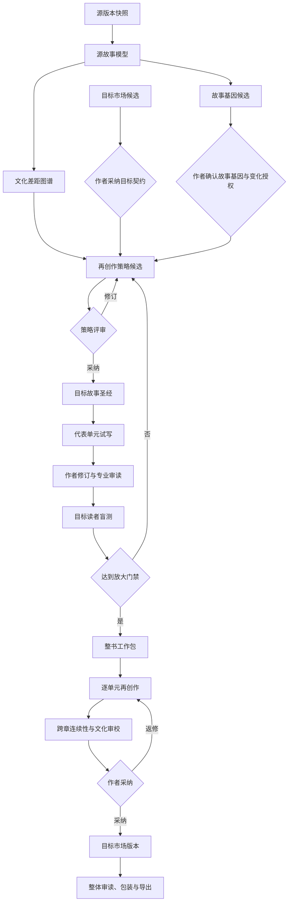

# 跨文化故事再创作产品与开发方案

| | |
|---|---|
| 状态 | 已批复，首个端到端产品闭环开发中 |
| 日期 | 2026-07-26 |
| 适用基线 | ScriptNow `v7-spec-v1.1` |
| 典型场景 | 将中文作者创作的小说再创作为目标欧美市场读者愿意阅读、能够理解且情感成立的作品 |
| 参考材料 | 团队 Skill 体系、传统世界观编辑手册、中英文小说转换规则指南 |
| 关联契约 | `01-PRD-V7.md`、`05-ADAPTIVE-SKILLS-CONTRACT.md`、`08-I18N-THEME-GOVERNANCE.md`、`10-NOVEL-GENRE-SKILL-QUALITY.md` |

> 本方案完全排除直译模式。这里讨论的不是“把中文翻成英文”，而是以原作为创作依据，
> 在目标文化、目标类型和目标发行环境中重新建立人物动机、社会因果、戏剧压力与阅读体验。

---

## 0. 结论先行

### 0.1 产品重新定义

用户面对的能力名称建议使用：

- 中文：**故事归化**
- 解释性名称：**跨文化故事再创作**
- 稳定业务键：`cross_cultural_recreation`
- 英文工作名：`Cross-cultural Story Recreation`

不建议继续使用“归化翻译”作为核心产品名。它会让用户和研发团队误以为：

1. 输入与输出应逐句对应；
2. 改写只是翻译后的润色；
3. 术语表和语言自然度是主要难题；
4. 现有翻译项目增加一个模式即可完成。

这些判断都不成立。故事归化的基本单位不是句子，而是**叙事功能**。它要保留的是原作的故事基因，
要重建的是目标社会中承载这些基因的制度、关系、行为、语言与类型机制。

### 0.2 核心公式

```text
故事归化
= 可追溯的源故事模型
+ 明确的目标市场契约
+ 经作者确认的故事基因
+ 目标文化中的因果与人物动机重建
+ 目标类型的阅读承诺
+ 目标语言原创写作
+ 目标读者验证
+ 全过程版本和变更治理
```

它不是：

```text
中文原稿 → 翻译 → 人名地名替换 → 欧美化润色
```

### 0.3 三项架构决策

1. **不依附 Translation 领域。** 不使用 `translation_mode` 区分，不调用
   `FaithfulTranslationService`，不以逐句对照或术语表作为主流程。
2. **媒介与工作流正交。** 小说仍是 Novel 作品；“原创、一般改编、跨文化再创作”是工作流目的，
   不能继续把 Translation 当作作品媒介。
3. **先小样验证，再整书扩展。** 系统先完成作品解构、目标市场契约和 2–3 个代表性单元的试写；
   未通过作者与目标读者验证，不允许自动展开整部作品。

建议新增稳定轴：

```text
artifact_medium:
  novel
  script

workflow_kind:
  original
  adaptation
  cross_cultural_recreation
```

本阶段只开发 Novel 的 `cross_cultural_recreation`。Script 保留产品入口规划，但不得复用 Novel 的
正文、StoryMap、Writer、审读和导出领域模块。

---

## 1. 圆桌讨论纪要

### 1.1 参会席位

本轮圆桌不把参考材料中的七个角色机械地当作七次模型调用，而将它们重组为三个决策席位：

| 席位 | 关注问题 | 吸收的专业能力 |
|---|---|---|
| 跨文化叙事与市场席 | 目标读者为什么会理解、相信并继续读 | 受众研究、类型研究、文化顾问 |
| 作者主权与产品席 | 哪些可以改、谁来决定、如何比较和撤销 | 文学分析、归化策略、编辑治理 |
| Agent 架构与质量席 | 如何稳定执行、控制上下文、量化提升 | 目标语创作、审校、Skills、RAG、评测 |

### 1.2 第一轮：问题到底是什么

**跨文化叙事与市场席：**

中文作品在海外失效，往往不是读者“不知道某个词”，而是读者缺少完成叙事推断所需的共同社会经验。
例如：

- 为什么人物不直接拒绝父母；
- 为什么“有编制”“学区房”“彩礼”“户口”“关系”能够改变命运；
- 为什么公开道歉、敬酒、称谓、座次或红包代表权力；
- 为什么人物嘴上否认、行动上服从，读者却应理解为爱、羞耻或忠诚；
- 为什么一种看似轻微的家庭评价足以成为终身创伤；
- 为什么人物依赖组织、亲族或熟人网络，而不是法律或个人协商。

这些是**文化脚本、制度约束、关系伦理和语用推断**，不是词汇问题。

**作者主权与产品席：**

不能把所有中国文化内容都视为障碍。作品的独特性可能恰好来自其中国经验。系统必须先判断每个元素的
叙事功能，再决定保留、解释、迁移还是重构。没有“叙事功能”这一层，所谓欧美化只能产生刻板、空洞的
元素替换。

**Agent 架构与质量席：**

如果输入只是原文和一句“改成美国故事”，模型会同时改变人物、制度、因果、节奏和语言，且无法说明
哪项变化造成质量提升或故事破坏。必须先生成结构化源故事模型与目标故事契约，再执行受约束的再创作。

**第一轮共识：**

> 产品要解决的是“跨文化叙事等效”，不是“跨语言文本对应”。

### 1.3 第二轮：“欧美读者”是否是有效目标

**跨文化叙事与市场席提出异议：**

“欧美用户”不是可以直接执行的受众标签。至少要拆分：

- 地区与语言变体；
- 年龄与内容分级；
- 发行平台和消费形态；
- 类型与子类型；
- 商业网文、类型出版或文学出版；
- 读者熟悉的叙事惯例；
- 读者对异域文化的期待程度。

同为英语市场，美国移动网文、英国类型出版、北美 YA、女性向 Romance、BookTok 驱动作品的接受契约
并不相同。系统不得从 `en-US` 自动推断故事背景，也不得把“美国背景”作为默认答案。

**产品席追问：**

用户未提供足够市场信息怎么办？

**圆桌结论：**

系统可以生成 2–3 个**目标市场假设候选**，说明每个候选的：

- 目标读者；
- 类型承诺；
- 背景保留程度；
- 预计变化范围；
- 商业机会；
- 创作风险；
- 需要用户确认的问题。

用户采纳后形成版本化 `TargetStoryContract`。不得静默代选。

### 1.4 第三轮：什么必须保留，什么可以重建

圆桌否决“表层/中层/深层归化就是逐级增加改写自由”的粗放模型。新的判断单位是：

| 层 | 要回答的问题 | 默认处理 |
|---|---|---|
| 故事基因 | 这部作品为何值得存在 | 作者确认后保护 |
| 叙事功能 | 某元素在人物、冲突和情绪中做了什么 | 保留功能，不承诺保留载体 |
| 社会因果 | 人物为何只能这样选择 | 在目标社会中重建 |
| 文化脚本 | 读者靠哪些共有知识理解潜台词 | 保留、解释或替换 |
| 类型机制 | 目标读者期待怎样获得快感与兑现 | 依据目标契约调整 |
| 表达实现 | 叙述声音、对白、节奏、意象 | 由目标语创作者重写 |

故事基因候选至少包括：

- 核心情感承诺；
- 主角创伤、欲望、需要与最终选择；
- 关键关系及其变化；
- 核心道德困境；
- 因果主干；
- 结局代价；
- 标志性意象或母题；
- 作者明确不可放弃的身份与文化特征。

### 1.5 第四轮：是否应该一次性重写全书

三席一致否决。

一次性整书重写会带来：

- 错误的目标市场假设被放大；
- 人物声音和文化规则逐章漂移；
- 作者直到高成本生成后才发现方向错误；
- 无法判断质量提升来自何种策略；
- 长上下文被摘要压缩后丢失关键因果；
- 大量 tokens 消耗在未验证的方向上。

圆桌采用“**试写实验室 → 放大生产**”：

1. 选择能够代表作品冲突、关系和文化门槛的 2–3 个单元；
2. 同一目标市场下生成差异明确的策略候选；
3. 作者比较并修订；
4. 目标读者或校准评审盲测；
5. 固化故事圣经、人物心理迁移和目标文体；
6. 达到门禁后才扩展整书。

### 1.6 第五轮：最大分歧与最终裁决

| 分歧 | 方案 A | 方案 B | 裁决 |
|---|---|---|---|
| 是否把中国背景换成欧美背景 | 默认替换 | 由叙事功能与市场契约决定 | 采用 B |
| 是否保存直译作为质量基线 | 保存逐句基线 | 保存源事实与故事模型 | 采用 B |
| 是否让七个角色固定串行 | 七次 Agent 调用 | 能力池动态调度 | 采用 B |
| 是否逐章生成后再整体审读 | 边写边补 | 先试写验证、再放大 | 采用后者 |
| 是否只让作者决定 | 作者独断 | 作者最终决定，系统提供证据与盲测 | 作者保留最终权 |
| 是否只评语言自然度 | 是 | 同时评故事、文化、类型、情绪与可追溯性 | 采用 B |

---

## 2. 产品目标与非目标

### 2.1 产品目标

1. 将中文小说的故事价值转化为目标市场中自然成立的原创阅读体验。
2. 让目标读者无需具备中国社会常识，也能正确理解人物欲望、风险、羞耻、权力和代价。
3. 保留作者确认的故事基因，不以“市场化”为由抹除作品的独特身份。
4. 让每项实质变化可解释、可比较、可编辑、可拒绝、可撤销。
5. 通过试写、盲测和版本化指标证明质量提升，而不是以“生成完成”代替验收。
6. 支持长篇作品的增量重构，并保证最新人工修订进入后续上下文。

### 2.2 非目标

- 不讨论或实现忠实翻译。
- 不要求输出与原文逐句对应。
- 不把中国人名、食物和地点替换成欧美元素视为完成归化。
- 不把美国当作英语市场默认背景。
- 不承诺存在一套适用于所有欧美市场的文化映射表。
- 不默认改变结局、核心关系、主角能动性或道德困境。
- 不自动开展整部作品再创作。
- 不让模型的泛化常识替代目标市场研究和真实读者反馈。
- 不复制目标作品的表达、角色或情节。
- 不把用户作品蒸馏为跨项目可见的通用 Skill。

---

## 3. 创建入口与向导

### 3.1 首屏入口

创建页第一步显示四个独立卡片：

1. 剧本；
2. 小说；
3. 翻译；
4. **故事归化**。

“故事归化”卡片文案：

> 以原作为创作依据，为目标市场重建人物动机、社会规则、情节压力与阅读体验。

选择后进入独立五步向导，不进入翻译工作台。

### 3.2 第一步：源作品

支持从项目库选择 Novel 或上传 DOCX、PDF、TXT。必须展示：

- 识别的源语言；
- 章节、字数和结构；
- 可解析比例；
- 图片、脚注、表格和扫描内容；
- 文件指纹与版本；
- 权利确认；
- 解析缺口。

源作品生成不可变 `SourceEditionSnapshot`。后续所有分析、候选和版本必须绑定该快照。

### 3.3 第二步：目标市场契约

必填：

- 目标语言变体；
- 目标国家或文化区域；
- 目标平台/出版形态；
- 目标年龄和内容分级；
- 目标类型与子类型；
- 目标读者；
- 期望保留的异域程度；
- 商业目标或文学目标。

可选：

- 对标作品；
- 发行渠道；
- 章节与阅读节奏偏好；
- 目标时代和地域；
- 禁止项；
- 现实题材研究范围。

信息不足时由 Agent 生成目标市场候选，不静默补全。

### 3.4 第三步：故事基因

系统从原作生成候选，用户逐项确认：

- 核心情感承诺；
- 主角人物弧线；
- 关键关系；
- 核心冲突与道德困境；
- 因果主干；
- 结局和代价；
- 标志性意象；
- 必须保留的文化身份；
- 允许合并、删除、替换或新增的边界。

用户可以锁定、修改或删除候选。锁定项形成 `StoryGenomeInvariant`。

### 3.5 第四步：变化授权

变化按领域授权，不使用模糊的“深度”滑杆：

- 背景时代与地域；
- 姓名与身份；
- 家庭结构；
- 教育、职业和阶层；
- 法律、医疗、金融和组织制度；
- 恋爱、婚姻、性与家庭边界；
- 宗教、种族与政治；
- 衣食住行；
- 幽默、隐喻和禁忌；
- 章节结构与信息顺序；
- 场景增删合并；
- 人物合并与新增；
- 结局。

每项可设：

```text
locked
proposal_required
adaptable
```

高风险领域即使设为 `adaptable`，仍需证据和人工确认。

### 3.6 第五步：试写计划

提交前展示：

- 推荐试写单元及理由；
- 将参与的 Agent 能力；
- 将使用的外部研究；
- 预计 tokens、点数和时长区间；
- 人工决策点；
- 质量指标；
- 取消、恢复和重试策略。

用户确认后创建项目，先进入“作品解构”，不直接生成正文。

---

## 4. 跨文化再创作模型

### 4.1 源作品不是文本堆，而是因果系统

`SourceStoryModel` 包含：

- 章节与事件；
- 人物及其欲望、创伤、需要、秘密和选择；
- 关系及变化；
- 冲突与压力来源；
- 时间线；
- 世界规则；
- 社会制度；
- 文化脚本；
- 母题和意象；
- Setup/Payoff；
- 情绪曲线；
- 类型承诺；
- 叙述声音；
- 事实、推断和解释的置信度。

所有条目锚定源快照。系统必须区分：

```text
explicit_fact
strong_inference
editorial_interpretation
```

### 4.2 文化差距图谱

`CulturalGapAtlas` 不罗列“中国元素”，而记录目标读者可能在哪一步错误理解：

```json
{
  "source_anchor": "chapter-3:block-18",
  "element": "父亲要求女儿辞职回家",
  "narrative_function": "建立家庭控制与主角独立冲突",
  "required_reader_knowledge": [
    "家庭义务优先于个人职业",
    "成年子女仍受父母重大影响"
  ],
  "target_reader_risk": "可能把主角的不反抗理解为软弱",
  "adaptation_options": [
    "保留中国背景并增加行为证据",
    "迁移为经济依赖和照护义务",
    "重建为宗教社区或家族企业压力"
  ],
  "protected_genome_refs": ["conflict-family-autonomy"],
  "risk": "high"
}
```

### 4.3 叙事功能等效

文化元素的处理方法不是固定替换，而是五种策略候选：

- `retain_and_dramatize`：保留并通过行动让读者理解；
- `contextualize_in_scene`：在场景中自然补足所需信息；
- `functional_equivalent`：使用目标文化中承担同一叙事功能的机制；
- `rebuild_causal_chain`：重建制度、关系和事件因果；
- `remove_and_redistribute`：删除载体，将叙事功能分配到其他场景。

任何策略都必须说明：

- 保留了什么功能；
- 改变了什么载体；
- 影响哪些人物、事件和后续伏笔；
- 是否触碰故事基因；
- 目标文化依据；
- 风险与置信度。

### 4.4 人物动机迁移

人物不能只换姓名和职业。每个主要人物生成 `CharacterMotivationMigration`：

| 字段 | 含义 |
|---|---|
| source_pressure | 原文化中迫使人物行动的压力 |
| reader_interpretation | 原目标读者自然形成的判断 |
| target_misread | 新读者可能产生的错误判断 |
| target_pressure | 目标社会中可信的等效压力 |
| behavior_changes | 因压力变化必须调整的行为 |
| relationship_effect | 对关系和权力的影响 |
| arc_invariant | 不可破坏的人物弧线 |
| validation | 目标读者是否按预期理解 |

### 4.5 目标故事圣经

`TargetStoryBible` 至少包括：

- 目标背景与时代；
- 家庭、法律、医疗、教育、职场和金融制度；
- 阶层与权力；
- 人物档案和命名；
- 关系边界；
- 地理与移动；
- 衣食住行；
- 宗教、种族、性别和身份处理；
- 类型规则；
- 目标语言声音；
- 禁止项；
- 已确认的文化等效；
- 未决问题和来源。

它是有版本、来源和影响范围的项目事实，不是一段超长 prompt。

---

## 5. 工作流



### 5.1 阶段 A：作品解构

产物：

- `SourceStoryModel`
- `StoryGenomeCandidate`
- `CulturalGapAtlas`
- `SourceVoiceProfile`
- `AnalysisGap`

阶段门禁：

- 核心人物和事件均有源锚点；
- 事实与推断分离；
- 主要因果链无断点；
- 低置信度问题可见；
- 作者确认故事基因。

### 5.2 阶段 B：目标市场与策略

产物：

- `TargetStoryContract`
- `TargetReaderPersona`
- `GenrePromise`
- `AdaptationStrategyCandidate[]`
- `CulturalEquivalenceMap`
- `RiskRegister`

策略候选必须具有实质差异，例如：

- 保留中国背景，降低理解门槛；
- 混合背景，迁移部分制度与关系；
- 重建目标社会背景，保留故事基因。

这些只是候选类型，不是写死的三个档位。Agent 可根据作品提出更合适的策略。

### 5.3 阶段 C：试写实验室

系统推荐 2–3 个代表单元：

- 开篇与类型承诺；
- 文化门槛最高的场景；
- 关键关系或情感转折；
- 高风险制度/身份场景；
- 结局兑现片段。

每个试写单元提供：

- 源场景功能摘要；
- 目标场景设计；
- 主要变化；
- 文化和市场依据；
- 只读流式候选；
- 校验后编辑器；
- 版本比较；
- 作者批注和采纳；
- 读者测试结果。

### 5.4 阶段 D：放大生产

试写通过后，将整书拆成依赖明确的 `RecreationWorkPackage`。每个单元读取：

1. 最新采纳的故事基因；
2. 目标市场契约；
3. 目标故事圣经；
4. 人物动机迁移；
5. 前文最新人工修订；
6. 后文约束和 Setup/Payoff；
7. 本单元文化差距与策略；
8. 目标语言声音；
9. 质量发现与未决问题。

生成中只读；结构校验后解锁编辑；人工保存形成独立修订；明确采纳后才进入目标正文。

### 5.5 阶段 E：整书审读

整书审读覆盖：

- 故事基因；
- 人物弧线和能动性；
- 因果与时间线；
- 关系变化；
- 文化可信度；
- 制度可信度；
- 类型承诺和兑现；
- 目标语原创感；
- 情绪曲线；
- Setup/Payoff；
- 刻板印象和敏感风险；
- 目标背景内部一致性；
- 未授权变化；
- 章节间文体漂移。

---

## 6. Agent 团队与 Skills

### 6.1 能力角色

| Role key | 用户名称 | 核心职责 |
|---|---|---|
| `source_story_analyst` | 原作解构师 | 故事基因、因果、人物、声音、文化脚本 |
| `target_market_strategist` | 目标市场策划 | 读者、平台、类型、分级和市场假设 |
| `cross_cultural_architect` | 跨文化故事建筑师 | 功能等效、社会因果和策略候选 |
| `character_psychology_adapter` | 人物心理适配师 | 动机、关系、能动性和弧线迁移 |
| `world_institution_editor` | 世界与制度编辑 | 法律、家庭、医疗、教育、职场和日常可信度 |
| `target_language_author` | 目标语主笔 | 按目标契约进行原创写作 |
| `genre_editor` | 类型编辑 | 类型承诺、节奏、钩子和兑现 |
| `continuity_editor` | 连续性编辑 | 跨章事实、因果、时间线和伏笔 |
| `cultural_risk_reviewer` | 文化风险审校 | 身份、刻板印象、高风险事实与伦理 |
| `reader_response_evaluator` | 读者反应评估师 | 盲测、困惑点、情绪和继续阅读意愿 |

角色是能力职责，不是固定十次调用。`WorkflowOrchestrator` 依据：

- 工作阶段；
- 变化授权；
- 内容风险；
- 置信度；
- 未决问题；
- 质量失败；
- 成本策略；

生成 `SkillPlan`。

### 6.2 Skill 分层

```text
platform skills
  source parsing / evidence / version / export

domain skills
  novel causality / character arc / POV / genre / continuity

cross-cultural skills
  cultural script detection
  narrative function equivalence
  motivation migration
  institution plausibility
  target reader simulation

market overlays
  locale + platform + genre + audience + rating

project overlays
  story genome + target contract + adopted decisions + human edits
```

### 6.3 Skill 质量要求

每个跨文化 Skill 必须声明：

- 适用语言、地区、类型和平台；
- 输入契约；
- 输出 schema；
- 证据要求；
- 失败条件；
- 反例；
- 版本和 digest；
- 评测集；
- 不适用范围；
- 是否允许调用外部工具；
- 高风险时的人工门禁。

不得用“西方读者喜欢……”这类无来源、无地域、无类型限定的宽泛规则作为 Skill。

---

## 7. 数据与领域架构

### 7.1 领域边界

建议新增：

```text
scriptnow/novel/cross_cultural_recreation/
  application/
  domain/
  ports/
  infrastructure/
  api/
```

可共享 platform：

- 文件存储；
- Provider/Model；
- Agent Runtime；
- Run/Event；
- 计量；
- 权限；
- 版本基础设施；
- MCP 工具治理。

可通过端口读取 Novel：

- 源章节；
- 已采纳正文；
- StoryMap；
- 故事图谱；
- 上传素材。

不得直接复用：

- `FaithfulTranslationService`；
- 翻译章节状态机；
- 翻译术语表作为核心语义；
- 逐句对照模型；
- 译文历史；
- Translation 项目导航。

### 7.2 核心聚合

- `RecreationProjectProfile`
- `SourceEditionSnapshot`
- `SourceStoryModel`
- `StoryGenome`
- `TargetStoryContract`
- `CulturalGapAtlas`
- `AdaptationStrategy`
- `TargetStoryBible`
- `CharacterMotivationMigration`
- `RecreationPilot`
- `RecreationWorkPackage`
- `RecreationUnit`
- `RecreationRevision`
- `ChangeProposal`
- `ReaderTest`
- `QualityReport`
- `ReleaseEdition`

### 7.3 版本原则

- 源快照不可变；
- 策略、圣经、故事基因和目标契约均版本化；
- 每个正文修订绑定生成时使用的所有版本；
- 人工修订永不被自动覆盖；
- 未采纳候选不进入后续上下文；
- 上游变化生成影响列表，不静默批量重写；
- 恢复历史版本时同时恢复其依赖版本；
- 任何目标正文均可追溯到源故事模型和作者决策。

---

## 8. 前端信息架构

### 8.1 独立工作台

导航：

```text
归化概览
原作解构
目标市场
故事基因
文化差距
策略工坊
试写实验室
目标故事圣经
整书再创作
质量与读者测试
版本与导出
```

### 8.2 归化概览

展示：

- 当前源版本；
- 目标市场契约；
- 已确认故事基因；
- 变化授权；
- 当前阶段；
- 试写状态；
- 已采纳策略；
- 风险和未决问题；
- tokens、成本和人工返工；
- 下一项需要作者判断的事项。

不展示 Provider、模型名、内部事件码等无助创作的技术信息。

### 8.3 文化差距图

提供四种视图：

- 按章节；
- 按人物；
- 按社会制度；
- 按风险。

每个差距卡回答：

1. 目标读者可能误解什么；
2. 该元素承担什么叙事功能；
3. 有哪些重建方案；
4. 会影响哪里；
5. 谁确认。

### 8.4 策略工坊

候选不是“方案一、方案二、方案三”的空标签。每个候选必须展示：

- 一句话方向；
- 目标读者；
- 背景策略；
- 人物动机迁移；
- 类型承诺；
- 代表场景变化；
- 保留与牺牲；
- 风险；
- 预计工作量；
- 试写预览。

支持：

- 对比；
- 局部组合；
- 反馈修订；
- 生成新版；
- 明确采纳；
- 查看过期版本。

### 8.5 试写与正文编辑器

- 左侧：章节/场景与状态；
- 中部：目标正文编辑器；
- 右侧：源功能摘要、故事基因、文化策略、连续性约束；
- 底部：创作搭档，默认折叠；
- 生成中：流式只读预览；
- 校验后：Gutenberg 风格块编辑；
- 保存：独立人工修订版本；
- 采纳：成为目标正文；
- 比较：任意两个版本的语义和文本差异。

---

## 9. 上下文、RAG、图谱与记忆

### 9.1 上下文优先级

```text
项目变化授权
> 故事基因
> 目标市场契约
> 最新采纳策略
> 目标故事圣经
> 最新人工修订
> 当前单元约束
> 前后文连续性
> 原作证据
> 项目 Overlay Skill
> 通用 Skill
```

### 9.2 多轮检索

复杂单元使用有界 RAG loop：

1. 检索当前单元源证据；
2. 检索人物和关系历史；
3. 检索 Setup/Payoff 与后文约束；
4. 检索已确认文化等效；
5. 检索目标制度和现实证据；
6. 识别冲突和缺口；
7. 仅对缺口追加检索；
8. 达到上限或超时后显式停止。

循环上限、超时和预算来自项目/租户策略，不写死在代码中。

### 9.3 图谱

共享概念模型但不共享 Novel 领域实现：

- 人物；
- 事件；
- 地点；
- 组织；
- 关系；
- 世界规则；
- Setup/Payoff；
- 社会制度；
- 文化脚本；
- 故事基因；
- 目标等效；
- 变化影响。

未知旧值读取时兼容映射为“其他”，不能让单条异常导致整图失败。写入时强制规范化，
历史值通过 migration 迁移。

### 9.4 记忆

长期记忆只保存：

- 作者明确决策；
- 已采纳策略；
- 已确认目标世界事实；
- 人物声音；
- 人工修订偏好；
- 已确认质量纠偏；
- 未决问题。

模型临时推断、未采纳候选和私有思维链不得进入长期记忆。

---

## 10. 质量体系

### 10.1 十二项质量锚点

| 锚点 | 核心问题 |
|---|---|
| 故事基因完整 | 核心情感、人物弧线、关系、困境和代价是否仍成立 |
| 人物动机可信 | 目标社会中的压力是否足以驱动人物行为 |
| 人物能动性 | 改写是否保留人物的选择和责任 |
| 社会因果可信 | 制度、家庭、阶层和组织是否真实影响剧情 |
| 文化可理解 | 目标读者能否正确完成叙事推断 |
| 文化可信 | 日常、礼仪、身份与制度是否自然且无拼贴感 |
| 类型承诺 | 是否满足目标类型的核心期待 |
| 叙事动能 | 开篇、冲突升级、转折和章末动力是否有效 |
| 情绪等效 | 目标读者是否在关键节点产生预期情绪 |
| 目标语原创感 | 是否像目标市场作者写作，而非翻译或 AI 改写 |
| 连续性 | 事实、时间线、关系、声音和伏笔是否一致 |
| 变化可审计 | 实质变化是否有功能、理由、证据和决策 |

### 10.2 评价证据

质量报告使用四类证据：

1. 契约校验：故事基因、版本、锚点、授权；
2. Agent 审读：按锚点评估并引用文本；
3. 人工专业审读：目标语编辑、类型编辑、文化顾问；
4. 目标读者盲测：不告知版本来源，记录真实反应。

模型评审不能单独作为上线依据。

### 10.3 读者测试指标

- 开篇继续阅读意愿；
- 章节完成率；
- 人物动机理解正确率；
- 文化困惑点；
- 不自然表达率；
- 关键情绪命中；
- 关键事件回忆；
- 类型满足度；
- 角色喜爱/厌恶是否符合预期；
- 结局接受度；
- “像翻译/像 AI”主观判断；
- 与对照候选的盲选偏好。

### 10.4 工程与商业指标

- 每采纳千词 tokens/成本；
- 首次候选采纳率；
- 人工编辑比例；
- 策略返工次数；
- 上游变化影响单元数；
- 未授权变化数；
- 故事基因破坏数；
- 文化事实错误数；
- 跨章连续性缺陷；
- 从试写到整书的放大通过率。

### 10.5 放大门禁

试写进入整书生产前必须满足项目配置的阈值：

- 故事基因破坏为 `0`；
- 未授权结构变化为 `0`；
- 目标读者对人物动机无阻断级误解；
- 目标语原创感达到准入；
- 类型承诺达到准入；
- 高风险文化问题已处理；
- 作者采纳目标故事圣经和人物迁移；
- 试写策略相较基线候选有可解释提升。

阈值由版本化评测套件、租户策略和项目配置提供，不写死在业务代码中。

---

## 11. 风险治理

### 11.1 高风险领域

- 种族、族裔与原住民；
- 宗教与神圣符号；
- 奴役、殖民与历史创伤；
- 性别、性取向与身份；
- 未成年人；
- 医疗、法律和金融；
- 政治制度与现实人物；
- 家暴、性暴力、自杀和心理疾病；
- 移民、阶层和贫困。

高风险内容必须：

- 使用有来源的现实研究；
- 显示来源地域和日期；
- 标注不确定性；
- 由文化风险审校；
- 需要人工采纳；
- 保存影响记录。

### 11.2 权利与原创性

- 用户确认拥有改写权；
- 目标版本是派生作品，保留源权利链；
- 对标作品只抽取机制和读者预期；
- 禁止复刻可识别表达、角色组合和情节序列；
- 导出包含源版本、策略版本和权利声明；
- 用户素材不得进入全局 Skill；
- 跨项目学习必须去作品化、匿名化并经许可。

### 11.3 失败模式

系统必须显式检测：

- 美国化等于现代化；
- 人名地名替换但社会逻辑未变；
- 为追求节奏删除人物动机；
- 把集体主义角色改成不可信的个人主义宣言；
- 把文化冲突写成刻板印象；
- 目标制度不可能支撑原情节；
- 类型套路压倒作品独特性；
- 人物身份变化却未重建关系和权力；
- 章节分别精彩但整书因果断裂；
- 英文自然但情感承诺失效；
- 过度解释导致叙事停顿；
- 以“市场偏好”为名进行无证据改写。

---

## 12. 成本与性能

低成本模型可用于：

- 章节和实体候选抽取；
- 重复与格式检查；
- 源锚点匹配；
- 低风险事实一致性；
- 已确认词表和命名检查；
- 图谱增量更新。

高能力模型用于：

- 故事基因；
- 文化脚本；
- 人物动机迁移；
- 社会因果重建；
- 策略候选；
- 目标语原创写作；
- 整书审读；
- 高风险文化审校。

所有模型选择来自角色/阶段/风险/租户模型池和项目策略，不在代码中写模型名。

### 12.1 预算治理契约

成本预算与运行安全是两套独立机制：

- **成本预算**用于预留、计量、比较、软告警和策略优化，默认不得中断创作；
- **运行安全**使用可配置的循环上限、单次运行超时和人工取消，防止失控调用；
- 预算模式、阶段预留量和计算参数来自系统设置、租户策略或项目策略，不按开发/生产环境隐式切换；
- 每次运行记录预留 Tokens、实际输入/输出 Tokens、偏差、利用率、价格快照和估算成本；
- 实际消耗超过预留时，默认状态为“软超额”：继续完成当前核心产物并完整落账；
- 只有管理员显式启用强制模式时，配额规则才可以拒绝新的运行；不得在运行中截断正文；
- 优化策略只能调整后续运行的模型路由、检索范围、缓存命中与非关键审读轮次，不得以残缺产物伪装成功。

预算合理区间不是写死的统一阈值。系统以同一角色、阶段、媒介、任务规模和模型的历史分布形成可比较基线；样本不足时只展示预留与实际，不给出误导性的“高效/低效”判断。

增量策略：

- 内容指纹缓存；
- 只重跑受影响单元；
- 上游变化先显示影响列表；
- 试写未通过不扩展；
- 研究证据设置有效期；
- 章节审读与整书审读分离；
- 长篇按情节弧工作包组织，不把全书塞入单次上下文。

---

## 13. API 草案

```text
POST   /api/cross-cultural-recreations
GET    /api/cross-cultural-recreations/{id}

POST   /api/cross-cultural-recreations/{id}/analyze-source
GET    /api/cross-cultural-recreations/{id}/source-story-model
GET    /api/cross-cultural-recreations/{id}/cultural-gaps

POST   /api/cross-cultural-recreations/{id}/target-contract/candidates
POST   /api/cross-cultural-recreations/{id}/target-contract/adopt
POST   /api/cross-cultural-recreations/{id}/story-genome/adopt
POST   /api/cross-cultural-recreations/{id}/change-policy

POST   /api/cross-cultural-recreations/{id}/strategies
POST   /api/cross-cultural-recreations/{id}/strategies/{version}/revise
POST   /api/cross-cultural-recreations/{id}/strategies/{version}/adopt

POST   /api/cross-cultural-recreations/{id}/pilots
GET    /api/cross-cultural-recreations/{id}/pilots/{pilot_id}/stream
POST   /api/cross-cultural-recreations/{id}/pilots/{pilot_id}/revisions
POST   /api/cross-cultural-recreations/{id}/pilots/{pilot_id}/adopt
POST   /api/cross-cultural-recreations/{id}/pilots/{pilot_id}/reader-tests

POST   /api/cross-cultural-recreations/{id}/scale
POST   /api/cross-cultural-recreations/{id}/units/{unit_id}/generate
POST   /api/cross-cultural-recreations/{id}/units/{unit_id}/revisions
POST   /api/cross-cultural-recreations/{id}/units/{unit_id}/adopt

GET    /api/cross-cultural-recreations/{id}/versions
POST   /api/cross-cultural-recreations/{id}/versions/{version}/restore
POST   /api/cross-cultural-recreations/{id}/quality-reports
POST   /api/cross-cultural-recreations/{id}/exports
```

所有运行端点支持：

- 幂等键；
- 取消；
- 超时；
- 恢复点；
- 结构化错误；
- Run/Event；
- 计量；
- 版本绑定；
- 权限校验。

---

## 14. 分期开发

### 14.0 当前实现基线（2026-07-26）

首个可运行闭环已经落入独立的 Novel `cross_cultural_recreation` 领域：

1. 创建独立故事归化项目，并保存源语言、目标语言、目标市场、目标读者和发行语境；
2. 生成并明确采纳 `SourceStoryModel`；
3. 由作者填写并版本化确认 `TargetStoryContract`；
4. 生成三套可解释策略候选，明确采纳后才进入后续上下文；
5. 生成代表性试写候选，确认试写后才能生成整书蓝图；
6. 整书蓝图中的工作包数量、顺序、依赖和验收条件来自结构化 Agent 产物，不在代码中写死；
7. 每个工作包可反复生成版本，只有人工确认的版本进入后续工作包上下文；
8. 全部工作包确认后，按已确认蓝图顺序合并并下载目标语稿。

当前后端状态机覆盖：

```text
source_pending
→ source_analyzed
→ target_confirmed
→ strategy_ready
→ strategy_adopted
→ pilot_ready
→ pilot_adopted
→ scale_plan_ready
→ scale_plan_adopted
→ production_in_progress
→ production_complete
```

候选、采纳、替代和幂等均持久化。生成失败会保留明确错误，不以旧候选或非结构化文本冒充成功。
Token 与成本继续由统一 Run/Event 计量链路记录，但不作为本闭环的阻断条件。

### P0：领域契约与 tracer bullet

产物：

- ADR：故事归化独立于 Translation；
- `artifact_medium` / `workflow_kind` 正交契约；
- 创建页第四入口和五步向导；
- 源快照、故事模型、故事基因和目标契约；
- 一章从源证据到试写候选的 tracer bullet；
- TextBlock/ThinkingBlock/Tool 事件正确分离；
- 版本、事件、tokens 和成本证据。

退出门槛：

- 不调用忠实翻译服务；
- 不覆盖源项目；
- 故事基因可阻断破坏；
- 候选可人工编辑、保存修订并明确采纳；
- 错误可恢复，不以旧结果冒充成功。

### P1：作品解构与策略工坊

产物：

- SourceStoryModel；
- CulturalGapAtlas；
- 目标市场候选；
- 故事基因和变化授权；
- 策略候选、文化等效和目标故事圣经；
- 图谱影响分析；
- 策略工坊 UI。

退出门槛：

- 每项策略可回到源叙事功能；
- 事实、推断和编辑判断分离；
- 未采纳内容不进入后续上下文；
- 高风险事实有来源；
- 目标市场不是由语言自动推断。

### P2：试写实验室

产物：

- 代表单元推荐；
- 多策略试写；
- 流式只读候选；
- Gutenberg 风格编辑；
- 人工修订和版本比较；
- 专业审读；
- 目标读者测试；
- 放大门禁。

退出门槛：

- 至少一个策略通过作者和目标读者验证；
- 人物动机、文化理解和类型承诺达到准入；
- 质量提升可解释；
- 试写失败不会创建整书任务。

### P3：长篇放大与连续性

产物：

- 情节弧工作包；
- 逐章再创作；
- 最新人工修订上下文；
- 目标故事圣经增量更新；
- 上游变化影响与批量纠偏；
- 连续性、时间线和 Setup/Payoff 审读；
- 历史版本和恢复。

退出门槛：

- 后续章节读取最新采纳与人工修订；
- 单章失败不污染其他章节；
- 上游变化不静默覆盖正文；
- 长篇因果、人物声音和文化规则无阻断漂移。

### P4：质量、包装与 Release Candidate

产物：

- 十二锚点评测套件；
- 人工与读者盲测；
- 成本、返工和质量仪表盘；
- 作品包装；
- 读者版、编辑版和审计包；
- 全量 i18n、主题、权限、删除和恢复；
- 运维与失败处理手册。

退出门槛：

- `make test && make lint && make build` 通过；
- 完成至少一部长篇 Novel 的全流程验证；
- 导出、版本、恢复和审计均可验证；
- 没有 P0/P1 数据、安全和权利问题。

---

## 15. 测试与验收

### 15.1 后端

- workflow 与 medium 正交；
- 源快照不可变；
- 故事基因和变化授权；
- 候选采纳、过期和影响；
- 人工修订优先级；
- 未知旧值兼容；
- AgentScope block 与工具事件；
- RAG loop 上限、超时和恢复；
- 工具证据来源与过期；
- 幂等、取消、计量和并发；
- 结构化输出缺失时明确失败；
- 未采纳候选不进入上下文；
- 忠实翻译服务未被调用。

### 15.2 前端

- 四个入口独立；
- 五步向导；
- 日/夜和中/英 UI；
- 目标市场候选与明确采纳；
- 故事基因锁定和变化授权；
- 差距图、策略对比和试写；
- 生成中只读、校验后编辑；
- 保存修订与明确采纳；
- 窄屏不压缩成竖条；
- Dock 默认折叠、不重复事件；
- 错误、取消、恢复和版本；
- UI 语言不改变作品内容语言。

### 15.3 对抗样本

- 中国家庭伦理被错误改成个人软弱；
- 中国制度元素只换英文名；
- 目标地区制度无法支撑情节；
- 背景迁移后人物动机消失；
- 过度市场化破坏结局；
- 文化身份被无授权抹除；
- 少数族裔和宗教刻板化；
- 类型钩子增强但人物因果断裂；
- 语言自然但故事基因失效；
- 单章优化导致后文伏笔丢失；
- 读者喜欢但作者保护项被破坏；
- 模型评审通过但真人读者误解。

### 15.4 全链路

```text
选择源作品
→ 建立源快照
→ 生成源故事模型
→ 确认故事基因
→ 采纳目标市场契约
→ 确认变化授权
→ 比较策略候选
→ 采纳策略
→ 建立目标故事圣经
→ 完成代表单元试写
→ 人工修订
→ 专业审读
→ 目标读者盲测
→ 通过放大门禁
→ 逐章再创作
→ 整书审读
→ 包装与导出
→ 恢复历史版本
```

---

## 16. 首个验证样本

首个 tracer bullet 不使用整部长篇：

- 一部强依赖中国社会语境的中文小说；
- 选取 3 个代表单元，共约 6,000–12,000 中文字；
- 目标为一个明确的英语地区、平台、年龄与类型组合；
- 至少包含家庭权力、职业/制度、关系语用、日常生活和文化隐喻；
- 作者确认 8–15 个故事基因；
- 生成至少两个具有实质差异的策略；
- 由目标语类型编辑提供专业评审；
- 由 5–10 名符合目标画像的读者进行盲测；
- 记录每个版本的理解、情绪、继续阅读、编辑量、tokens 和成本。

只有当试写证明：

1. 目标读者更容易正确理解人物和冲突；
2. 故事基因未被破坏；
3. 目标语言具有原创感；
4. 类型承诺更清晰；
5. 作者认可变化；
6. 质量收益足以覆盖成本；

才进入整书放大。

---

## 17. 研发前批复清单

- [ ] 产品名称使用“故事归化/跨文化故事再创作”，不以翻译模式呈现；
- [ ] 创建页新增独立第四入口；
- [ ] `artifact_medium` 与 `workflow_kind` 正交；
- [ ] 领域不依赖 Translation 服务与状态机；
- [ ] 第一阶段只支持 Novel；
- [ ] 目标市场必须明确到地区、平台、类型和读者；
- [ ] 故事基因由作者确认；
- [ ] 变化授权按领域控制；
- [ ] 文化处理以叙事功能为单位；
- [ ] 人物动机和社会因果必须迁移；
- [ ] 七类参考角色重组为动态能力池；
- [ ] 先试写、盲测，再整书放大；
- [ ] 十二项质量锚点；
- [ ] 高风险文化内容需要来源和人工审校；
- [ ] 人工修订进入后续上下文；
- [ ] 所有实质变化可追溯、可撤销；
- [ ] 阈值、预算、模型和循环上限均来自配置；
- [ ] 首个验证样本、目标市场和读者招募方式。

---

## 18. 传统人工工作流吸收评审

本节审查两份传统工作材料：

- 《归化翻译编辑工作手册（世界观设定版）》；
- 《中英文小说翻译规则指南》。

它们是人工编辑经验与历史作业方式的证据，不是可以直接导入系统的产品契约。吸收原则是：

1. 保留能稳定提高叙事一致性、编辑可控性和目标语质量的机制；
2. 将依赖项目、类型、年代和目标地区的知识转为有来源、可修订的候选；
3. 拒绝没有上下文的一对一文化替换；
4. 与直译有关的规则不得进入故事归化主流程；
5. 示例中的具体数值、章节周期和映射均不得硬编码。

### 18.1 传统手册中应继承的机制

| 传统机制 | 处理决定 | ScriptNow 产品化方式 |
|---|---|---|
| 先建立世界规则，再处理正文 | 继承并升级 | 形成版本化 `TargetStoryBible`，保存制度、生活、空间、时间、技术、关系和文化脚本 |
| 按世界观领域分册管理 | 继承 | 使用稳定领域键和国际化显示名；领域可按项目启用，不盲目扩类 |
| 翻译过程中持续补充规则 | 继承并加治理 | Agent 只能提交规则候选；确认后进入有效版本并影响后续单元 |
| 人名、地名、组织名称对照表 | 继承但改变定位 | 从“词语替换表”升级为实体身份、命名理由、社会位置和叙事功能记录 |
| 问题记录表 | 继承 | 建立 `AdaptationIssue`，关联单元、规则、证据、严重度、决定与修复版本 |
| 定期阶段复盘 | 继承但不写死周期 | 在项目设置中配置按章、按卷、按情节弧或人工触发复盘 |
| 名称与术语一致性 | 继承 | 作为目标故事圣经和目标语审校规则，不作为故事正确性的唯一依据 |
| 句法、时态、语态、语域与文体检查 | 继承 | 进入目标语言 Writer/Reviewer Skills 和可解释 lint，不进入文化策略决策 |
| 文化不可译性识别 | 继承并扩展 | 形成文化差距候选，要求说明读者误读风险、叙事功能与处理选项 |
| 忠实度与可读性权衡 | 改写为故事基因与接受度权衡 | 由作者确认的故事基因、变化授权和目标读者测试共同裁决 |

传统手册提出的“完成设定—执行—持续补充—阶段复盘”是可继承的骨架。但在系统中，任何新增规则都必须
经过候选、影响分析、人工确认和版本生效，不能让 Agent 在写作时静默修改全书规则。

### 18.2 明确禁止产品化的固定映射

以下做法可以作为对抗测试样本，不能成为自动 Skill 或默认候选：

- 北京固定替换为华盛顿或纽约；
- 春节固定替换为圣诞节；
- 元宵节固定替换为万圣节；
- 中国机构和职务直接套用美国同名机构；
- 面馆固定替换为 diner；
- 牛肉面固定替换为 burger and fries；
- 豆浆固定替换为 coffee；
- 饺子固定替换为 ravioli；
- 人民币按一个静态汇率换算美元；
- 通过英文常见姓氏排行榜自动改角色名；
- 默认认为“西方叙事必然线性、中国叙事必然缓慢”；
- 默认增加内心独白、减少插叙或改变结局。

这些替换的问题不只是“不够准确”，而是会同时破坏：

1. 场景的社会阶层与生活质感；
2. 角色行动的成本和可行性；
3. 仪式在家庭、社区或制度中的功能；
4. 食物、空间和机构携带的情绪记忆；
5. 故事所处年代与地区的真实性；
6. 原作故事基因与作者授权边界。

系统遇到这类候选时，应要求回答：

```text
源元素在当前情节中完成什么叙事功能？
目标读者可能在哪一步产生错误推断？
目标社会中什么机制能产生等价的行动压力和情绪结果？
替代会改变哪些人物、事件、伏笔和后续因果？
作者是否授权这种变化？
依据来自哪里，适用到哪个地区、年代、类型和平台？
```

回答不完整时，不允许将候选写入目标故事圣经。

### 18.3 规则资产五级分类

传统材料中的每条经验在入库前必须被分类，避免把案例误当契约：

| 级别 | 定义 | 示例 | 是否自动生效 |
|---|---|---|---|
| 产品契约 | 跨项目稳定不变的流程和治理原则 | 版本追溯、作者确认、影响分析 | 是 |
| 项目规则 | 只对当前作品和目标契约有效 | 目标城市制度、角色命名体系 | 确认后 |
| Skill 策略 | 特定媒介、类型、地区或任务的方法 | 英语狼人言情的关系节奏审读 | 调度后执行 |
| Validator 规则 | 可检测、可解释、可豁免的质量规则 | POV 漂移、时态漂移、名称不一致 | 报告，不静默改写 |
| 研究材料/反例 | 尚未验证或已知危险的经验 | 节日、食物、城市固定映射 | 否 |

每条可执行规则至少包含：

```yaml
rule_key:
display_name:
rule_class:
scope:
  artifact_medium:
  workflow_kind:
  target_locale:
  target_region:
  genre:
  platform:
  effective_units:
source:
rationale:
confidence:
status: proposed | confirmed | deprecated | rejected
version:
supersedes:
approved_by:
```

### 18.4 目标故事圣经的领域模型

传统手册的二十余类表格应收敛为对作者和 Agent 都有意义的七个领域：

| 领域 | 要解决的问题 |
|---|---|
| 社会与制度 | 权力、法律、职业、教育、医疗、家庭和公共机构如何实际运行 |
| 人物与关系 | 身份、称谓、边界、依恋、冲突和关系变化如何被目标读者理解 |
| 空间与生活 | 地理、住宅、交通、饮食、消费、物质环境如何约束行动 |
| 时间与仪式 | 年代、日历、节庆、葬礼、婚恋和人生阶段如何组织事件 |
| 语言与命名 | 名称、称谓、语域、口语、方言、隐喻和文体如何保持一致 |
| 类型与叙事 | 钩子、节奏、信息差、情绪曲线和结局承诺如何满足目标类型 |
| 风险与保护 | 敏感文化、作者保护项、法律风险和不可逆变化如何治理 |

货币、单位、食物和组织不再各自无限扩张为顶层类别，而作为“空间与生活”或“社会与制度”中的结构化规则。
只有当某类信息对 Agent 创作不可或缺、对编辑理解有益并得到领域共识时，才允许提升为稳定类别。

### 18.5 动态更新与纠偏闭环

```text
正文或审读发现新问题
→ Agent 提交规则候选和来源
→ 系统计算受影响人物、事件、单元与伏笔
→ 作者/编辑比较旧规则与候选规则
→ 确认、拒绝或限定作用范围
→ 生成新的目标故事圣经版本
→ 仅对指定单元重写或重新审校
→ 连续性、故事基因和目标读者理解复验
→ 保留旧版本与决定记录
```

纠偏必须支持：

- 修改固定译名或文化规则后查看影响范围；
- 选择“仅后续生效”“回溯指定单元”“全书重审”；
- 冲突规则并存时显示优先级和适用范围；
- 将误用频繁的候选降级或废弃；
- 从人工修订中提出经验，但不得自动提升为全局 Skill；
- 撤销某次规则变更并恢复依赖它的单元版本；
- 记录规则对质量锚点和读者测试的真实影响。

当前后端治理契约（2026-07-29）：

- 源作品分析按结构、人物、因果、文化和保护项五层检索并保存 Retrieval Manifest；
- 归化策略与整书方案分别保存自己的 Retrieval Manifest，不复用一份模糊的“全书上下文”；
- 文化映射集和保护项冲突决策分别版本化，保存前一版本引用与证据引用；
- 新确认版本会自动进入后续策略、整书方案和逐包生产的确定性上下文；
- 映射触及保护项时必须先完成人工冲突决策，未授权变更拒绝确认；
- 治理版本更新不推进或回退主创作阶段，避免“改术语/映射后项目退回上一阶段”。

这里的“增量更新”指最新版治理事实进入后续 ContextPack，并由 Retrieval Manifest 固化
实际使用版本；源文件和源素材索引不被覆盖。叙事图谱投影属于可重建派生视图，不能反向
成为保护项或文化映射的事实源。

### 18.6 对 Agent 团队与 Skills 的补充

传统人工角色不应机械复制为固定 Agent 数量，应转为可组合能力：

| 能力 | 输入 | 输出 | 核心限制 |
|---|---|---|---|
| 世界规则编辑 | 源故事模型、目标契约、证据 | 规则候选与冲突报告 | 不直接写正文 |
| 文化功能分析 | 源单元、文化差距 | 叙事功能和读者误读路径 | 不提供无证据固定替换 |
| 目标生活研究 | 地区、年代、阶层、职业 | 有来源的生活与制度约束 | 标记时效和适用范围 |
| 目标语小说创作 | 已确认策略、故事圣经、当前单元 | 原创目标语候选稿 | 不读取被拒绝规则 |
| 文体与语言审校 | 目标语候选、风格契约 | 句法、时态、语域、POV 报告 | 不擅自重构情节 |
| 连续性审读 | 全书事实、规则版本、伏笔 | 冲突和影响报告 | 不以单章局部最优覆盖整书 |
| 文化与敏感性审读 | 候选稿、目标读者、风险规则 | 风险证据和修订建议 | 高风险结论必须人工复核 |

《中英文小说翻译规则指南》中的句式重组、主语明确、时态语态、语域、情感色彩和文体一致性，
可拆成目标语写作与审校 Skill 的候选检查项。其名称音译、脚注、逐句忠实和源文解释策略属于传统翻译，
不进入本工作流。

### 18.7 新增验收要求

- [ ] 传统材料的每条规则均有分类，不允许整份文档直接作为系统提示词；
- [ ] 固定城市、节日、食物、制度和汇率映射进入对抗测试；
- [ ] 世界规则候选具有来源、范围、状态和版本；
- [ ] 规则确认前不影响正文生成；
- [ ] 规则修改能够生成影响清单；
- [ ] 支持局部回溯、仅后续生效和全书重审；
- [ ] 语言 lint 与文化策略分离；
- [ ] 传统直译规则不进入故事归化上下文；
- [ ] 阶段复盘周期来自项目配置或人工触发；
- [ ] 目标故事圣经的七个领域有稳定业务键和国际化显示名；
- [ ] 被拒绝规则不会被后续 Agent 重新召回；
- [ ] 质量变化能回溯到规则版本、正文版本和真实读者证据。

---

## 19. 外部依据

本方案采用以下原则作为外部校验，而不是照搬行业术语：

- 国际译联指出，面向目标文化的内容存在从源导向到目标导向的连续谱，选择位置并非简单决定；
  这支持“目标契约必须显式化”，但本产品进一步把任务定义为故事再创作，而非传统翻译。
- 系统性文献回顾通常把 transcreation 描述为语言转换、文化适配与创造性重释的组合，同时指出
  该概念没有完全统一的定义；这正是产品不能只保存一个模糊 `transcreation=true` 的原因。
- 跨文化文学理解研究指出，读者会用自身世界知识和文化概念填补文本空白；因此本方案将
  “目标读者会如何完成叙事推断”设为文化差距图的核心。
- 读者反应实证研究显示，不同文化群体对同一文学文本的情绪和理解可能显著不同；因此质量验收必须
  包含真实目标读者盲测，不能只依赖模型或双语编辑。

参考：

- International Federation of Translators, *Translation, Localisation & Transcreation*:
  https://library.fit-ift.org/public/Publications/positionpapers/PDP_202201_Translation_Localisation_Transcreation_EN.pdf
- Díaz-Millón & Olvera-Lobo, *Towards a definition of transcreation: a systematic literature review*:
  https://doi.org/10.1080/0907676X.2021.2004177
- Zhang Yehong, *Cross-cultural Literary Comprehension: Theoretical Basis and Empirical Research*:
  https://doi.org/10.1515/ifdck-2022-0005
- Chesnokova et al., *Cross-cultural reader response to original and translated poetry*:
  https://doi.org/10.5325/complitstudies.54.4.0824
