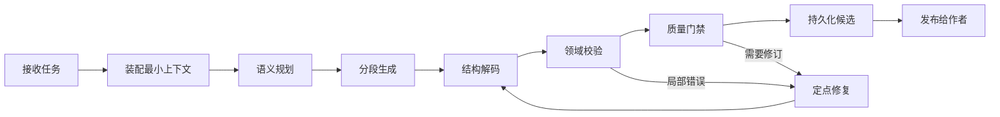

# ScriptNow 创作流畅性、效率与质量技术审查

- Version: 1.0
- Date: 2026-07-28
- Status: Proposed implementation baseline
- Scope: Novel、Script、忠实翻译、故事归化
- Related: `01-PRD-V7.md`、`03-DEVELOPMENT-PLAN.md`、`04-DOMAIN-CONTRACTS.md`、`12-CHAPTER-PIPELINE.md`

## 1. 审查结论

当前最严重的问题不是某一个页面、Prompt 或 Provider，而是系统把一次长时间、易漂移的模型调用误当成完整创作流程。其后果是：

1. 用户必须等待整个调用、解析、修复和校验结束后，才知道这一轮是否可用；
2. “模型返回成功”与“领域产物可用”混为一谈，运行状态和界面反馈失真；
3. 大型 JSON 一次生成、整体修复、整体重试，放大延迟、Token 成本和契约失败概率；
4. 小说、剧本、翻译与故事归化各自重复实现运行和恢复逻辑，体验不一致；
5. Agent 被用于确定性编排、标识生成、格式转换等不需要创造力的工作；
6. 上下文反复整包传输，缺少按版本、变化范围和任务目标组织的最小上下文；
7. 质量问题在昂贵生成完成后才被发现，修订又触发大范围重做。

因此，下一阶段不能继续按页面逐点修补。应以“创作产物流水线”为新的平台执行基线：每个阶段有持久状态、明确产物、独立超时、可恢复重试和可量化质量门。

## 2. 这次为什么没有更早发现

此前研发与测试过度聚焦局部闭环：

- 以“当前报错消失”为完成标准，没有把跨领域反复出现的慢、失败和状态错乱聚合为系统信号；
- 自动化测试主要验证局部契约，没有建立端到端的首屏、首字、完整产物、恢复时间和质量回归指标；
- 运行成功以 Runtime 返回为边界，没有以“领域校验通过并持久化可用产物”为边界；
- 全流程测试之后没有强制生成性能剖面、调用瀑布、失败分类和质量差异报告；
- 没有建立“相同故障第二次出现即升级为平台问题”的治理规则。

这是审查机制不足，而不是用户反馈不够。以后每次 Golden Project 全流程验证都必须自动形成四份证据：阶段耗时、模型与 Token 用量、产物状态迁移、质量基准差异。

## 3. 现状证据

对当前开发数据库中 2026-07-20 之后的运行进行抽样，结果显示：

| 流程 | 运行数 | 平均耗时 | P50 | P95 | 失败率 |
|---|---:|---:|---:|---:|---:|
| Novel adaptation | 153 | 372.8s | 143.5s | 1713.2s | 29.4% |
| Story recreation | 27 | 222.4s | 218.4s | 318.8s | 37.0% |
| Script original | 53 | 150.4s | 156.8s | 245.7s | 5.7% |
| Novel original | 26 | 124.7s | 106.0s | 233.2s | 11.5% |
| Translation | 4 | 82.2s | 78.9s | 83.9s | 75.0% |

样本较少的 Translation 失败率只用于风险提示，不作为稳定统计。更关键的流程级证据包括：

- `creative-graph` 平均 769.1 秒；
- `narrative-graph` 平均 1004.6 秒；
- `novel-ideation` 平均 566.7 秒；
- `faithful-translation` 6 次运行中失败 5 次；
- 当前 Script StoryMap 的一次用户操作会发生完整生成和完整修复两次调用，内部运行可记录成功，但最终领域校验仍失败。

这证明当前等待不是感知问题，而是执行模型与业务完成边界的问题。

## 4. 目标体验

用户不应面对“启动一次 Agent，然后等待它想完所有事情”。正确体验是：

1. 操作立即得到任务确认；
2. 一秒内看到当前步骤、使用的素材和预期产物；
3. 数秒内看到第一个可读片段或结构；
4. 后续内容连续汇入同一候选稿，不产生碎片化事件卡片；
5. 断网、刷新或单步失败后从最后一个检查点恢复；
6. 校验完成后解锁人工编辑，保存形成独立版本，明确采纳才进入正文；
7. 修订只重跑受影响的步骤和质量规则；
8. Dock 展示简洁的计划摘要、工具动作和决策，不暴露内部协议、原始异常或隐藏思维链。

## 5. 新执行基线：Creative Pipeline Kernel

平台新增统一的“创作生产内核”，共享的是运行语义，不共享领域模型。



每个阶段必须具备：

- 独立 `stage_run_id`、输入版本、输出 artifact、状态和耗时；
- 幂等键、取消、超时、恢复、有限重试；
- 模型、SkillPlan、Prompt、上下文摘要和用量快照；
- `queued/running/waiting/validating/succeeded/failed/cancelled` 状态；
- 只有领域校验、持久化和发布全部完成，用户级任务才可标记成功。

### 5.1 双通道执行

**快速通道**处理确定性或低风险任务：

- 标识生成、排序、格式转换、结构装配、导出；
- 已有术语匹配、缓存命中、规则校验；
- 图谱布局和索引更新；
- 能由代码完成的 schema 归一化。

**深度通道**只处理需要语义判断和创造力的任务：

- 创意方向、人物动机、戏剧冲突、场景设计；
- 小说叙述、剧本行动与台词；
- 翻译歧义判断；
- 故事归化策略、文化因果和市场适配；
- 质量审读与有依据的修订建议。

Agent 不再生成随机 ID、重复元数据或可由领域代码推导的字段。

### 5.2 渐进产物协议

大型产物不再要求一次返回完整 JSON：

1. 先返回轻量 manifest：标题、分段键、预期数量和依赖；
2. 按章节、场次、蓝图分区或翻译单元流式产生内容；
3. 每个单元完成后立即解码、校验和持久化；
4. 前端将 TextBlock 合并到一个只读候选，而不是显示为多张碎片事件；
5. 完整校验后解锁编辑。

结构化输出优先使用 Provider 支持的 schema constrained output；不支持时使用清晰边界的 TextBlock/DataBlock。禁止把任意 Markdown 与隐藏思考混入领域 JSON。

### 5.3 定点修复

校验失败后根据错误路径只修复最小片段：

- 缺少 `episodes`：只重建 episodes；
- 场次缺少人物或行动：只修复该场次；
- 术语冲突：只重译相关句段；
- 归化故事基因丢失：只返回受影响工作包。

默认不再把完整原始输出、完整 schema 和完整上下文送入第二次全量模型调用。一次定点修复仍失败时，保留已验证部分并向用户提供明确选择，不伪装成功。

### 5.4 最小上下文与变化影响

上下文按内容哈希和版本保存，运行只引用需要的 Context Pack：

- 不可变项目契约；
- 当前工作包；
- 前序最新已采纳版本摘要；
- 本次任务直接相关的人物、关系、伏笔、术语和原文证据；
- SkillPlan 与质量标准。

人工修订或采纳后生成变化集，图谱只计算受影响实体，后续章节只刷新相关摘要。避免每次重送整部作品、完整蓝图和全部对话。

## 6. 四条领域流水线

### 6.1 Novel

```text
StoryCore → 小说蓝图 → Volume/Chapter StoryMap
→ 章节契约 → 章节计划 → 正文流
→ 连续性审读 → 类型/风格审读 → 候选 → 人工修订 → 采纳
```

- 正文仅使用 Novel Block；
- 首字优先，计划和质量准备可并行；
- 后续章节只读取前序最新已采纳版本；
- 质量规则来自项目契约与 SkillPlan，不把平台题材偏好写死。

### 6.2 Script

```text
StoryCore → 剧本蓝图 → Episode/Scene StoryMap
→ 场次契约 → 场面调度 → action/dialogue blocks
→ 剧本格式校验 → 戏剧/可拍性审读 → 候选 → 人工修订 → 采纳
```

- 剧本创作先遵循“可见行动、可听台词、场景目标、转折和离场状态”，格式是领域表达的结果；
- 中国剧本与 Hollywood 是格式策略，不改变 Script 的场次思维；
- StoryMap 锚点由模型表达语义，稳定 ID 和引用由服务端生成；
- 不能复用 Novel Writer、Novel StoryMap 或小说审读。

### 6.3 忠实翻译

```text
源文切分 → 术语/声音契约 → 章节任务
→ 有界并行翻译 → 原文/译文对齐 → 一致性审读
→ 人工确认术语 → 翻译版本 → 导出
```

- 章节任务有界并行，默认并发度来自 Provider 和租户策略；
- 首章可在其他章节排队时立即预览；
- 术语具有 `proposed/confirmed/superseded` 状态；
- 术语纠偏产生影响范围，只重译受影响章节；
- 翻译版本、历史和导出独立于原文正文。

### 6.4 故事归化

```text
原作功能提取 → 故事基因与保护边界
→ 目标市场/读者契约 → 多个归化策略
→ 试写单元 → 作者确认 → 整书工作包
→ 逐包生产 → 连续性/文化/市场审读 → 采纳与导出
```

- 不一次生成整书，不把所有阶段铺在一个页面；
- 原作分析、策略、试写、蓝图、章节生产分别落盘；
- 试写未确认前不得自动扩展整部作品；
- 每个章节保留原作功能、归化策略、变更理由和证据血缘；
- 文化适配不是直译后的词语替换，而是受保护故事基因约束下的重新创作。

## 7. AgentScope 使用边界

保留并正确使用 AgentScope 原生能力：

- `ThinkingBlock`：仅用于运行内部；用户侧展示经过整理的计划摘要，不展示隐藏思维链；
- Tool events：展示工具名称、目的、状态和可确认动作；
- `TextBlock`：连续写入当前候选正文；
- Data/structured block：写入可独立校验的领域片段；
- ReAct：只在确实需要工具选择和多步观察的阶段使用。

默认 ReAct 上限不能等同所有任务。每个阶段应配置：

- 最大迭代数；
- 单步超时与总超时；
- 最大工具调用数；
- 最大无进展轮数；
- 完成判据。

连续两轮没有新增 artifact、有效工具结果或校验改善，立即停止，不允许用长循环掩盖缺失上下文或错误工具挂载。

## 8. 模型与成本路由

| 任务 | 推荐执行 |
|---|---|
| 分类、抽取、术语候选、图谱实体 | 低成本模型或规则 |
| 大纲一致性、短文本校验 | 中等模型 |
| 关键创意、正文、戏剧场景、归化决策 | 高质量模型 |
| ID、排序、schema 归一化、格式、导出 | 确定性代码 |
| 已确认事实检索 | 缓存/RAG，不调用生成模型 |

路由由项目、租户、Provider 能力和质量策略决定，不能硬编码模型名称。每个阶段记录输入/输出 Token、缓存命中、重试成本和每个有效产物的单位成本。

## 9. 可观测性与真实状态

建立三层状态：

1. **Model call**：Provider 调用是否完成；
2. **Stage run**：当前阶段产物是否通过领域校验；
3. **User operation**：用户请求的候选是否成功发布。

三者不得共用一个 “succeeded”。前端只使用 User operation 状态；Dock 可以展开 Stage run；Provider 调试信息只进入管理和 trace。

每次完整流程自动生成：

- 阶段瀑布图；
- 首事件、首字、候选可编辑、完整完成耗时；
- Token、缓存、修复、重试和工具调用；
- 失败分类与恢复点；
- 质量维度相对上一个版本和对标样本的变化。

## 10. 验收指标

### 10.1 体验与性能

| 指标 | 目标 |
|---|---:|
| 创建任务并返回 operation id | P95 < 500ms |
| 首个可读状态事件 | P95 < 1s |
| 创意/蓝图首个候选片段 | P95 < 8s |
| 章节正文首字 | P95 < 12s |
| 1200 词章节候选完成 | P95 < 75s |
| 单章忠实翻译 | P95 < 45s |
| StoryMap 首个结构分区 | P95 < 12s |
| StoryMap 完整候选 | P95 < 45s |
| 刷新/断线恢复可见状态 | P95 < 2s |

目标需通过真实 Provider 基线校准，但不得因现状较慢而放宽用户体验目标。

### 10.2 正确性

- 领域校验和持久化前，用户操作成功率计为 0；
- 原始 Pydantic、AgentScope、Provider 异常泄露到用户界面为 0；
- 重复请求产生重复候选或重复扣费为 0；
- 未采纳内容污染后续上下文为 0；
- 单个工作包失败导致整书不可用为 0；
- 可恢复阶段从头重跑比例低于 5%。

### 10.3 质量

质量不使用一个跨领域总分。每个领域建立对标语料和独立维度：

- Novel：人物欲望、情绪兑现、叙述声音、节奏、连续性、类型承诺；
- Script：场景目标、冲突升级、可见行动、台词潜台词、转折、可拍性；
- Translation：忠实度、自然度、声音保持、术语一致性、漏译/增译；
- Recreation：故事基因保留、文化因果自洽、市场契合、语言原生度、原创重建程度。

每次修订显示质量 delta 和证据，不用 blocking 阈值替代作者判断。只有结构损坏、安全问题、严重事实冲突和明确项目红线可作为阻断项。

## 11. 实施顺序

### P0 — 先恢复可信与可用

1. 修正所有“模型调用成功即 run succeeded”的错误边界；
2. 当前 Script StoryMap 作为第一条垂直切片，改为分段解码、领域校验后成功；
3. 将原始异常统一映射为用户可读问题和可恢复动作；
4. 禁止完整输出的无限或全量修复，建立一次定点修复上限；
5. 为四条流程加入 operation/stage/call correlation；
6. 当前未提交的可用性修复完成验证后再进入内核重构，避免两套行为混杂。

退出条件：当前 Script 项目可生成、失败可解释、刷新可恢复；运行状态与领域事实一致。

### P1 — Creative Pipeline Kernel

1. 新增 durable operation、stage run 与 artifact 表；
2. HTTP 写操作只创建任务，SSE/事件查询负责进度与恢复；
3. 落实阶段级 timeout、cancel、idempotency 和 retry policy；
4. 建立渐进产物和前端单一候选流；
5. 建立统一调用瀑布和成本观测。

退出条件：模拟 Provider 故障、断网、刷新、校验失败时均能从阶段检查点继续。

### P2 — Provider、上下文与模型效率

1. Provider capability adapter：结构化输出、流式、Thinking/Tool/Text block；
2. 内容哈希 Context Pack、缓存和变化影响计算；
3. 快速/深度双通道路由；
4. 低成本模型承担抽取、图谱、术语和预检；
5. 定点修复替代全量重试。

退出条件：同质量下 Token 成本降低至少 30%，全量重试成本降低至少 70%。

### P3 — 分领域迁移

迁移顺序：

1. Script StoryMap 与 Script Writer；
2. 忠实翻译章节管线；
3. Novel 章节生产；
4. 故事归化试写与章节生产；
5. 图谱、包装和审读等派生流程。

每个领域单独通过 Golden Project，不为共享内核而共享领域契约。

### P4 — 质量基准与持续优化

1. 为四领域建立版本化 Golden Corpus；
2. 建立盲评维度和模型评分校准；
3. 每次 Prompt、Skill、模型或上下文策略变更运行质量/成本/延迟三维回归；
4. Admin 展示领域、阶段、模型和 SkillPlan 的真实效果；
5. 只有通过非劣效质量门且改善成本或延迟的策略才能晋升。

## 12. 研发治理

从本审查起执行以下规则：

1. 同类故障第二次出现，必须创建平台级根因项，不能继续页面级补丁；
2. 每次全流程测试结束自动产出运行剖面和质量差异；
3. 新流程没有首字时间、完整时间、失败恢复和 Token 指标，不得标记完成；
4. 新的 Agent 环节必须证明它需要语义判断，否则使用代码或轻量模型；
5. 新的全量重试必须经过架构审查；
6. 用户看见的成功必须对应可读、可编辑、可持久化的领域产物；
7. 优化不能以跳过校验、降低契约或伪造成功为代价。

## 13. 下一步立即执行

1. 完成当前 Script StoryMap 可用性修复，并校正运行成功边界；
2. 对四条 Golden Project 录制现状基线：阶段耗时、调用数、Token、失败点、质量评分；
3. 写 `CreativeOperation/StageRun/Artifact` ADR 与迁移方案；
4. 以 Script StoryMap 实施第一条异步、渐进、可恢复垂直切片；
5. 通过指标后再依次迁移翻译、Novel 和故事归化，停止继续扩散旧同步模式。
