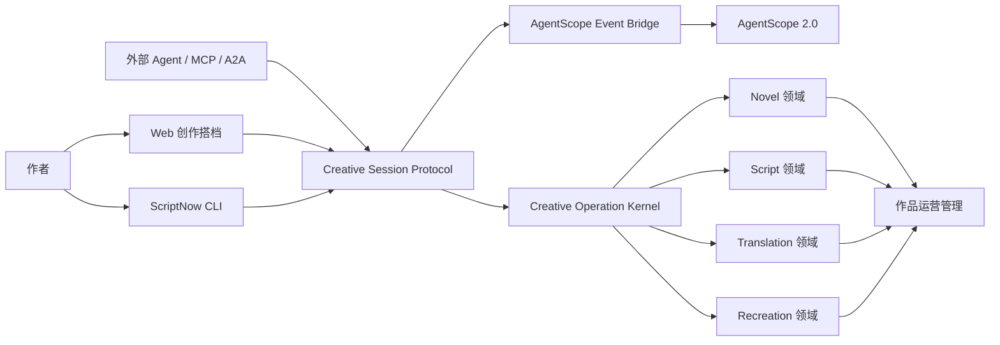
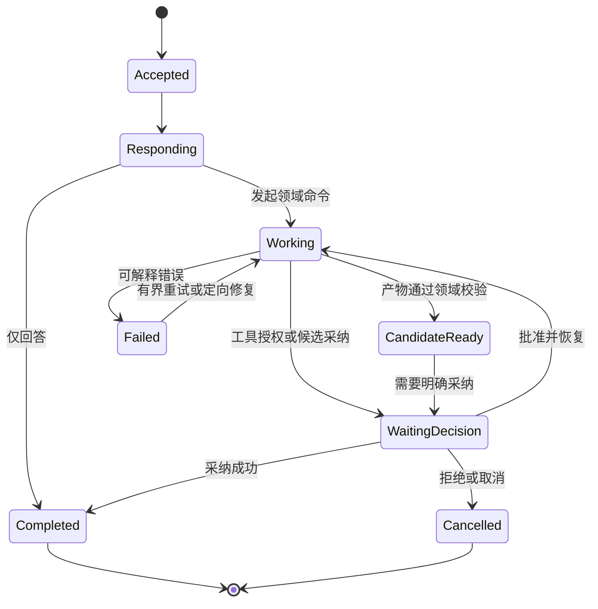

# 无界面创作搭档与 CLI 架构规划

| | |
|---|---|
| 版本 | v1.0 |
| 日期 | 2026-07-28 |
| 状态 | 备选计划，暂不进入当前研发主线 |
| 架构决策 | ADR-0012、ADR-0013 |
| 目标 | 不打开 ScriptNow 页面也能完成端到端创作 |

## 0. 计划状态与启动条件

本方案作为 ScriptNow 的备选演进方向保留，当前不启动 CLI、MCP/A2A 适配器或为 CLI
专门建设基础设施。现阶段研发主线仍是：

1. 修复 Web 创作流程中的可用性、正确性与连续性问题；
2. 完成 AgentScope 真实 Block、Tool、确认、暂停、恢复与取消语义；
3. 稳定 Novel、Script、Translation、Recreation 四个独立领域管线；
4. 让创作搭档与页面操作共享真实运行事实、产物和版本。

只有同时满足以下条件，才重新评审并启动 CLI：

- 四领域核心流程均可通过稳定的公开应用接口完成，不依赖特定 Vue 页面编排；
- 刷新、断线、取消、确认和服务重启后的恢复机制通过端到端验证；
- 成功 operation 均有可消费 artifact，且人工修订能被后续创作完整继承；
- Web 创作流程的主要阻断问题已收敛，CLI 不会复制现有双轨和历史债务；
- 有明确的无界面创作或外部 Agent 接入需求，并确认相应资源投入。

预计规模：完整无界面创作约 `10–15 人周`；连同外部 Agent、能力授权与审计约
`15–22 人周`。CLI 客户端本身只占其中较小部分，不能以简单 HTTP 包装替代协议和领域
正确性建设。

## 1. 产品目标

创作搭档不是悬浮在页面上的聊天窗口，而是 ScriptNow 的主要创作入口。作者可以从一句
想法开始，通过连续对话完成创意发散、方向选择、蓝图、StoryMap、逐章或逐场创作、人工
修订、审读、翻译或归化、包装和导出。Web、CLI 和外部 Agent 共享同一会话和同一事实源。

最终形态：



Web 不是编排者，CLI 不是旁路实现，外部 Agent 也不能直接写业务表。三者都是 Creative
Session Protocol 的客户端。

## 2. 当前问题诊断

### 2.1 五个标签混合了不同层级

| 当前标签 | 实际语义 | 问题 |
|---|---|---|
| 重点 | 查询投影 | 不是事实类型，规则变化会造成遗漏或噪音 |
| 对话 | 人机消息 | 属于交互通道 |
| 确认 | 决策结果 | 既缺待处理队列，也缺影响预览和恢复点 |
| 过程 | 领域进度与工具节点混合 | 创作者无法分辨产物进度和内部工具执行 |
| 运行 | 技术遥测 | 与创作内容并列，增加认知负担 |

正确的信息架构是“会话摘要 / 对话 / 待决定 / 工作进度”，诊断信息按权限展开。事件仍然
可以统一存储，但不能按存储类型直接设计用户导航。

### 2.2 当前事件流不等于 AgentScope 真实事件流

现有 `DockService.send_message()` 在一次完整 `runtime.generate()` 返回后，人工追加
thinking、tool、data、text 事件。结果是：

- 用户看到的“思考”和“工具”不是实际执行时序；
- 首个真实状态与正文被整次模型调用阻塞；
- 运行错误与补造的展示事件可能不一致；
- CLI 无法依靠事件恢复真实进度。

整改要求：Event Bridge 必须在 `reply_stream()` 产生事件时同步投影；不能在生成完成后
重演一套虚拟过程。

### 2.3 当前确认不是真正的暂停与续跑

现有 `requires_confirmation` 是前端人为开关：模型调用已经结束后，run 才被改成
`WAITING`；批准后并未用 `UserConfirmResultEvent` 恢复原 AgentState，而是生成上下文
模板并结束任务。

整改要求：

1. 确认只能来自实际的工具策略或明确领域决策门；
2. AgentScope 发出 `RequireUserConfirmEvent` 时持久化 parked state；
3. 决定落库后，以 `UserConfirmResultEvent` 恢复同一回合；
4. 幂等键保证工具副作用和产物采纳至多一次；
5. 服务重启、换客户端后仍可处理同一待决定事项。

### 2.4 Dock 与领域操作割裂

当前聊天响应和页面按钮分别调用不同端点。Agent 可以提出建议，但不能以同一协议安全地
发起、跟踪和完成“生成蓝图”“修订章节”“确认术语”“导出作品”等操作。因此它更像旁白，
不是创作入口。

整改要求：把页面已有能力注册为领域命令；Agent 只能调用命令，命令只能产生候选或待决定
事项，不能越过领域不变式直接改写已确认事实。

## 3. 目标交互模型

### 3.1 一个会话，三种面向作者的对象

作者只需要理解：

1. **消息**：搭档理解了什么、建议什么；
2. **决定**：现在需要作者选择或授权什么；
3. **产物**：已经形成什么候选、修订或最终版本。

operation、stage、trace 是系统保证，不应要求作者理解技术状态。

一次典型回合：



### 3.2 决定卡的最小信息

每个 `DecisionRequest` 必须包含：

- 用户能理解的问题和建议；
- 候选或工具将改变什么；
- 不批准会怎样；
- 允许的选择及可选反馈；
- 关联 operation、stage、artifact；
- AgentScope checkpoint 或领域恢复点；
- 到期策略、幂等键和权限要求。

“允许并继续”不能是没有对象、没有影响说明的通用按钮。

### 3.3 计划摘要而非隐藏思维

AgentScope ThinkingBlock 保留在受保护 trace 中。作者侧展示结构化的计划摘要，例如：

- 正在比较三种冲突引擎；
- 将读取已确认蓝图与最近两章修订；
- 下一步会生成章节候选，不会覆盖正文。

不得将隐藏思维链、原始 Provider debug 文本或内部 schema 错误暴露给作者。

## 4. Creative Session Protocol

### 4.1 核心资源

```text
CreativeSession
  id, tenant_id, project_id, active_domain, status, version

CreativeTurn
  id, session_id, actor, input, created_at, completed_at

CreativeOperation
  id, session_id, turn_id, command, domain, stage, status
  idempotency_key, policy_snapshot, context_manifest_id

DecisionRequest
  id, operation_id, kind, prompt, options, impact
  checkpoint_ref, status, decided_by, decided_at

ArtifactRef
  id, operation_id, domain, artifact_type, artifact_id
  revision, status, provenance

CreativeEvent
  id, session_id, operation_id, sequence
  type, payload, occurred_at, correlation_id, causation_id
```

状态和策略值来自数据库、项目参数、租户设置或 Agent 交互，禁止在客户端写死业务预算、
章节数、模型和确认策略。

### 4.2 命令分类

| 类别 | 示例 | 默认行为 |
|---|---|---|
| 查询 | 当前进度、读取蓝图、比较版本 | 只读，可直接执行 |
| 提议 | 创意发散、生成蓝图、章节候选、译文候选 | 形成 candidate，不覆盖事实 |
| 修订 | 根据反馈生成新版、人工保存 | 新 revision，保留旧版 |
| 决策 | 采纳方向、确认正文、确认术语 | 必须显式授权 |
| 外部副作用 | MCP 外呼、写外部文件、发布 | 按策略请求工具确认 |
| 运营 | 包装、导出、发布准备 | 只读取已确认版本 |

### 4.3 传输接口

首期采用 REST command/query + SSE event cursor：

```text
POST /creative-sessions
POST /creative-sessions/{id}/turns
GET  /creative-sessions/{id}
GET  /creative-sessions/{id}/events?after={cursor}
GET  /creative-sessions/{id}/decisions?status=pending
POST /creative-sessions/{id}/decisions/{decision_id}
POST /creative-sessions/{id}/operations/{operation_id}/cancel
GET  /creative-sessions/{id}/artifacts
```

SSE 负责顺序事件和断线续传；REST 负责有幂等键的命令。若以后需要双向低延迟，可增加
WebSocket adapter，但不能改变 CSP 领域语义。

### 4.4 事件分类

稳定用户事件：

- `message.created`
- `plan.summary.updated`
- `operation.started|progressed|completed|failed|cancelled`
- `decision.requested|resolved|expired`
- `artifact.candidate_ready|revised|adopted|rejected`
- `quality.report_ready`

诊断事件：

- `agentscope.block.*`
- `tool.call.*`
- `model.call.*`
- `trace.*`

诊断事件不能直接作为作者界面文案；必须通过投影器生成用户状态。

## 5. AgentScope 对接方案

### 5.1 单回合执行

```text
CreativeTurn
  → 构建 ContextManifest
  → Agent.reply_stream()
  → Event Bridge
      ├─ TextBlock → 会话消息或候选流
      ├─ ThinkingBlock → trace + 计划摘要投影
      ├─ Tool event → operation stage
      ├─ RequireUserConfirm → DecisionRequest + parked AgentState
      └─ terminal event → 领域校验 / artifact / run terminal
```

Event Bridge 必须使用 AgentScope 事件 ID、operation ID 和 stage ID 去重。delta 实时转发，
Block 完成、阶段变化、决定和产物才耐久化；不逐 token 写数据库。

### 5.2 恢复

恢复记录至少包含：

- AgentScope AgentState 序列化内容及版本；
- Agent、role、model、skill plan、toolkit 的运行快照；
- operation/stage、context manifest 和 policy snapshot；
- 待处理 framework event 与 decision ID；
- 已完成副作用的幂等凭证。

恢复时先校验租户、权限、运行快照兼容性和决定状态，再调用公开 `reply()` /
`reply_stream()` 传入对应结果事件。无法兼容时明确标记 `checkpoint_incompatible`，不能伪装
续跑成功。

### 5.3 Agent 工具目录

平台提供统一注册和治理，领域分别实现：

```text
novel.propose_story_core
novel.propose_blueprint
novel.propose_story_map
novel.propose_chapter
novel.revise_chapter
novel.request_adoption

script.propose_story_core
script.propose_blueprint
script.propose_story_map
script.propose_scene
script.revise_scene
script.request_adoption

translation.propose_chapter
translation.propose_terminology
translation.request_confirmation

recreation.analyze_source
recreation.propose_contract
recreation.propose_strategy
recreation.propose_pilot
recreation.propose_unit

project.status
project.list_pending_decisions
artifact.compare
quality.review
package.prepare
export.create
```

工具返回 artifact/operation/decision 引用，不把整部作品反复塞回 Agent 上下文。

## 6. CLI 与外部 Agent

### 6.1 CLI 体验

```text
scriptnow chat --project <id>
scriptnow status --project <id>
scriptnow decisions --project <id>
scriptnow approve <decision-id>
scriptnow reject <decision-id> --feedback "..."
scriptnow artifacts --project <id>
scriptnow compare <artifact-a> <artifact-b>
scriptnow export --project <id> --format docx
```

`chat` 支持流式消息、进度和决定卡的终端呈现；退出后 operation 继续运行，再次进入通过事件
游标恢复。CLI 由 OpenAPI 生成或共享协议客户端，不导入 backend service 或数据库模型。

### 6.2 外部 Agent 接入

外部 Agent 使用短期、租户范围的 capability token，只能调用被授权的 CSP command。
需要区分：

- 可查询项目事实；
- 可生成候选；
- 可提交反馈；
- 可请求决定；
- 可代表人采纳；
- 可产生外部副作用。

默认不授予“代表人采纳”和“外部副作用”。适配 MCP、A2A 或其他 Agent 协议时，只做
协议映射，不复制领域规则。

## 7. Web 产品调整

创作搭档收起时只显示：

- 当前 operation 的人类可读状态；
- 待决定数量；
- 最新候选或失败。

展开后：

1. **对话**：连续消息与产物卡；
2. **待决定**：跨流程的决策收件箱；
3. **工作进度**：按 operation/stage 展示；
4. **诊断**：开发或授权用户可见。

页面上的按钮也必须走 CSP command，不能保留“页面直调领域端点、Dock 只记录旁白”的双轨。
现有创作页面可以保留为深度编辑器和可视化工具，但不是完成流程的前置条件。

## 8. 分阶段实施

### P0：修正事实语义

- 移除 Dock 人工补造的 thinking/tool/data/text fixtures；
- Event Bridge 实时消费 `reply_stream()`；
- 接入真实 `RequireUserConfirmEvent`、AgentState 持久化与恢复；
- 将“操作前确认”改为策略设置，不再为每条消息伪造工具确认；
- 建立“同一工具副作用至多一次”集成测试；
- 将运行错误转换为稳定错误码和作者文案。

退出门槛：刷新或服务重启后可以从真实确认点继续；事件时序与 tracer fixture 一致。

### P1：Creative Session Protocol

- 增加 session/turn/operation/decision/artifact/event 契约与迁移；
- 建立 command、query、SSE cursor API；
- 将现有 Dock 改为 CSP 客户端；
- 建立会话摘要、待决定和工作进度投影；
- 对旧 project/run/event 做有界迁移和兼容读取。

退出门槛：不用创作页面，仅通过 API 可完成一次 Novel 和 Script 的候选—反馈—采纳链路。

### P2：领域命令接入

- Novel、Script、Translation、Recreation 分别发布命令目录；
- 页面按钮与 Agent 工具统一走领域 command handler；
- 每个 terminal success 都必须关联可消费 artifact；
- 统一候选、修订、采纳和质量门，保持领域 DTO 独立。

退出门槛：四领域不再存在仅能从特定 Vue 页面触发的核心流程。

### P3：CLI（备选，当前不实施）

- 发布 `scriptnow` CLI 和会话流式渲染；
- 支持登录、项目选择、聊天、恢复、决定、比较、导出；
- 建立中断、断网、服务重启和重复命令测试；
- 文档化非交互 JSON 输出，供自动化调用。

退出门槛：从一句创意开始，CLI 可完成端到端作品并导出，全程不访问 Web UI。

### P4：外部 Agent 与运营界面

- 提供 capability token、范围授权和审计；
- 发布 MCP/A2A adapter；
- 管理端聚焦作品、版本、成本、质量、发布和审计；
- Web 创作现场成为可选的深度编辑器与可视化客户端。

退出门槛：第三方 Agent 能生成候选但不能越权采纳；所有操作有 provenance 和审计记录。

## 9. 验收场景

必须以真实 Provider、真实 AgentScope 事件和真实领域产物验证：

1. CLI 输入一句创意，收到三个可区分方向；
2. 作者反馈后获得新版候选，旧候选仍可回看；
3. 作者选择方向，生成并采纳蓝图和 StoryMap；
4. 生成章节或场次候选，人工修订形成独立版本，再明确采纳；
5. 后续创作读取最新已确认版本；
6. 触发真实工具确认，关闭客户端和重启服务后仍可批准续跑；
7. 拒绝确认后无副作用，重复批准不重复写入；
8. 完成审读、包装和导出；
9. Web 打开同一项目时看到完全一致的会话、决定、产物和版本；
10. 外部 Agent 只有候选权限时，采纳请求被权限层拒绝并留下审计。

## 10. 质量指标

| 指标 | 含义 |
|---|---|
| Time to first meaningful event | 接受输入到首个真实计划或进度 |
| Time to candidate | 输入到可审查候选 |
| Resume success rate | 断线或重启后成功恢复比例 |
| Decision completion rate | 待决定被理解并完成的比例 |
| Duplicate side effects | 重试或恢复导致的重复写入，目标为 0 |
| Artifact-backed success | succeeded operation 中存在可消费 artifact 的比例，目标 100% |
| Human correction retention | 人工修订被后续上下文保留的比例，目标 100% |
| Flow interruption rate | 需要离开当前客户端或人工修库才能继续的比例 |

指标目标值由运行策略和监控配置管理，不写死在领域代码中。

## 11. 本轮结论

该规划与 AgentScope 架构吻合：AgentScope 继续负责 Agent 行为、Block 流、Skill、Tool、
MCP 和 parked reply；ScriptNow 只补齐它不负责的耐久会话、领域 operation、决定、
artifact、权限和多客户端协议。

最先实施的不是 CLI，也不是重画 Dock，而是修复“补造事件”和“模拟确认”两项事实错误。
只有 Creative Session Protocol 成为唯一入口后，CLI 和外部 Agent 才不会变成第三套、
第四套工作流。
