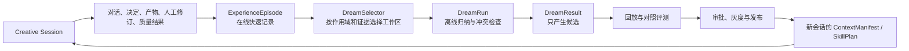

# 受控 Dreaming 与经验进化架构

| | |
|---|---|
| 版本 | v1.0 |
| 日期 | 2026-07-28 |
| 状态 | 已规划，等待分阶段实施 |
| 关联决策 | ADR-0010、ADR-0011、ADR-0013、ADR-0014 |
| 目标 | 让每次对话和每部作品形成可验证的系统复利 |

## 1. 结论

ScriptNow 引入类似 Auto-Dreamer 的离线经验整合机制，但不允许运行中的 Agent 直接修改
自己的 Prompt、Skill 或全局记忆。在线协作负责忠实记录，离线 Dream 负责跨会话发现重复
模式、矛盾、过期内容和能力缺口，评估与发布门禁负责决定哪些结果能够进入下一次运行。

这不是“模型自动训练”，而是一个有证据、有作用域、有版本、有评测、有审批和可回滚的
经验操作系统。

## 2. 为什么不能把全部聊天直接变成长期记忆

一次对话中同时存在：

- 用户明确决定、偏好和禁用项；
- Agent 的建议、猜测和失败尝试；
- 未采纳候选、已采纳事实与后续人工修订；
- Provider 调试文本、工具事件和临时运行状态；
- 作品中受版权和租户隔离保护的内容。

如果不区分这些语义，系统会把失败候选学成规则、把一次性要求学成永久偏好、把私有作品
泄漏到全局 Skill，并让重复摘要持续挤占上下文。Dream 必须读取完整 provenance，而不是
只读取相似度命中的聊天片段。

## 3. 双速学习模型



在线路径不能等待 Dream。Dream 在会话结束、作品里程碑、空闲时间或人工触发时异步运行，
并对运行时快照保持只读。

## 4. ExperienceEpisode

每个完成或明确终止的 CreativeOperation 形成一个 `ExperienceEpisode`：

```text
ExperienceEpisode
  id, tenant_id, user_id, project_id, session_id, operation_id
  domain, stage, role_key, outcome
  input_refs[], decision_refs[], artifact_refs[], quality_refs[]
  skill_plan_ref, context_manifest_ref, runtime_snapshot_ref
  user_edit_delta_ref, adoption_status, failure_code
  consent_scope, retention_policy, created_at
```

它只保存引用和结构化结果，不复制整部作品，不保存隐藏思维链。AgentScope
`ThinkingBlock` 留在受保护 trace；可学习内容是计划摘要、工具结果、领域产物、用户决定、
人工修订差异和质量结果。

必须保留的负例包括：

- 被用户拒绝或撤销的候选；
- 生成成功但领域校验失败的结果；
- 人工大幅改写后的模型版本；
- 造成连续性、风格、格式或事实破坏的 SkillPlan；
- 超时、空转、重复工具调用和无产物成功。

没有负例的“进化”只会放大既有偏差。

## 5. Dream 工作区与作用域

Dream 只能在一个明确的 `DreamWorkspace` 内运行：

| 作用域 | 可归纳内容 | 自动生效边界 |
|---|---|---|
| Session | 当前任务的临时策略和未决事项 | 会话结束即失效 |
| Project | 角色、世界、风格、术语、用户修订模式 | 可形成项目 Overlay 候选 |
| User | 跨项目稳定偏好、交互习惯和明确禁用项 | 用户可查看、修改、删除 |
| Tenant | 团队流程、质量标准和术语政策 | 管理员批准后生效 |
| Global | 匿名化的通用方法、能力缺口和基准样本 | 只允许候选，必须跨项目评测和人工发布 |

项目原文、角色、专有设定和可识别语句不得进入 User、Tenant 或 Global 作用域。跨作用域
归纳前必须完成最小化、去标识、近似复述检测和来源许可检查。

## 6. DreamResult

Dream 不修改输入存储，只输出新的可丢弃结果：

```text
DreamResult
  id, dream_run_id, workspace_scope, source_episode_refs[]
  findings[]
  memory_candidates[]
  preference_candidates[]
  skill_proposals[]
  benchmark_candidates[]
  contradictions[]
  supersession_plan[]
  confidence, risk_flags[], evaluator_status
```

### 6.1 允许的结果

- 合并重复但证据一致的项目记忆；
- 标记被新决定取代的旧记忆；
- 提议稳定的用户偏好并请求确认；
- 从重复纠偏中提炼项目 Overlay 或 SkillProposal；
- 把高价值失败转为回归样本；
- 发现 Skill 覆盖缺口、冲突和无效装配；
- 推荐检索索引压缩或过期候选归档。

### 6.2 禁止的结果

- 自动覆盖已确认正文、蓝图、StoryMap 或术语；
- 根据 Agent 自评直接发布 Skill；
- 从单个私有作品推广全局风格规则；
- 把推测写成用户偏好；
- 保存或展示隐藏思维链；
- 静默修改既有运行的 SkillPlan；
- 删除仍被已确认决定或产物引用的证据。

## 7. 与自适应 Skill 体系的连接

DreamResult 只连接 ADR-0011 已定义的晋升链：

```text
重复纠偏证据
  → SkillProposal
  → 静态契约校验
  → 历史会话回放
  → 同题材/跨题材对照评测
  → shadow
  → project canary
  → tenant/global approval
  → versioned release
```

已开始的 CreativeOperation 固定使用原 SkillPlan digest。新 Skill 只影响新运行；需要迁移
在途作品时必须生成影响预览并由用户明确决定。

## 8. 评测与量化复利

不能用 Dream 自己的评分证明 Dream 有效。每个候选必须与未使用该候选的基线比较：

| 指标 | 观察目标 |
|---|---|
| Human edit distance | Agent 候选到人工确认版本的修改量 |
| Adoption / rejection / undo | 候选被采纳、拒绝和撤销的比例 |
| Continuity defects | 人物、事实、时间线和术语破坏 |
| Quality anchor delta | 题材、结构、情感和表达质量锚点变化 |
| Context precision | 注入上下文中真正被任务使用的比例 |
| Recall with provenance | 需要的信息能否召回并回到原始证据 |
| Cost and latency | Dream 与后续运行节省或增加的 token、时延 |
| Cross-project leakage | 私有事实跨项目出现，目标为 0 |
| Rollback rate | 发布后因回归撤回的比例 |

阈值来自数据库评估策略，不写死在领域代码或测试 fixture 中。

## 9. AgentScope 边界

该方案与 AgentScope 2.0 的职责分工如下：

- AgentScope 负责 Agent、Message Block、Tool、Skill 和实时执行状态；
- Creative Session Protocol 负责耐久 session、operation、decision、artifact 和 provenance；
- ScriptNow Dream Orchestrator 选择离线工作区并调度专门的 Curator / Evaluator Agent；
- `MemoryService` 执行版本化读写、压缩、删除和来源追踪；
- `SkillResolver` 只消费已发布版本，不消费未评测 DreamResult；
- Novel、Script、Translation、Recreation 各自提供领域评价器和产物契约，不能共享正文 Skill。

Dream 是 ScriptNow 的后台治理 operation，不是 AgentScope 内部 Agent 在一次 reply 中递归
自我改写。

## 10. 用户和管理界面

### 10.1 作者侧“系统学到了什么”

只展示与本人或当前项目相关的候选：

- 学到的内容及适用范围；
- 来自哪些决定或人工修订；
- 系统为何认为它稳定；
- 接受、修改、拒绝、以后不再建议；
- 删除后会影响哪些未来运行。

不展示原始 trace 和其他作品内容。

### 10.2 管理侧“能力进化”

展示：

- DreamRun 状态、成本和处理范围；
- Memory / Preference / Skill / Benchmark 四类候选；
- 来源覆盖、隐私风险、相似内容风险和冲突；
- baseline、shadow、canary、promoted、rolled_back 生命周期；
- 新旧版本质量、成本、时延和失败率对比；
- 一键回滚及受影响 SkillPlan 列表。

## 11. 删除、撤回与版权

1. 原始会话、作品或账户被逻辑删除后，相关 Episode 立即停止检索和新 Dream 使用。
2. 删除任务沿 provenance 反向标记派生候选；只有仍有独立合法证据支撑的抽象结果才能保留。
3. 用户私有内容默认只用于本项目连续性，不默认贡献全局能力。
4. 全局学习必须有明确许可、最小化和跨项目聚合；不得保留可还原的原文表达。
5. 每个 DreamResult 和 SkillRelease 必须能回答“由哪些证据形成、谁批准、何时生效、如何撤回”。

## 12. 成本控制

- 在线只生成 Episode 索引，不为每条消息调用昂贵模型；
- 按新证据量、冲突、重复纠偏和里程碑触发，不按固定频率空跑；
- 先用确定性规则做去重、作用域过滤和候选分组；
- 低成本模型做分类与压缩，高能力模型只处理高价值冲突和 SkillProposal；
- DreamWorkspace 有 episode、token、时间和工具调用上限；
- 内容摘要按 artifact revision 缓存，未变化内容不重复处理；
- 候选未进入回放门禁前不注入生产上下文。

## 13. 实施顺序

### P0：经验账本

- 在 Creative Session Protocol terminal operation 上生成 ExperienceEpisode；
- 串联决定、候选、人工修订、采纳、质量与失败 provenance；
- 定义 consent、retention、删除传播和租户隔离测试；
- 建立“没有 Artifact 的成功不能形成正例”不变式。

### P1：项目 Dream

- 实现只读 DreamWorkspace 与版本化 DreamResult；
- 首批只开放项目记忆去重、矛盾检测、过期标记和项目 Overlay 候选；
- 作者可以查看、修改、拒绝和撤回；
- 未经确认的偏好不得进入 ContextManifest。

### P2：Skill 与基准候选

- 从重复人工纠偏中生成 SkillProposal 和 BenchmarkCandidate；
- 建立旧会话回放、反事实基线和按题材/语言/领域分层的评测；
- 先 shadow，再项目 canary，不直接全局发布。

### P3：租户与全局晋升

- 完成匿名化、版权、相似表达与跨项目泄漏检查；
- 管理端审批、灰度、监控和回滚；
- 以质量提升、上下文精度和成本下降证明复利，而不是以候选数量证明。

## 14. 首批验收场景

1. 用户连续三次把同类章节候选改成更克制的语言，系统提出项目级风格 Overlay，但不自动启用。
2. 新决定推翻旧设定后，Dream 标记旧记忆被取代，仍可回到原始决定。
3. 被拒绝的候选不会被当成正例；其失败原因进入 BenchmarkCandidate。
4. 同一作品的 Novel 经验不会生成 Script 正文 Skill。
5. 删除作品后，它不再参与 Dream；只由该作品支撑的派生候选同步失效。
6. SkillProposal 在回放中提高采纳率但破坏连续性时被门禁拒绝。
7. 新 Skill 发布后，旧运行仍使用旧 digest；新运行可解释为何选中新版。
8. 用户可在“系统学到了什么”中修改或删除自己的偏好。
9. 未获全局学习许可的原文和专有设定不出现在其他项目检索或 Skill 中。
10. Dream 失败不阻断实时创作，也不损坏原始记忆和运行快照。

## 15. 架构判断

Auto-Dreamer 的“快记录、慢整合、输入只读、输出替换候选”适合作为 ScriptNow 的经验
整合范式；但 ScriptNow 还必须增加创作产品特有的事实采纳、版权、租户隔离、领域隔离和
质量晋升门禁。

因此系统进化的正确单位不是“每句话修改一次模型”，而是：

```text
每次协作留下证据
→ 多次证据形成候选经验
→ 候选经验通过回放证明有效
→ 受控发布进入下一轮创作
```

