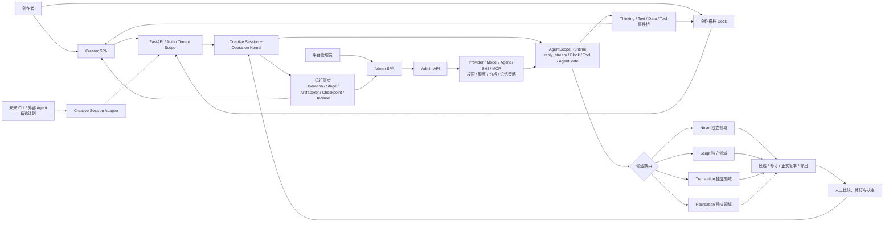
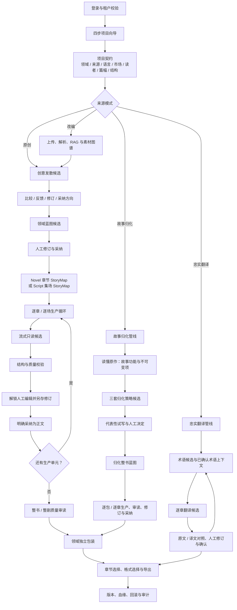
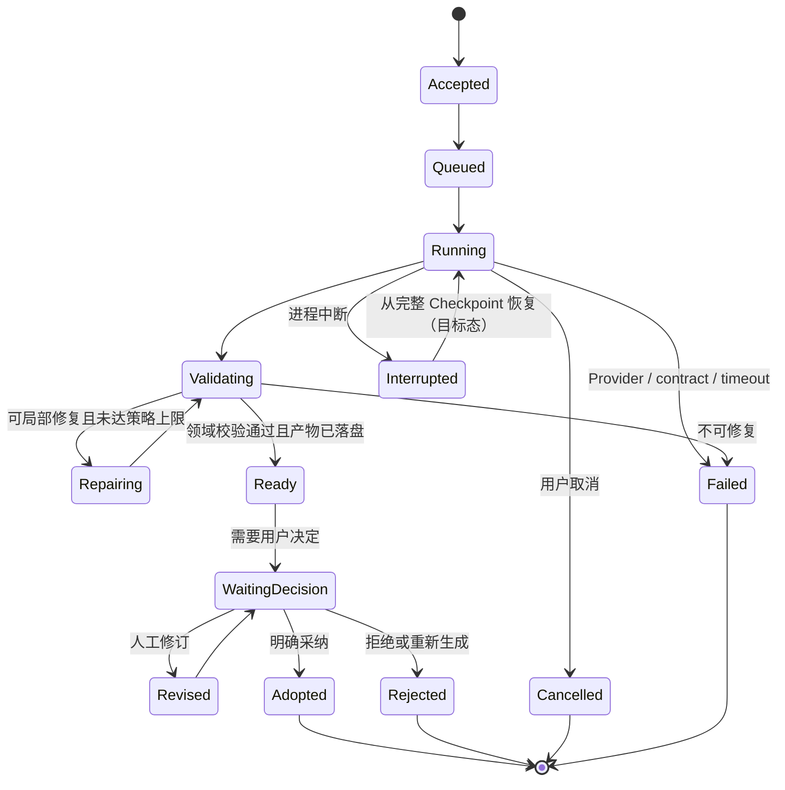
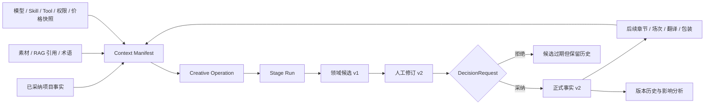
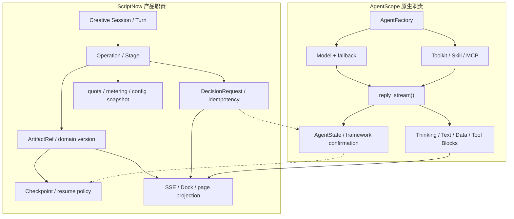
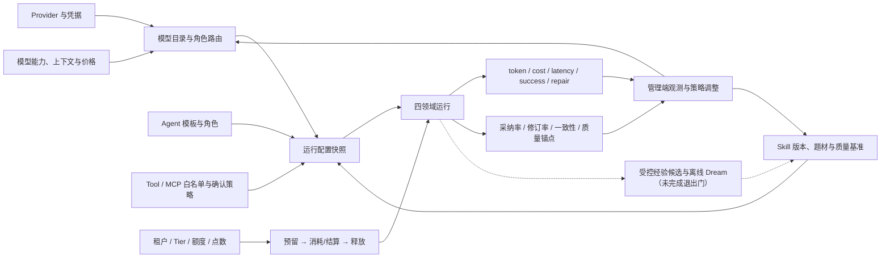

# ScriptNow 全系统业务流程逻辑图

| | |
|---|---|
| 版本 | v1.0 |
| 日期 | 2026-07-28 |
| 状态 | v1.1 规范修订单 |
| 范围 | Creator、Dock、Admin、AgentScope、Novel、Script、Translation、Recreation |

## 1. 阅读约定

- 实线表示当前规范和已接入的主链路。
- 虚线表示已批准但尚未完成退出门的目标能力。
- 四个创作领域只共享 platform 运行协议，不共享正文、StoryMap、生成器、审读和导出契约。
- 本文是业务与系统边界图，不以图中出现节点作为“已经生产可用”的证据。

## 2. 全系统上下文

## 3. 作品全生命周期

## 4. 一次生成操作的状态机

业务成功必须同时满足：领域校验通过、可消费产物落盘、ArtifactRef 来源完整、完整 Checkpoint
落盘、用户投影已发布。模型返回文本或事件流结束不构成成功。

## 5. 产物、版本与决定血缘

后续创作只能读取最新已采纳版本以及获准进入上下文的人工修订，不得回退到旧候选。

## 6. AgentScope 与 ScriptNow 的责任边界

当前已接入公开 `reply_stream()`、Block 投影、最小耐久运行内核及四领域主要生成入口。
Context Manifest、恢复判定矩阵、parked AgentState checkpoint 与 resumption claim 已落地。
真实 MCP 的 `RequireUserConfirmEvent → 进程重启 → UserConfirmResultEvent` 端到端续跑仍需
通过退出门。

## 7. 管理与治理闭环

## 8. 当前能力边界

| 状态 | 能力 |
|---|---|
| 已接入 | Creative Session/Operation 最小持久化谱系；四领域主要生成入口；ArtifactRef 与 Checkpoint 成功边界；真实 Block 事件投影；候选、人工修订、采纳与版本原则 |
| 已接入 | Context Manifest；跨进程恢复判定矩阵；parked AgentState checkpoint 与单次 resumption claim；Skill 基准准入闭环；四领域真实 Provider 证据审计工具 |
| 部分完成 | 全阶段状态统一；真实 MCP parked confirmation 续跑；四领域外部 Provider 实跑证据包 |
| 目标态 | 创作搭档完全驱动所有流程；受控 Dreaming；经重新评审后可能启动的 CLI / 外部 Agent |

成本路由已从当前目标态移除。既有模型绑定和用量记账继续有效，但系统不得因价格自动替换
用户或租户已选择的模型。

## 9. 验收使用方式

1. 每个新增功能必须能定位到图中的领域、Operation 阶段、产物和决定。
2. 任何跨领域复用必须证明只复用 platform 协议。
3. 任何“已完成”状态必须提供可读取产物及自动化证据。
4. 新状态、新事件或新产物类型必须先更新本文与对应领域契约。
