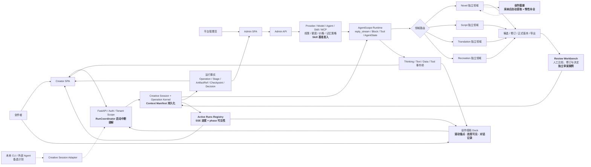
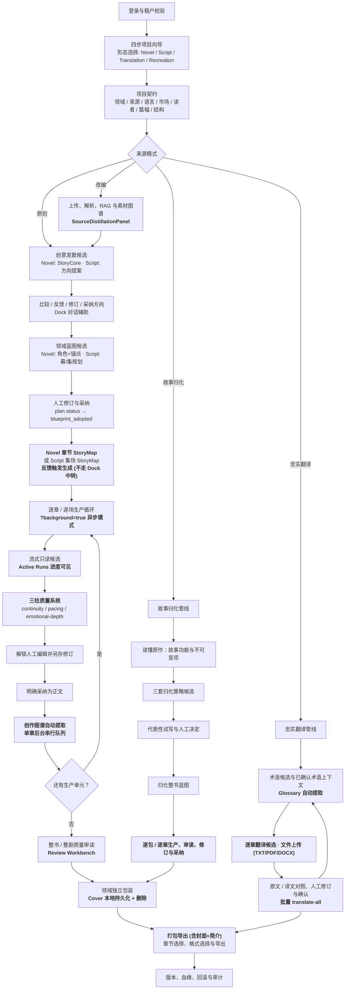
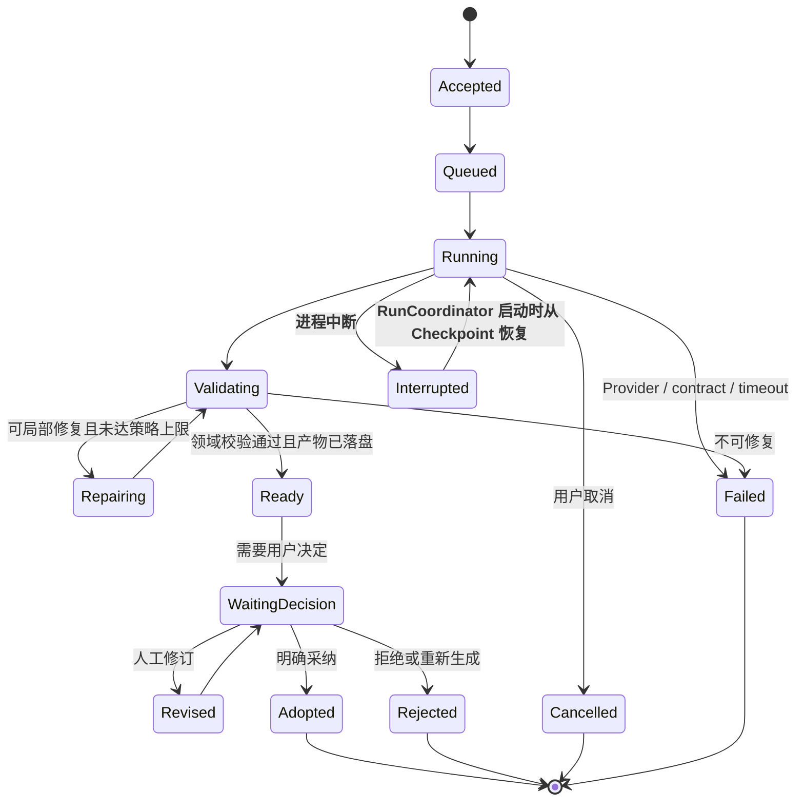
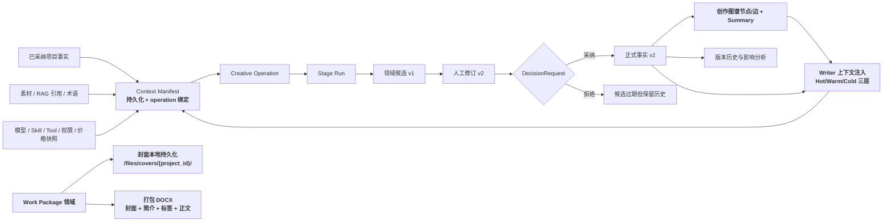
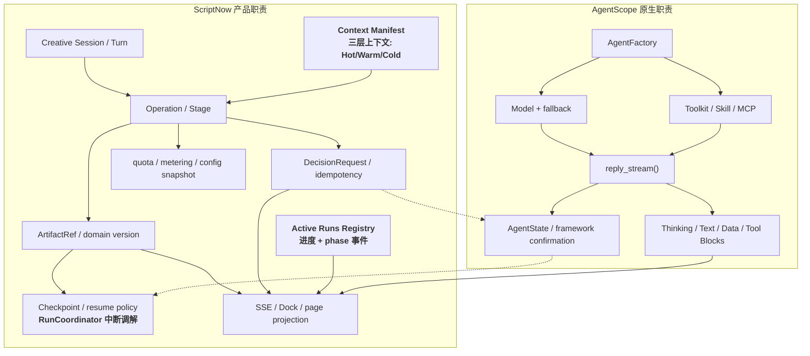
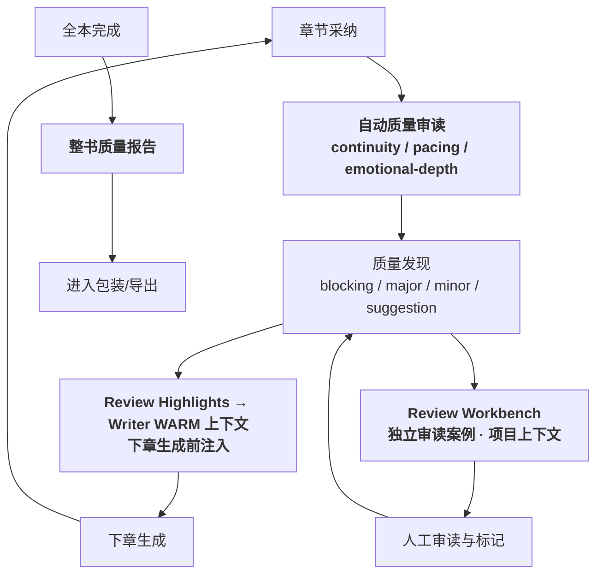
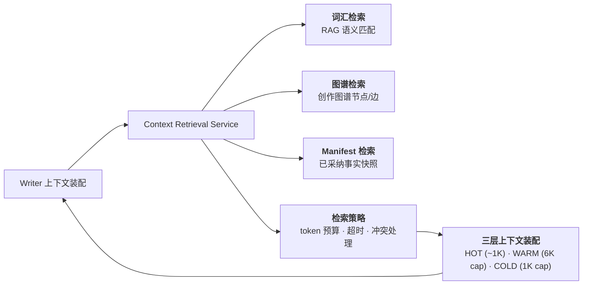
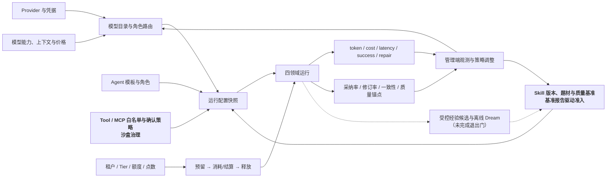

# ScriptNow 全系统业务流程逻辑图

| | |
|---|---|
| 版本 | v1.1 |
| 日期 | 2026-07-31 |
| 状态 | 与 0.2.0-rc.1 对齐 |
| 范围 | Creator、Dock、Admin、AgentScope、Novel、Script、Translation、Recreation、Review、Package |

## 1. 阅读约定

- 实线表示当前规范和已接入的主链路。
- 虚线表示已批准但尚未完成退出门的目标能力。
- **粗体** 表示自 v1.0 (2026-07-28) 以来新增或重大变更的子系统。
- 四个创作领域只共享 platform 运行协议，不共享正文、StoryMap、生成器、审读和导出契约。
- 本文是业务与系统边界图，不以图中出现节点作为"已经生产可用"的证据。

## 2. 全系统上下文

## 3. 作品全生命周期

## 4. 一次生成操作的状态机

业务成功必须同时满足：领域校验通过、可消费产物落盘、ArtifactRef 来源完整、完整 Checkpoint
落盘、用户投影已发布。模型返回文本或事件流结束不构成成功。

## 5. 产物、版本与决定血缘

后续创作只能读取最新已采纳版本以及获准进入上下文的人工修订，不得回退到旧候选。

## 6. AgentScope 与 ScriptNow 的责任边界

当前已接入公开 `reply_stream()`、Block 投影、最小耐久运行内核及四领域主要生成入口。
Context Manifest、恢复判定矩阵、parked AgentState checkpoint 与 resumption claim 已落地。
Active Runs Registry 实现 SSE 进度推送和 AgentDock pulse-animated 进度指示。

## 7. 审读与质量闭环 (新增)

## 8. 跨域上下文检索 (新增)

## 9. 管理与治理闭环

## 10. 当前能力边界

| 状态 | 能力 |
|---|---|
| 已接入 | Creative Session/Operation 最小持久化谱系；四领域主要生成入口；ArtifactRef 与 Checkpoint 成功边界；真实 Block 事件投影；候选、人工修订、采纳与版本原则 |
| 已接入 | Context Manifest 持久化 + operation 绑定；跨进程恢复判定矩阵；parked AgentState checkpoint 与单次 resumption claim；Skill 基准准入闭环；四领域真实 Provider 证据审计工具 |
| **已接入** | **RunCoordinator 启动时中断调解；Active Runs Registry + SSE 进度推送；AgentDock 滚动锚点 + 对话记录；创作图谱自动提取 + 惰性补全 + 后台串行队列** |
| **已接入** | **Writer 三柱质量系统 (continuity/pacing/emotional-depth)；Reviewer→Writer 反馈闭环；Review Workbench 独立审读案例；Context Retrieval 跨域服务 (lexical/graph/manifest)** |
| **已接入** | **Cover 本地持久化 + 打包导出 (含封面+简介)；翻译文件上传 (TXT/PDF/DOCX) + 批量翻译 + 术语表自动提取；故事归化全管线** |
| 部分完成 | 全阶段状态统一；真实 MCP parked confirmation 续跑；四领域外部 Provider 实跑证据包 |
| 目标态 | 创作搭档完全驱动所有流程；受控 Dreaming；经重新评审后可能启动的 CLI / 外部 Agent |

成本路由已从当前目标态移除。既有模型绑定和用量记账继续有效，但系统不得因价格自动替换
用户或租户已选择的模型。

## 11. 领域模块对照表 (新增)

| 模块 | 后端文件数 | 前端组件 | 核心能力 |
|------|-----------|----------|----------|
| **Novel** | 19 | NovelStudio · NovelDeliveryPanel · NovelQualityPanel · NovelStoryMapEditor | StoryCore → Blueprint → StoryMap → 逐章写作 + 图谱 |
| **Script** | 13 | ScriptStudio · ScriptDeliveryPanel · ScriptStoryMapEditor | 方向 → 蓝图 → StoryMap → 逐场写作 |
| **Translation** | 4 | TranslationStudio · TranslationOptions | 忠实翻译 + 文件上传 + 术语表 |
| **Recreation** | 5 | CrossCulturalRecreationStudio | 故事归化: 分析 → 策略 → 试写 → 生产 |
| **Review** | 6 | ReviewPanel · ReviewWorkbenchPage | 三柱质量 + 独立审读案例 |
| **Work Package** | 3 | PackagingPage | 封面生成/管理 + 打包导出 |
| **Dock** | 3 | AgentDock · AgentMessage | 创作搭档: 对话 + 进度 + 滚动锚点 |
| **Platform** | 61 | (N/A) | Auth · DB · Skills · Agent Runtime · Graph · Config |

## 12. 验收使用方式

1. 每个新增功能必须能定位到图中的领域、Operation 阶段、产物和决定。
2. 任何跨领域复用必须证明只复用 platform 协议。
3. 任何"已完成"状态必须提供可读取产物及自动化证据。
4. 新状态、新事件或新产物类型必须先更新本文与对应领域契约。

## 13. 版本变更记录

| 版本 | 日期 | 变更 |
|------|------|------|
| v1.0 | 2026-07-28 | 初始版本，四领域主链路 + 状态机 + AgentScope 边界 |
| **v1.1** | **2026-07-31** | **新增: 创作图谱 · 审读质量闭环 · Review Workbench · Context Retrieval · Active Runs · Cover 持久化 · 打包导出 · 翻译上传 · 故事归化全管线 · 领域模块对照表** |
