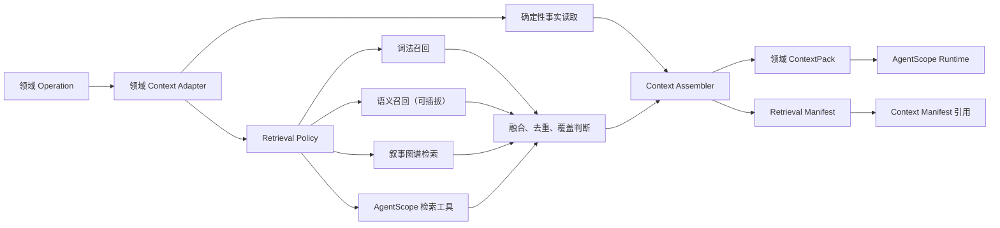

# ScriptNow 跨领域创作上下文与检索架构

> 状态：实施中（P0、P1 完成；P2 后端生产链路完成；P3 章节写作与 P4
> 归化工作包已接入）
> 适用范围：`platform` 检索基础设施，以及 `novel`、`script`、`translation`、`recreation` 四个独立领域适配器
> 不包含：成本路由、外部互联网研究的默认启用、跨领域复用正文或 StoryMap

## 1. 决策摘要

ScriptNow 不应把所有上下文问题都称为 RAG，也不应只给小说配置 RAG。

四个领域都需要“按当前任务找到正确事实”的能力，但所需证据、允许的变换和失败边界不同：

- 小说需要人物、关系、时间线、伏笔、最新正文修订和改编素材证据；
- 剧本需要场景进入状态、角色策略、连续性、道具、视听兑现和改编素材证据；
- 忠实翻译需要当前原文单元、上下文窗口、确认术语、翻译记忆和文体约束；
- 故事归化需要原作故事基因、跨章节因果、保护项、目标文化证据和变更授权。

因此，正确方向是建立平台级 **Creative Context Retrieval**，由领域适配器生成各自的
`ContextPack`。平台共享检索、索引、证据、审计和缓存能力；领域不得共享正文、StoryMap、
Writer、审读或导出契约。

首期不以更换向量数据库为前置条件。现有确定性事实、BM25 和叙事图谱足以建立可验证基线；
语义检索是可插拔召回器，不是正确性的唯一来源。

## 2. 当前实现盘点

| 能力 | 当前实现 | 成熟度 | 主要问题 |
|---|---|---:|---|
| 素材入库 | 上传后切块写入 `RagChunkModel` | 部分可用 | 固定字符切块，缺少结构、版本和语义边界 |
| 基础检索 | `RagService.search` 词项计数 | 原型 | 全表扫描、召回弱、无命中解释和覆盖率 |
| 小说创意 | 两轮检索与查询扩展 | 部分可用 | 轮数写死，排序简化，未形成统一证据清单 |
| 小说蓝图 | 均匀抽取最多若干素材块 | 不等同 RAG | 与当前任务相关性弱，容易漏掉关键因果 |
| 小说 StoryMap/写作 | 采纳事实、最新修订和前文上下文 | 基础较好 | 未统一接入素材证据与图谱检索 |
| 剧本创作 | 蓝图、StoryMap、前场正文的确定性上下文 | 基础较好 | 改编项目缺少来源检索、出处和覆盖判断 |
| 忠实翻译 | 当前单元 + 传入的术语文本 | 不完整 | 缺翻译记忆、相邻单元、术语生命周期和对齐证据 |
| 故事归化 | 拼接全部素材后交给 Agent | 高风险 | 上下文膨胀、无缺口驱动循环、无明确停止原因 |
| 叙事图谱 | BM25、图扩展与融合排序 | 有能力未贯通 | 未进入四领域核心生产管线 |
| Context Manifest | 固化项目、决策、策略和摘要 | 部分可用 | 未记录实际查询、命中、排除、冲突和覆盖缺口 |

结论：当前不是“小说有、其他领域没有”，而是检索能力呈碎片化分布。小说创意的实现最接近
多轮 RAG；其他流程要么只使用确定性上下文，要么采样或整份注入素材。它们尚未形成同一个
可审计的运行契约。

## 3. 概念边界

### 3.1 五类上下文

按可信度和优先级装配：

1. **当前任务契约**：用户输入、目标、篇幅、语言、格式、保护项和本次决策。
2. **已确认创作事实**：采纳方向、蓝图、StoryMap、最新人工修订、确认术语和有效决策。
3. **领域动态状态**：人物关系、时间线、伏笔、场景连续性、翻译记忆和文化映射。
4. **原始素材证据**：改编、翻译和归化项目的来源片段与定位信息。
5. **检索补充证据**：词法、语义、图谱或经明确授权的外部研究结果。

前两类不是 RAG，必须确定性读取。检索不能覆盖或重写已确认事实，只能补足任务所需证据。

### 3.2 原创与改编

- 原创小说、原创剧本可以没有原始素材 RAG，但仍需要从已确认事实、最新修订和叙事图谱中
  进行任务相关的上下文检索；
- 改编小说、改编剧本必须读取可定位的来源证据；
- 忠实翻译必须以原文单元和确认术语为事实源；
- 故事归化必须同时保留来源证据、故事基因和用户授权的可变维度。

### 3.3 检索不是记忆

- 项目事实和用户确认是事实源；
- 检索索引、向量和图谱是可重建的派生数据；
- 长期经验或 Dream 产物只能作为建议，不能自动晋升为当前项目事实；
- Skill 定义做事方法，不保存某部作品的具体事实。

## 4. 目标架构



### 4.1 平台契约

建议新增以下平台协议，名称可在 ADR 中调整，但职责不可合并：

```text
ContextRequest
  tenant_id / project_id
  retrieval_project_ids
  domain / stage / operation
  unit_ref
  user_intent
  required_dimensions
  risk_level
  policy_ref

RetrievalPolicy
  allowed_sources
  retrieval_modes
  coverage_requirements
  token_limit / timeout / max_iterations
  conflict_policy
  external_research_policy

ContextPack
  task_contract
  canonical_facts
  latest_revisions
  domain_state
  evidence
  conflicts
  omissions
  provenance

RetrievalManifest
  request_ref / policy_version
  source_versions
  queries
  hit_refs / graph_paths
  excluded_refs
  coverage
  conflicts
  token_usage / latency
  stop_reason
  digest
```

`ContextManifest` 只引用 `RetrievalManifest` 的 ID 与摘要，不复制大量正文。这样可以在跨进程
恢复时验证当时用了哪些事实，又不会让运行记录无限膨胀。

### 4.2 召回器接口

平台允许组合而不是互斥：

- `CanonicalRetriever`：领域表、采纳产物、最新有效修订；
- `LexicalRetriever`：BM25 或等价词法召回；
- `SemanticRetriever`：向量召回，可后续接入 SQLite 向量扩展或独立向量库；
- `NarrativeGraphRetriever`：人物、事件、关系、伏笔、地点、母题和世界规则；
- `TranslationMemoryRetriever`：源译对齐单元、确认术语和历史译法；
- `ExternalEvidenceRetriever`：只有操作明确需要且用户/租户策略允许时启用。

不得用空结果、解析异常或不可用召回器触发“伪成功”。允许的降级必须写入
`RetrievalManifest.stop_reason`，且仍满足本操作的最低覆盖策略。

## 5. AgentScope 对齐

该架构与 AgentScope 2.0 的职责一致：

1. 运行前由领域适配器装配确定性 `ContextPack`；
2. 改编素材库可通过真实 `RAGMiddleware` 或等价知识库适配器提供基础召回；
3. Agent 在运行中通过 Tool 补齐显式缺口，例如：
   - `read_source_chunk`
   - `query_continuity`
   - `list_active_foreshadows`
   - `read_translation_memory`
   - `query_cultural_equivalent`
4. `ThinkingBlock`、`ToolUseBlock`、`ToolResultBlock` 与正文 `TextBlock` 分离；
5. 工具事件进入运行流，面向用户显示友好的用途与结果摘要，技术载荷保留在审计层；
6. 暂停、确认和续跑使用 AgentScope/Creative Session 的真实状态，不补造聊天记录冒充运行。

平台 Context Assembler 不替代 AgentScope，也不重复实现 block 流式协议。它负责提供可信、
受限、可追溯的输入；AgentScope 负责 Agent 运行、工具调用、流式输出和状态恢复。

## 6. 四领域适配策略

### 6.1 小说

章节 `NovelContextPack` 至少包含：

- 当前章节目标与字数区间；
- 已采纳 StoryCore、蓝图和 StoryMap 单元；
- 最新有效正文修订，人工修订优先；
- 人物状态、关系变化、时间线和活动伏笔；
- 前文相关片段，而不是机械拼接全部章节；
- 改编项目的原始素材证据及出处；
- 本章必须推进和不得破坏的约束。

写作完成后，新的事实候选进入审读和人工确认，确认后才更新领域事实与检索索引。

### 6.2 剧本

场景 `ScriptContextPack` 至少包含：

- 集/场目标、进入状态、场景策略、转折与离开状态；
- 出场人物当下意图、知识边界和关系权力；
- 时间、地点、道具、服化和连续性；
- 前后场的因果连接与视听伏笔；
- 选择的剧本格式和制作约束；
- 改编项目的来源片段和引用。

检索目标不是生成更多背景资料，而是保证场景行动、冲突、连续性与可拍摄性。

### 6.3 忠实翻译

翻译单元 `TranslationContextPack` 至少包含：

- 当前源文单元及稳定定位；
- 必要的前后文窗口；
- 已确认术语和人物称谓；
- 已确认的相邻译文与翻译记忆；
- 作品文体、叙述人称、时态和标点规范；
- 有冲突的旧译法和待确认项。

语义召回不得擅自补写、改造世界观或更换文化语境。未确认术语只能作为候选，不能自动污染
后续章节。

### 6.4 故事归化

归化单元 `RecreationContextPack` 至少包含：

- 当前源单元与跨章节因果；
- 用户明确保护的故事基因；
- 可改变与不可改变维度；
- 人物关系、伏笔兑现和结局约束；
- 已确认文化映射及其理由；
- 目标文化制度、生活方式和语言证据；
- 发现的冲突、空缺和不确定项。

归化使用缺口驱动的有界循环：

```text
装配已知事实
  → 检测覆盖缺口和冲突
  → 只针对缺口检索
  → 更新候选映射
  → 达到覆盖要求则停止
  → 达到策略上限仍未满足则暂停并请求决策
```

迭代次数、超时和上下文预算来自租户或项目策略，不写死在代码中。

## 7. 失败边界

| 情况 | 正确处理 |
|---|---|
| 缺少必要采纳事实或最新修订 | 阻止该 Operation，提示回到缺失决策 |
| 改编素材覆盖不足 | 暂停并显示缺失维度，不允许无来源继续写成“已完成” |
| 检索索引版本落后于源文件 | 重建派生索引；不修改源文件 |
| 语义召回不可用 | 仅当确定性事实 + 词法/图谱仍满足覆盖策略时继续，并记录模式 |
| 命中证据彼此冲突 | 输出冲突集合，交由领域规则或用户决策，不让模型静默选择 |
| 外部研究不可用 | 只阻断明确依赖外部事实的操作，不影响普通原创流程 |
| 上下文超过预算 | 按领域优先级压缩并记录排除项，不从尾部任意截断 |
| Agent 输出结构不符合契约 | 保留真实错误和原始 block；不得用默认模板冒充成功 |

## 8. 质量与可观测性

每次生产操作至少记录：

- 最新有效修订命中率；
- 必需维度覆盖率；
- 来源主张的引用覆盖率；
- 检索命中被实际使用的比例；
- 过期事实进入上下文的数量；
- 冲突发现与解决状态；
- 上下文 token、检索时延、Agent 补检次数；
- 停止原因和未纳入内容。

门槛值不得写死在领域代码中，由版本化 `RetrievalPolicy` 提供。首轮建立基线，不立即启用
成本路由；成本与 token 只做度量和优化证据。

## 9. 实施顺序

### P0：契约与特征测试

- 固化现有四领域上下文行为和已知缺陷；
- 建立 `ContextRequest`、`ContextPack`、`RetrievalManifest` schema；
- 给当前 `ContextManifest` 增加检索清单引用；
- 建立原创零素材、改编有素材、索引过期和证据冲突测试。

退出门：不改变创作结果，但每个测试能说明当前上下文从哪里来、缺什么。

### P1：平台检索内核

- 抽象召回器接口和领域 `ContextAdapter`；
- 将现有词法搜索、叙事图谱和确定性读取纳入统一融合；
- 增加来源版本、稳定 chunk ID、命中解释、去重和覆盖计算；
- 实现有界循环控制器，所有限制读取策略。

退出门：同一请求可重放得到同版本证据；派生索引可安全重建。

### P2：忠实翻译与剧本改编

- 翻译接入确认术语、相邻译文和翻译记忆；
- 剧本接入场景连续性与来源证据；
- 前端展示用户语言的“使用了哪些依据”和待确认冲突；
- 黄金回放验证导出产物的来源与版本。

当前实现（2026-07-29）：

- 忠实翻译的真实章节生产入口已在 Agent 执行前生成不可变 Retrieval Manifest，确定性装配
  当前源文修订、已确认术语和相邻已确认译文，并可从显式源项目执行词法/图谱补检；
- 剧本真实场次生产入口已确定性装配当前场契约、蓝图锚点和此前已采纳场次；改编项目可显式
  指向源项目检索，Manifest ID 与摘要进入场次产物依赖；
- token、超时、迭代次数、召回数量和冲突策略均来自 `SCRIPTNOW_` 设置，不在领域服务写死；
- 原创项目无素材时不会伪造来源；术语为空会形成 omission，但在源文、声音和连续性满足时
  不冒充已确认术语；
- 后端相关回归和真实 API 集成测试已通过。

P2 尚余：Creator 面向作者的证据摘要/冲突确认界面，以及 Provider 黄金回放中对
Retrieval Manifest 的显式断言。

选择这两个领域优先，是因为目前一个缺术语记忆闭环，一个缺改编证据链，正确性风险最直接。

### P3：小说全链路

- 用统一适配器替换创意阶段的私有两轮检索；
- 蓝图从均匀采样改为任务相关检索；
- StoryMap、章节写作和审读接入最新修订、图谱与素材证据；
- 验证人工修订在后续章节中优先且不可丢失。

当前实现（2026-07-29）：

- 小说章节写作已通过 `NovelChapterContextAdapter` 确定性读取当前章节契约、已采纳蓝图
  锚点和此前章节的最新有效修订；现有修订仲裁继续保证人工修订优先；
- 已从当前 StoryMap 移除的旧章节修订不会进入后续章节上下文；
- 原创小说不要求伪造素材证据；改编小说可以通过显式来源项目执行词法与图谱补检；
- 每次章节 Agent 运行前持久化 Retrieval Manifest，其 ID、摘要和 ContextPack 进入真实
  AgentScope 运行上下文。
- 小说章节审读已复用同一章节适配器；不可变候选正文与可追溯补充证据同时进入审读
  上下文，审读运行不再依赖另一套隐式上下文拼装。

P3 尚余：创意、蓝图、StoryMap 入口统一迁移，及面向作者的证据摘要。

### P4：故事归化有界检索

- 移除整份源文无界拼接；
- 按六阶段产物建立单元级 ContextPack；
- 实现缺口驱动检索、文化证据、保护项冲突和停止原因；
- 在人工确认后增量更新映射、图谱和后续上下文。

当前实现（2026-07-29）：

- 归化逐包生产已使用独立的 `RecreationUnitContextAdapter`，不复用忠实翻译语义；
- 当前工作包确定性读取已采纳的源故事模型、目标契约、归化策略、代表性试写、整书计划
  和此前已采纳工作包；
- 源素材与叙事图谱只负责填补 `source_fidelity` 等明确缺口，迭代、超时和 token 边界
  来自版本化策略；
- 正常生成、JSON 结构修复及错误工作包纠偏均保留同一 Retrieval Manifest 引用，不会在
  重试时丢失证据链。
- 逐包生产提示已移除整部原文拼接旁路；缺少 Retrieval Manifest 或 ContextPack 时明确
  失败，不以全量源文兜底掩盖检索契约错误。
- 代表性试写已使用阶段级适配器读取已采纳源故事模型、目标契约和归化策略，并按
  `source_fidelity` 缺口检索源素材；试写提示不再拼接整部源文。
- 源作品分析已拆为结构、人物、因果、文化与保护项五层检索；首轮优先读取可定位源素材，
  后续轮次才使用叙事图谱补足缺口，不再把整部原文无界注入 Prompt。
- 归化策略与整书方案均在运行前生成不可变 Retrieval Manifest；源故事模型、目标契约、
  归化策略、试写及已确认治理产物分别作为显式维度进入清单。
- 文化映射和保护项冲突决策是独立、版本化、可追溯的采纳产物。确认新版本后，阶段级和
  工作包级适配器会在下一次运行中增量读取最新版，不要求重建或覆盖源素材索引。
- 文化映射若影响保护项，必须先存在逐项 `preserve`、`allow_change` 或
  `revise_mapping` 决策；未授权或要求保留的冲突不能被映射确认静默穿透。
- 治理产物的确认只更新治理索引，不改变六阶段主状态；候选确认和直接采纳两条路径均有
  防阶段回退约束。

P4 尚余：将同一治理确认能力接入作者界面，以及把已确认文化映射投影为可视化图谱节点；
后者只属于派生视图，不改变当前版本化事实源。

### P5：体验与优化

- 创作搭档显示“已读取 / 发现冲突 / 需要确认”，隐藏技术 chunk 与 schema 细节；
- 图谱、来源、术语和修订可从产物反查；
- 建立检索回归集、精确率/召回率和上下文浪费率基线；
- 根据证据决定是否引入向量数据库、重排模型或缓存优化。

## 10. 黄金验收场景

1. 原创小说没有素材块也能完成章节，且使用最新人工修订和活动伏笔；
2. 改编小说章节能定位使用的原文片段，不能引用未入库的事实；
3. 改编剧本场景同时满足来源忠实度、前场连续性和格式契约；
4. 忠实翻译在后续章节稳定沿用已确认术语，纠正术语后影响范围可预览和重算；
5. 故事归化只改变获授权维度，保护项、跨章节因果和文化依据可追溯；
6. 索引过期、证据冲突、覆盖不足和召回器故障均产生明确状态，不出现静默成功；
7. 同一 `ContextManifest + RetrievalManifest + Agent 配置快照` 可以跨进程恢复和审计。

## 11. 明确不做

- 不建立一个跨领域的万能 StoryMap 或 Writer；
- 不把全部历史聊天、全部原文或全部图节点塞进每次上下文；
- 不让向量相似度覆盖用户确认事实；
- 不把外部互联网检索默认开放给所有 Agent；
- 不把阈值、轮数、章节数、篇幅或模型写死在实现中；
- 不在本阶段恢复已暂停的成本路由；
- 不以“有 RAG”作为质量结论，只以证据覆盖、创作一致性和用户可控性验收。

## 12. 实施记录

### 2026-07-29 · P0 公共基础

已完成：

- `ContextRequest`、`RetrievalPolicy`、`EvidenceRef`、`ContextPack` 与
  `RetrievalManifestPayload` 严格契约；
- Retrieval Manifest 内容寻址、租户隔离、不可变摘要校验与数据库迁移；
- Context Manifest 对 Retrieval Manifest 的 ID、摘要和来源版本引用；
- Creative Operation 对领域、阶段和项目作用域的引用校验；
- 契约往返、非法额外字段、策略边界、篡改检测、迁移升降级和引用链测试。

本次没有改变任何领域的检索、Prompt 或产物内容。下一步从 P1 检索内核开始，并在接入
每个领域适配器时分别补齐原创零素材、改编有素材、索引过期和证据冲突的特征测试。

### 2026-07-29 · P1 平台检索内核

已完成：

- 建立与领域无关的 `Retriever`、`ContextAdapter`、`RetrievalCoordinator` 协议；
- 将现有词法素材索引与叙事图谱封装为公共召回器，保留来源文件摘要、索引版本、
  稳定片段 ID、命中原因和原文摘录；
- 查询显式声明本轮负责的覆盖维度，禁止从自然语言 purpose 猜测覆盖范围；
- 按策略执行确定性事实优先、稳定排序、来源白名单、版本冲突检测、去重、token
  边界、外部检索开关和有界循环；
- 召回器异常、索引不可用、过期来源、覆盖不足和超时均写入 Retrieval Manifest，
  不以默认文本或虚构覆盖率伪装成功；
- 在 Agent Runtime 调用前持久化不可变 Retrieval Manifest，并返回其 ID 与摘要供
  Context Manifest 引用。

验证覆盖：

- 相同请求、相同来源版本和相同查询可重放得到相同证据集合与 ContextPack；
- 确定性事实优先于派生检索结果；
- 过期索引、重复证据、token 越界、证据冲突和召回器故障均有明确结果；
- 真实词法召回器保留来源内容摘要、版本、摘录和显式覆盖维度。

P1 只提供平台内核，不宣称四个领域已经接入。下一步按 P2 顺序分别建立忠实翻译与
剧本改编的领域 `ContextAdapter`，领域契约、术语、场景连续性和来源证据不得回流到
平台公共层。
