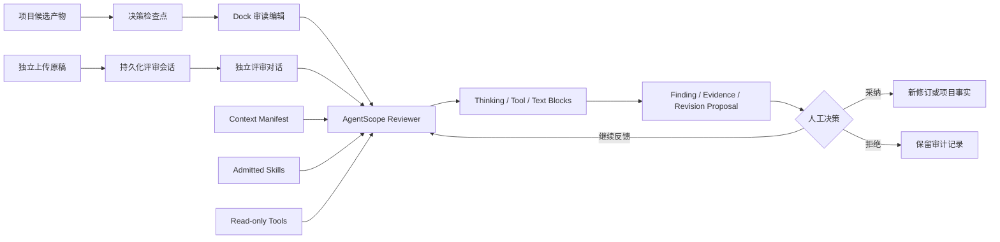

# 审读编辑与独立评审

状态：已实施并通过自动化与浏览器验收
适用版本：v1.1

## 产品定义

ScriptNow 使用“双轨一核”的审读体系：

1. **项目决策检查点 + Dock 审读编辑**：取代面向用户的独立“质量检查”步骤。在创意方向、蓝图、StoryMap、正文候选以及归化翻译关键产物被采纳前，Dock 主动进入审读编辑状态。
2. **独立评审工作台**：不创建创作项目，用户上传小说、剧本或故事大纲后，与评审 Agent 进行可持续、多轮、可恢复的对话。
3. **同一证据底座**：两种入口共享 AgentScope 原生 Block、准入 Skill、只读工具、Finding、证据锚点、版本绑定和人工决策治理。

后台质量评估器、审读报告与一致性校验仍作为审读编辑可调用的证据工具存在，但不再形成与项目决策检查点重复的前台流程。

## 项目决策检查点

项目事件流按照领域产物识别未决检查点：

- 创意方向候选；
- 蓝图候选；
- StoryMap 候选；
- 章节或场景正文候选；
- 源作品分析与目标故事契约；
- 归化策略、代表性试写、整书方案与生产单元。

候选产生后，Dock 主动切换为“审读编辑”，读取当前候选、已确认事实、对应修订版本与证据清单。用户可以继续追问、要求补证或提出修订意见。只有明确采纳事件发生后，检查点才关闭并返回原创作角色。

审读编辑默认只读：

- 可以形成 Finding、证据引用和修订建议；
- 不能静默改写正文；
- 不能替用户采纳候选；
- 不把创作偏好伪装成阻塞事实；
- 不以降级结果掩盖上下文或结构化输出错误。

## 独立评审工作台

独立评审是连续对话工作流，而不是一次性上传表单：

1. 上传 DOCX、PDF、TXT、Markdown 或 HTML 原稿；
2. 选择作品领域与评审目标；
3. 建立持久化评审会话；
4. Reviewer 读取原稿和准入 Skill，返回可读结论；
5. 用户围绕同一原稿持续追问、改变评审范围或补充证据标准；
6. 会话、消息、Skill 快照和原稿摘要均可恢复。

历史评审属于辅助导航，应收纳在抽屉或历史入口，不占用主要对话区域。

Skill 清单属于运行时能力目录，不是创作者的阅读内容。前台不得铺陈 Skill key、英文说明、模型连接信息或权限诊断；系统应根据作品领域、文档类型和本轮评审目标自动选择已准入 Skill。需要排障时，能力快照只进入管理端或诊断记录。创作者界面只呈现当前评审目标、证据、Finding、建议和待决策事项。

## 领域与权限

- Script 与 Novel 保持独立领域 Skill、上下文和评审契约。
- Creative Session、AgentScope Blocks、工具事件、权限与确认机制由 platform 共享。
- Review domain 的 Finding、证据锚点、修订提案与采纳治理是结构化产物底座。
- 对话不是事实库；只有确认的 Finding、Decision 与 Artifact 才进入项目事实。
- 项目审读上下文必须自动定位当前项目及当前决策产物，不得再次要求用户提供系统已经持有的正文。

## Skill 来源治理

首批方法来源为 `/Users/quchenchen/Documents/github/screen-creative-skills`。该仓库是研究材料集合，不是可直接执行的 ScriptNow Skill 包。

接入必须按领域转换为带 metadata 的 `SKILL.md`，记录来源与边界并通过 admission。固定比例、分数和推荐阈值不是全局产品真理，只能由项目评审目标或版本化 rubric 明确选择。

首批接入：

- `script-screen-creative-review`：剧本、短剧、系列大纲和影视 IP 的证据式评审；
- `novel-screen-ip-review`：小说/短故事阅读质量与影视改编潜力分离评审。

## 运行链

## 验收

- 新的关键候选出现时，Dock 只打开一个对应检查点，不重复触发。
- 采纳对应候选后，检查点关闭并恢复之前的创作角色。
- Reviewer 自动获得项目、当前单元、当前修订与已确认事实。
- 面向用户的项目流程不再出现重复“质量检查”终点。
- 独立评审支持同一原稿的连续对话与跨刷新恢复。
- 历史评审不占据主要内容区。
- Thinking 只展示完成后的可读摘要；不逐 Token 制造卡片。
- Reviewer 的模型、连接状态和候选 Skill 来自后端能力清单并由运行时自动选择，不在创作主界面展示原始目录。
- 未准入或跨领域 Skill 不得挂载。
- 正文改变必须经过 Finding、候选与采纳链。
